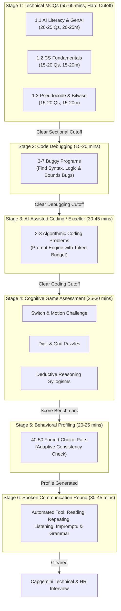

[Home](../README.md) > [00-start-here](README.md) > 01_exam-format.md

# Capgemini Assessment Architecture & Format Reconciliations

This document consolidates the complete evaluation structure reported across candidate experiences, campus placement cells, and technical preparation debriefs.

Where historical sources report differing parameters (such as section duration or token quotas), both reported values are listed side-by-side with their sources and marked `[UNVERIFIED]` so candidates are prepared for either configuration.

---

## 1. Master Assessment Stage Table

| Stage # | Stage Name | Duration / Timing | Questions / Format | Elimination? | Discrepancies & Conflicting Reports `[UNVERIFIED]` |
| :---: | :--- | :---: | :---: | :---: | :--- |
| **Stage 1** | **Technical Assessment (MCQs)** | 55 - 65 Mins `[UNVERIFIED]` | 55 - 60 Questions | **Yes (Hard Cutoff)** | **Duration**: Some campus drives report 55 minutes total; others report 20-25 mins for AI Literacy + 20-25 mins for CS/Pseudocode. Source: Video reports 25 mins per section; Chat reports 20 mins. |
|  | *1.1 AI Literacy & GenAI* | 20 - 25 Mins `[UNVERIFIED]` | 20 - 25 MCQs | Sub-section | Video reports 25 Qs; some tests feature 20 scenario-based questions. |
|  | *1.2 CS Fundamentals* | 15 - 20 Mins `[UNVERIFIED]` | 15 - 20 MCQs | Sub-section | Includes Networking, SQL, DBMS, OOPs, OS, and fundamental DSA theory. |
|  | *1.3 Pseudocode & Bitwise* | 15 - 20 Mins `[UNVERIFIED]` | 15 - 20 MCQs | Sub-section | Tracing loop execution, recursion trees, operator precedence, and bit shifts. |
| **Stage 2** | **Code Debugging Round** | 15 - 20 Mins `[UNVERIFIED]` | 3 - 7 Problems `[UNVERIFIED]` | **Yes** | **Timing & Problem Count**: Video describes 7 short buggy programs in 20 minutes (2-3 mins per problem); some candidate portals report 3 multi-bug problems in 15-20 minutes. |
| **Stage 3** | **AI-Assisted Coding (Exceller)** | 30 - 45 Mins `[UNVERIFIED]` | 2 - 3 Coding Problems | **Yes** | **Duration & Token Budget**: Chat reports 45 mins with ~2,000 token conversational budget; other placement portals report 30 mins with under 1,000 token limit. Candidates are advised to keep prompt turns to <= 3 prompts per problem. |
| **Stage 4** | **Cognitive Game Assessment** | 25 - 30 Mins `[UNVERIFIED]` | 4 - 6 Interactive Games | **Yes** | Games include Motion Challenge, Switch Challenge, Digit Challenge, Grid Puzzle, Bubble Memory, and Deductive Reasoning. |
| **Stage 5** | **Behavioral Profiling** | 20 - 25 Mins `[UNVERIFIED]` | 40 - 50 Forced-Choice Pairs | **No (Profiling)** | Adaptive personality mapping. Tests consistency across disguised rewordings. Non-elimination, but inconsistent profiles raise red flags. |
| **Stage 6** | **Spoken Communication Round** | 30 - 45 Mins `[UNVERIFIED]` | 6 Automated Modules | **Yes** | Automated Versant/Mettl-style tool testing reading, listening, situational response, spoken presentation, business writing, and grammar. |

---

## 2. Parameter Conflicts & Heuristics Breakdown

### A. Technical Assessment Timing
- **Report A (KN Academy Video)**: 25 minutes allocated for AI Literacy MCQs; 25 minutes for Core CS / Pseudocode.
- **Report B (Gemini Placement Chat)**: 20 minutes allocated per MCQ module.
- **Preparation Rule**: Train using a target pace of **45 to 55 seconds per question**. Never linger on any calculation or trace for more than 75 seconds.

### B. Code Debugging Timing & Count
- **Report A (KN Academy Video)**: 7 distinct problems to debug within 20 minutes (~2.8 minutes per bug).
- **Report B (Portal Candidate Debriefs)**: 3 longer algorithmic problems (e.g. Trees, Matrices, DP) within 20 minutes (~6.5 minutes per problem).
- **Preparation Rule**: Use the **10-Point Syntax & Logic Scanner** (detailed in `04-code-debugging/README.md`) to isolate bounds errors, uninitialized variables, and premature returns in under 30 seconds.

### C. AI-Assisted Coding Token Limits
- **Report A**: 2,000 token context buffer supporting up to 5 dialog turns.
- **Report B**: Strict < 1,000 token cap where candidate scores drop if the AI conversation exceeds 3 prompts.
- **Preparation Rule**: Adopt the **3-Prompt Precision Architecture**:
  1. *Turn 1*: Formal specification + boundary conditions + expected asymptotic bounds.
  2. *Turn 2*: Counter-example defense / edge-case injection.
  3. *Turn 3*: Final code syntax generation and memory verification.

---

## 3. Commonly Advised Assessment Heuristics `[UNVERIFIED]`

The following metrics are commonly cited across campus preparation groups. They represent historical rule-of-thumb guidance rather than official Capgemini regulations:

- **MCQ Cutoff Threshold**: Commonly advised that candidates should achieve approximately 65-75% accuracy (e.g. 15 to 18 correct answers out of 25 in AI Literacy) to guarantee section clearing.
- **Communication Round Silence Rule**: Pausing for more than 2 to 3 seconds during spoken modules is commonly reported to cause an automated score reduction (often claimed as a ~40% penalty). Maintain smooth filler transitions rather than dead silence.
- **Communication Speaking Timing**: Candidates are commonly advised to use the full 30 seconds of preparation to outline 3 bullet points, and speak for 40-45 seconds of the allotted 60-90 second window with clear articulation.
- **Behavioral Scoring Heuristic**: The frequent campus advice that "Statement B is always safer" is purely a heuristic; candidate consistency across paired queries is the primary metric evaluated by the adaptive profiling engine.

---

## Sources for This File
- KN Academy Video: [Capgemini Complete Recruitment Pattern](https://youtu.be/o5TbT3kzEnA)
- KN Academy Playlist: [Capgemini 2026/2027 Hiring Masterclass](https://www.youtube.com/watch?v=mLaYLknw4KU&list=PLGFjgYQtw1UjDBEkL2Edqej2kXbxGA1NO)
- Historical candidate test logs and Gemini conversational debriefs in `Capgemini Candidate Exam Debriefs`.

---

Previous: [00-start-here](README.md) | Next: [02_study-plans.md](02_study-plans.md)
