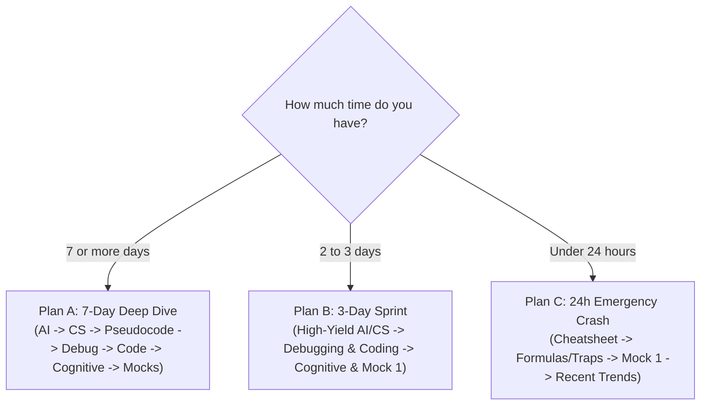

[Home](../README.md) > [00-start-here](README.md) > 02_study-plans.md

# Structured Preparation Schedules

---

## Plan A: Comprehensive 7-Day Schedule

Designed for thorough conceptual understanding, algorithmic tracing, and mock simulations.

| Day | Focus Area | Recommended Modules | Daily Goal |
| :---: | :--- | :--- | :--- |
| **Day 1** | AI Literacy & GenAI | `01-ai-literacy/` (Files 01 - 04) | Master LLM parameters, temperature, prompt patterns (RTC-FC), vector similarity, and RAG chunking. |
| **Day 2** | AI Governance & CS Core | `01-ai-literacy/` (Files 05 - 07) + `02-cs-fundamentals/` (01 - 03) | Review AI security (prompt injection), RAGAS metrics, Subnetting, SQL joins/aggregations, and ACID properties. |
| **Day 3** | CS Fundamentals & DSA | `02-cs-fundamentals/` (Files 04 - 06) | OOPs diamond problem, dynamic binding, OS deadlock Banker's matrices, page replacement, and tree/sorting theory. |
| **Day 4** | Pseudocode & Bitwise | `03-pseudocode-and-bitwise/` (All files) | Trace 40 pseudocode loops/recursions, practice operator precedence, negative modulo, and Brian Kernighan bit tricks. |
| **Day 5** | Code Debugging Round | `04-code-debugging/` (All files) | Practice the 10-point bug scanner across trees, matrices, interval overlaps, linked lists, and Kadane bounds. |
| **Day 6** | AI-Assisted Coding & Cognitive | `05-ai-assisted-coding/` + `06-cognitive-and-behavioral/` | Learn token-efficient prompt templates; practice Switch challenge permutations, Motion grid paths, and Syllogisms. |
| **Day 7** | Communication & Full Mocks | `07-communication/` + `09-mock-tests/` + `10-quick-revision/` | Take Mock 1, 2, and 3 under timed conditions; practice spoken delivery prompts; review CHEATSHEET.md. |

---

## Plan B: Accelerated 3-Day Sprint

Designed for candidates with limited time focusing on the highest-weight elimination sections.

| Day | Focus Area | Mandatory Reading & Practice | Target Hours |
| :---: | :--- | :--- | :---: |
| **Day 1** | Technical MCQs (AI & CS) | `01-ai-literacy/` (01, 02, 03, 04) + `02-cs-fundamentals/` (01, 02, 04, 05) + `03-pseudocode-and-bitwise/01_operator_precedence_and_tracing.md` | 6 Hours |
| **Day 2** | Debugging & Coding Rounds | `04-code-debugging/README.md` + 01, 02, 05, 06 + `05-ai-assisted-coding/README.md` + 01, 02, 05 | 6 Hours |
| **Day 3** | Cognitive, Spoken & Mock 1 | `06-cognitive-and-behavioral/03_deductive_reasoning.md` + 05_switch + `07-communication/` + `09-mock-tests/01_mcq_mock_1.md` + `10-quick-revision/CHEATSHEET.md` | 6 Hours |

---

## Plan C: Last 24-Hours Emergency Review

When your exam is tomorrow, prioritize rapid recognition of traps and formulas:

1. **Hour 1 - 2**: Read [10-quick-revision/CHEATSHEET.md](../10-quick-revision/CHEATSHEET.md) (covers all essential formulas, precedence tables, and bug checklists in under 800 words).
2. **Hour 3 - 4**: Read [10-quick-revision/formulas-and-traps.md](../10-quick-revision/formulas-and-traps.md) (memorize negative modulo rules, subnetting host formula $2^{32-n}-2$, Banker's Need matrix calculation, and 0/1 Knapsack reverse loop).
3. **Hour 5 - 6**: Solve [09-mock-tests/01_mcq_mock_1.md](../09-mock-tests/01_mcq_mock_1.md) and check explanations for any missed question.
4. **Hour 7 - 8**: Review [08-recent-patterns/README.md](../08-recent-patterns/README.md) to anticipate recent question formats.
5. **Night Before**: Read [10-quick-revision/last-24-hours.md](../10-quick-revision/last-24-hours.md) for mindset and environmental check (webcam, microphone, lighting).

---

Previous: [01_exam-format.md](01_exam-format.md) | Next: [03_tags-and-how-to-use.md](03_tags-and-how-to-use.md)
