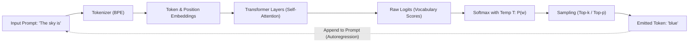

[Home](../README.md) > [01-ai-literacy](README.md) > 01_llm_basics.md

# 01. Large Language Model (LLM) Fundamentals

## Learn

### 1. What is Generative AI vs Traditional Automation?
- **1-Line Definition**: Generative AI creates *new content* (text, code, images) by predicting patterns learned from vast data, whereas rule-based systems follow strict `if-then` code written by a human.
- **Real-Life Analogy**: A traditional database query is a **librarian** fetching the exact book you asked for from a shelf. Generative AI is an **author** writing a brand-new summary in real time based on all books they ever read.
- **Exam Angle**: Capgemini asks scenario questions contrasting static deterministic rules (e.g., regex, SQL lookups) against probabilistic neural generation.

### 2. The Core Generation Mechanism: Autoregressive Next-Token Prediction
- **1-Line Definition**: LLMs generate text one single token (word chunk) at a time, appending each new token to the prompt before predicting the next one ($P(w_t \mid w_1, w_2, \dots, w_{t-1})$).
- **Tokens Explained**: A token is a piece of a word (roughly 4 characters or 0.75 English words in Byte-Pair Encoding).
- **Parameters**: Learned numerical weights and biases inside the neural network adjusted during pre-training.

### 3. Sampling Controls: Temperature and Top-p
- **Softmax Equation**: Converts raw output scores (logits $z_i$) into probabilities:
  $$P(y_i) = \frac{e^{z_i / T}}{\sum_j e^{z_j / T}}$$
- **Temperature ($T$)**:
  - $T \to 0$ (e.g. $0.0 - 0.2$): "Greedy decoding". The model picks the highest probability token. Best for SQL, code syntax, and math.
  - $T \approx 0.7 - 1.0$: Balanced creativity and coherence.
  - $T > 1.2$: High entropy, random token sampling, risking hallucinations.
- **Top-p (Nucleus Sampling)**: Selects only from the smallest group of top tokens whose cumulative probability exceeds threshold $p$ (e.g. $p=0.9$).

---

## Practice
### AI-001: Defining Characteristic of GenAI vs. Rule-Based Automation

**Tag**: [VIDEO] | **Difficulty**: Easy | **Topic**: GenAI Foundations

#### Question
Which of the following best captures the foundational operational difference between Generative AI architectures and traditional deterministic automation?

- **A**: GenAI processes relational database records using indexed B-trees
- **B**: GenAI synthesizes novel probabilistic representations rather than executing pre-programmed rule matrices
- **C**: Traditional automation generates natural language via recurrent neural networks
- **D**: GenAI operates strictly via static if-else decision trees

**Correct Answer**: **B**

#### Why
Traditional automation relies on hardcoded decision branches where identical inputs produce identical deterministic paths. Generative AI computes conditional token probabilities over multidimensional embeddings to generate novel content.

- **5-Second Shortcut**: Librarian retrieves exact static books; author writes new original stories.
- **Trap**: Thinking GenAI just does fast database queries. It creates new text via probability distributions.
- **Source**: KN Academy Video: https://youtu.be/o5TbT3kzEnA

---

### AI-007: Core Generation Mechanism of LLMs

**Tag**: [ADDED] | **Difficulty**: Easy | **Topic**: Autoregressive Generation

#### Question
How do autoregressive decoder-only Transformer models generate extended paragraphs of text?

- **A**: By rendering all tokens across the entire paragraph simultaneously in a single forward pass
- **B**: By iteratively calculating probability distributions to output one next token at a time
- **C**: By matching prompt keywords against an internal dictionary of pre-written answers
- **D**: By executing a compiled bytecode script generated during the pre-training phase

**Correct Answer**: **B**

#### Why
Autoregressive generation functions step-by-step. In each forward pass, the model emits one token, appends it to the sequence, and feeds the updated sequence back into the context to predict the next token.

- **5-Second Shortcut**: Autoregressive = self-looping next-word prediction.
- **Trap**: Assuming transformers generate whole paragraphs in one go. Images do diffusion, but LLMs predict sequentially.
- **Source**: Capgemini Candidate Exam Debriefs

---

### AI-008: Primary Purpose of Self-Attention

**Tag**: [ADDED] | **Difficulty**: Medium | **Topic**: Transformer Architecture

#### Question
What is the mathematical purpose of the self-attention mechanism in Transformers?

- **A**: Compressing text by stripping vowels and whitespace
- **B**: Calculating dynamic context weights representing relationships between every pair of tokens in a sequence
- **C**: Encrypting tokens to ensure privacy compliance
- **D**: Restricting vocabulary size to reduce memory usage

**Correct Answer**: **B**

#### Why
Self-attention computes Query, Key, and Value dot products ($Q K^T / \sqrt{d_k}$) across all token positions, enabling each token to attend to and incorporate context from all other tokens regardless of distance.

- **5-Second Shortcut**: Self-attention = dynamic contextual relevance weights between all words.
- **Trap**: Confusing self-attention with recurrent hidden states. Transformers process all tokens concurrently in attention layers.
- **Source**: Capgemini Candidate Exam Debriefs

---

### AI-009: Definition of Model Parameters

**Tag**: [ADDED] | **Difficulty**: Easy | **Topic**: Model Weights

#### Question
In deep learning and LLMs, what are 'parameters' (e.g. a 7-Billion parameter model)?

- **A**: The command-line arguments passed when launching the inference server
- **B**: The learned numerical weights and biases that store patterns acquired during pre-training
- **C**: The total count of training documents stored on the hard drive
- **D**: The maximum number of tokens a user is permitted to submit per day

**Correct Answer**: **B**

#### Why
Model parameters are the floating-point weights and biases of neural network layers. They are updated via backpropagation during training and frozen during inference.

- **5-Second Shortcut**: Parameters = learned neural network weights.
- **Trap**: Confusing user settings (hyperparameters like temperature) with internal model parameters (weights).
- **Source**: Capgemini Candidate Exam Debriefs

---

### AI-010: Definition of Context Window

**Tag**: [ADDED] | **Difficulty**: Easy | **Topic**: Context Budget

#### Question
What does the term 'context window' specify in an LLM system?

- **A**: The visual size of the browser GUI window in pixels
- **B**: The maximum cumulative token budget the model can accept and process across prompt and response in a single session
- **C**: The time duration in seconds before an idle connection closes
- **D**: The number of concurrent queries supported by the GPU

**Correct Answer**: **B**

#### Why
The context window is the hardware and architectural limit on the number of tokens (prompt + output) that the model can hold in its attention mechanism at one moment.

- **5-Second Shortcut**: Context window = total token capacity limit.
- **Trap**: Thinking the context window only counts user input. It must contain the user prompt, system prompt, and generated tokens.
- **Source**: Capgemini Candidate Exam Debriefs

---

### AI-030: Temperature vs. Top-p Sampling in SQL Generation

**Tag**: [CHAT] | **Difficulty**: Medium | **Topic**: Inference Parameters

#### Question
A developer is using an LLM to generate syntactically strict PostgreSQL queries from business descriptions. Which sampling setting is most appropriate?

- **A**: Temperature = 1.4, Top-p = 0.95
- **B**: Temperature = 0.1, Top-p = 0.1 (or Top-k = 1)
- **C**: Temperature = 0.9, Top-p = 1.0
- **D**: Temperature = 2.0, Top-p = 0.0

**Correct Answer**: **B**

#### Why
Code and SQL require deterministic, greedy token selection with zero hallucinated keywords or table names. Low temperature ($T \le 0.2$) flattens the probability tail and selects the single most probable grammatical token.

- **5-Second Shortcut**: Code/SQL = lowest temperature ($T \to 0$).
- **Trap**: Selecting high temperature for code because you want 'creative algorithms'. High temperature causes syntax errors.
- **Source**: Capgemini Candidate Exam Debriefs

---

### AI-031: BPE Tokenization & Numerical Inaccuracies

**Tag**: [CHAT] | **Difficulty**: Medium | **Topic**: Tokenization

#### Question
Why do LLMs frequently struggle with arithmetic operations on large numbers (e.g. multiplying two 8-digit numbers)?

- **A**: Transformers have no floating-point math chips
- **B**: Byte-Pair Encoding (BPE) splits large numbers into arbitrary token chunks (e.g., '142857' -> '14', '28', '57'), destroying digit place-value alignment
- **C**: Attention weights cannot exceed 1.0
- **D**: Weights are rounded to integers during inference

**Correct Answer**: **B**

#### Why
Subword tokenizers group frequent digit combinations into single tokens without understanding place value (units, tens, hundreds). The model sees numbers as arbitrary tokens rather than structured numerical quantities.

- **5-Second Shortcut**: Subword chunking fragments digits and hides place value.
- **Trap**: Assuming LLMs do mathematical calculations like a calculator. They predict tokens based on text statistics.
- **Source**: Capgemini Candidate Exam Debriefs

---

### AI-039: Deterministic Logit Sampling via Low Temperature

**Tag**: [CHAT] | **Difficulty**: Easy | **Topic**: Inference Controls

#### Question
As temperature $T$ approaches 0 ($T \to 0$), what mathematical transformation occurs within the softmax function?

- **A**: The distribution becomes completely uniform, assigning equal probability to all tokens
- **B**: The distribution sharpens into an argmax function, assigning near 100% probability to the single highest logit token
- **C**: Logits are inverted, favoring rare vocabulary words
- **D**: Softmax division by zero causes GPU kernel crashes

**Correct Answer**: **B**

#### Why
In $e^{z_i / T}$, as $T \to 0$, differences between logits are amplified exponentially. The highest logit dominates the denominator, turning sampling into greedy argmax selection.

- **5-Second Shortcut**: Low temperature = peaked distribution (greedy choice).
- **Trap**: Believing temperature 0 means random sampling. Temperature 0 is pure greedy argmax.
- **Source**: Capgemini Candidate Exam Debriefs

---

### AI-042: Context Window Drift & Instruction Forgetting

**Tag**: [VIDEO] | **Difficulty**: Medium | **Topic**: Attention Degradation

#### Question
A candidate passes a 25-page PDF into an LLM and asks a question about page 13. The model hallucinates an answer. What architectural factor is primarily responsible?

- **A**: Model parameter quantization
- **B**: Attention dilution and 'Lost in the Middle' phenomenon where attention weights concentrate on the start and end of long contexts
- **C**: Overfitting on the system prompt
- **D**: Loss of floating-point precision in the tokenizer

**Correct Answer**: **B**

#### Why
In very long context sequences, self-attention exhibits the 'lost-in-the-middle' curve: tokens placed in the middle of long prompts receive lower attention weights than tokens at the absolute beginning (primacy effect) or end (recency effect).

- **5-Second Shortcut**: Lost in the middle = middle tokens get lowest attention.
- **Trap**: Assuming all tokens in the context window are attended to with equal weight. Middle positions suffer attention decay.
- **Source**: KN Academy Video: https://youtu.be/o5TbT3kzEnA

---

### AI-052: Temperature and Top-P Mechanics

**Tag**: [VIDEO] | **Difficulty**: Medium | **Topic**: Sampling Controls

#### Question
What is the difference between Top-k sampling and Top-p (nucleus) sampling?

- **A**: Top-k dynamically adjusts vocabulary size; Top-p uses a constant count
- **B**: Top-k keeps a fixed number $k$ of highest probability tokens; Top-p dynamically selects the smallest set of tokens whose cumulative probability reaches threshold $p$
- **C**: Top-k is applied before softmax; Top-p is applied after softmax
- **D**: Top-p is only used for image generation

**Correct Answer**: **B**

#### Why
Top-k picks exactly $k$ candidate tokens regardless of probability distribution shape. Top-p (nucleus sampling) adapts dynamically: if one token has 95% probability, it selects just 1 token; if probability is spread thinly, it expands candidate count.

- **5-Second Shortcut**: Top-k = fixed count; Top-p = dynamic probability cutoff.
- **Trap**: Thinking Top-p and Top-k do the exact same filtering. Top-p expands or contracts based on certainty.
- **Source**: KN Academy Video: https://youtu.be/o5TbT3kzEnA

---

### AI-056: Token vs Character Count Ratio

**Tag**: [ADDED] | **Difficulty**: Easy | **Topic**: Tokenization

#### Question
On average in standard English text, approximately how many tokens are required to represent 100 English words in BPE tokenization?

- **A**: Exactly 10 tokens
- **B**: Approximately 75 to 100 tokens
- **C**: Approximately 130 to 140 tokens
- **D**: Exactly 1,000 tokens

**Correct Answer**: **C**

#### Why
As a rule of thumb, 1 token is roughly 0.75 words, meaning 1 word is approximately 1.33 tokens. Therefore, 100 English words translate to approximately 130-140 tokens.

- **5-Second Shortcut**: 100 words $\approx$ 133 tokens (1 token $\approx$ 0.75 words).
- **Trap**: Thinking 1 word = 1 token. Rare words and punctuation split into multiple subword tokens.
- **Source**: Added practice: Standard LLM tokenization rules

---

### AI-057: System Prompt vs User Prompt

**Tag**: [ADDED] | **Difficulty**: Easy | **Topic**: Prompt Architecture

#### Question
What is the primary role of the 'System Prompt' (or system message) in a chat-based LLM API?

- **A**: To compile the Python code before sending it to the GPU
- **B**: To set global behavior, persona, guardrails, and operating constraints that persist throughout the conversation
- **C**: To authenticate user API billing credentials
- **D**: To store the user's password securely

**Correct Answer**: **B**

#### Why
The system prompt provides high-priority baseline instructions guiding the model's tone, role, format constraints, and safety boundaries across subsequent user turns.

- **5-Second Shortcut**: System prompt = persistent persona and rule setter.
- **Trap**: Thinking the system prompt is only seen by system administrators. It is sent as the lead message in the context.
- **Source**: Added practice: Chat API message architecture

---

### AI-058: Vocabulary Size and Softmax Dimension

**Tag**: [PATTERN] | **Difficulty**: Medium | **Topic**: Transformer Dimensions

#### Question
In an LLM with a vocabulary size of $V = 32,000$ and embedding dimension $d = 4096$, what is the output dimension of the final linear projection layer before softmax?

- **A**: $4096$
- **B**: $32,000$
- **C**: $32,000 \times 4096$
- **D**: $1$

**Correct Answer**: **B**

#### Why
The language model head projects the hidden state vector of size $d=4096$ onto the full vocabulary dimension $V=32,000$. Softmax then calculates a probability for each of the 32,000 potential next tokens.

- **5-Second Shortcut**: Final logit vector size = vocabulary size ($V$).
- **Trap**: Thinking the output is the hidden dimension. The model must score every word in its dictionary.
- **Source**: Pattern practice: Architecture and logit dimensions

---

### AI-059: Pre-training vs Post-training Alignment

**Tag**: [PATTERN] | **Difficulty**: Medium | **Topic**: Training Pipeline

#### Question
What is the primary objective of the pre-training stage compared to the instruction fine-tuning stage of an LLM?

- **A**: Pre-training teaches the model to answer user questions politely; fine-tuning teaches grammar
- **B**: Pre-training compresses internet-scale text to learn language patterns and world knowledge; instruction tuning aligns the raw model to follow conversational commands
- **C**: Pre-training only uses supervised human labels; fine-tuning uses unlabelled text
- **D**: Pre-training reduces the parameter count from billions to millions

**Correct Answer**: **B**

#### Why
Pre-training is self-supervised next-token prediction across trillions of tokens to learn grammar, facts, and reasoning. Instruction tuning (SFT) and RLHF align that raw completion engine into a helpful, harmless chatbot.

- **5-Second Shortcut**: Pre-train = learn language & knowledge; Fine-tune = learn helpful dialogue.
- **Trap**: Assuming a pre-trained base model is already a ready-to-use chatbot. Base models just complete arbitrary sentences.
- **Source**: Pattern practice: LLM development stages

---

### AI-060: KV Cache in Autoregressive Inference

**Tag**: [PATTERN] | **Difficulty**: Hard | **Topic**: Inference Optimization

#### Question
What is the purpose of the Key-Value (KV) Cache during autoregressive LLM text generation?

- **A**: Storing user database passwords
- **B**: Caching previously calculated Key and Value attention tensors so past tokens do not need to be recomputed for every new generated token
- **C**: Compressing tokens onto SSD storage
- **D**: Preventing prompt injection attacks

**Correct Answer**: **B**

#### Why
Without KV caching, generating token $N$ would require recomputing attention for all $N-1$ previous tokens ($O(N^2)$ forward passes). The KV cache saves previous Keys and Values in GPU VRAM, reducing each new step to a single token computation.

- **5-Second Shortcut**: KV Cache = store past attention states to avoid redundant recomputations.
- **Trap**: Believing inference re-runs the entire prompt through every matrix from scratch for each word.
- **Source**: Pattern practice: LLM inference optimization

---

### AI-061: Greedy Decoding vs Beam Search

**Tag**: [ADDED] | **Difficulty**: Medium | **Topic**: Decoding Strategies

#### Question
In which scenario is Beam Search generally preferred over greedy decoding?

- **A**: When generating highly creative open-ended fiction
- **B**: When evaluating constrained translation or summarization where maintaining multiple parallel path hypotheses yields higher global likelihood
- **C**: When GPU memory is near 100% capacity and needs minimal footprint
- **D**: When the user requests maximum generation speed

**Correct Answer**: **B**

#### Why
Beam search tracks the top $B$ candidate sequences simultaneously. It avoids getting trapped in local probability peaks, making it well-suited for translation and structured summarization, though it requires more memory than greedy decoding.

- **5-Second Shortcut**: Beam search = tracks $B$ best paths together for global optimality.
- **Trap**: Thinking beam search is faster than greedy. Beam search maintains $B$ paths, taking more compute.
- **Source**: Added practice: Decoding algorithms

---

### AI-062: Context Window Token Eviction Policy

**Tag**: [PATTERN] | **Difficulty**: Medium | **Topic**: Context Management

#### Question
When a multi-turn chat conversation exceeds the model's maximum context window, what is the standard FIFO buffer eviction strategy?

- **A**: Deleting the system prompt first
- **B**: Removing the oldest user and assistant turns while strictly preserving the system prompt and the latest user turn
- **C**: Randomly dropping every third token across all messages
- **D**: Halving the model's vocabulary size

**Correct Answer**: **B**

#### Why
To maintain coherent operation, the system prompt (rules/persona) and the latest user query must be preserved. The oldest historical dialogue turns are dropped first (First-In, First-Out).

- **5-Second Shortcut**: FIFO context management: evict oldest turns, keep system prompt & newest prompt.
- **Trap**: Dropping the system prompt to save space. Without the system prompt, model guardrails vanish.
- **Source**: Pattern practice: Multi-turn session state management

---

### AI-063: Quantization (FP16 vs INT4)

**Tag**: [ADDED] | **Difficulty**: Medium | **Topic**: Model Optimization

#### Question
What is the primary benefit and trade-off of 4-bit model quantization (INT4)?

- **A**: It doubles model accuracy at the cost of requiring 4x more VRAM
- **B**: It reduces memory footprint and enables running large models on consumer GPUs with minimal degradation in output quality
- **C**: It eliminates hallucinations entirely
- **D**: It permanently fixes training data errors

**Correct Answer**: **B**

#### Why
Quantization converts 16-bit floating point weights (FP16) into 4-bit integers (INT4). This reduces VRAM by up to 70%, allowing a 7B parameter model to run in ~4GB RAM with negligible loss in benchmark performance.

- **5-Second Shortcut**: Quantization = smaller memory footprint with minor accuracy trade-off.
- **Trap**: Assuming quantization makes models run 10x slower. It often increases throughput due to reduced memory bandwidth bottlenecks.
- **Source**: Added practice: Deployment and model serving

---

## Sources for This File
- KN Academy Video: [Capgemini Complete Recruitment Pattern](https://youtu.be/o5TbT3kzEnA)
- KN Academy Playlist: [Capgemini 2026/2027 Masterclass](https://www.youtube.com/watch?v=mLaYLknw4KU&list=PLGFjgYQtw1UjDBEkL2Edqej2kXbxGA1NO)
- Gemini candidate chat archives in `Capgemini Candidate Exam Debriefs`

---

Previous: [01-ai-literacy README](README.md) | Next: [02_prompt_engineering.md](02_prompt_engineering.md)
