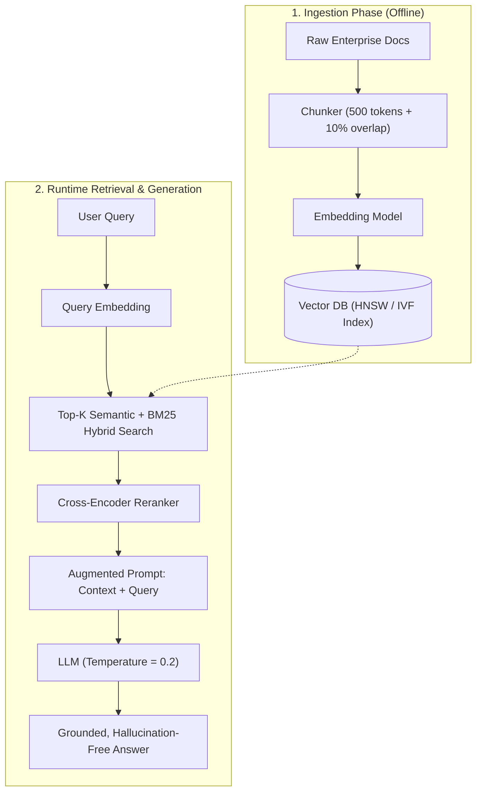

[Home](../README.md) > [01-ai-literacy](README.md) > 03_rag_and_vectors.md

# 03. Retrieval-Augmented Generation (RAG) & Vector Search

## Learn

### 1. What is RAG?
- **1-Line Definition**: RAG dynamically fetches verified external documents from a database and injects them into the LLM prompt context at runtime, ensuring grounded and up-to-date answers without retraining model weights.
- **Real-Life Analogy**: Taking an **open-book exam**. Instead of memorizing every medical textbook, the student opens the specific chapter to answer the question accurately.
- **Exam Angle**: Capgemini assesses RAG failure modes (lost-in-the-middle, chunk boundary truncation, alphanumeric retrieval failures) and hybrid search mechanics.

### 2. Embeddings & Distance Metrics
- **Embedding**: An array of floating-point numbers (e.g. 768 or 1536 dimensions) capturing semantic meaning. Concepts with similar meanings sit close together in geometric space.
- **Cosine Similarity**: Measures the cosine of the angle between two vectors:
  $$\text{Cosine}(\mathbf{u}, \mathbf{v}) = \frac{\mathbf{u} \cdot \mathbf{v}}{\|\mathbf{u}\| \|\mathbf{v}\|}$$
  - Range: $-1$ to $+1$. For normalized vectors ($\|\mathbf{u}\|=1$), Cosine Similarity equals the Dot Product!
- **Dot Product**: Magnitude-sensitive metric: $\mathbf{u} \cdot \mathbf{v} = \sum u_i v_i$.
- **Euclidean Distance ($L_2$)**: Straight-line distance between vector coordinates $\sqrt{\sum (u_i - v_i)^2}$.

### 3. Chunking & Sliding Window Overlap
- Documents must be split into chunks (e.g. 500 tokens).
- **Chunk Overlap** (e.g. 10-20% or 50 tokens): Copies trailing tokens from chunk $N$ to the start of chunk $N+1$. This prevents critical sentences from being split in half across chunk boundaries.

### 4. Hybrid Search: Dense + Sparse (BM25)
- **Dense Vector Search**: Excels at semantic concepts (*"headache medication"* matches *"ibuprofen"*). Fails on exact serial numbers or error codes (*"ERR_404_NULL"*).
- **Sparse Keyword Search (BM25)**: Matches exact keywords, codes, and acronyms using term frequency / inverse document frequency.
- **Hybrid Retrieval**: Combines Dense + BM25 using Reciprocal Rank Fusion (RRF) for the best of both worlds.

### 5. Vector Indexing: HNSW vs IVF vs Flat KNN
- **Flat KNN**: Brute-force comparison against every vector. 100% accurate, but $O(N)$ and too slow for millions of vectors.
- **IVF (Inverted File)**: Clusters vectors into Voronoi cells. Queries only search within nearby centroids.
- **HNSW (Hierarchical Navigable Small World)**: Multi-layer graph index. Provides logarithmic search time $O(\log N)$ with high recall. Industry standard.

### 6. Re-Ranking (Cross-Encoders)
- First stage (Bi-Encoder): Rapidly retrieves top 50-100 candidates in milliseconds using vector dot products.
- Second stage (Cross-Encoder): Passes the query and candidate chunk together through deep attention layers to output a precise relevance score. Re-orders to top 3-5 chunks.

---

## Practice
### AI-005: Fundamental Purpose of Vector Search in RAG

**Tag**: [VIDEO] | **Difficulty**: Easy | **Topic**: RAG Foundations

#### Question
What is the fundamental architectural purpose of using vector similarity search in a RAG pipeline?

- **A**: To compress the prompt into an MP3 audio file
- **B**: To retrieve semantically relevant context chunks from an external knowledge base based on geometric distance
- **C**: To update model weights during user sessions
- **D**: To verify user credit card details

**Correct Answer**: **B**

#### Why
Vector search converts text queries into numerical embeddings and calculates geometric proximity (e.g. cosine distance) to retrieve semantically related document chunks, regardless of exact keyword matches.

- **5-Second Shortcut**: Vector search = semantic meaning matching via geometric distance.
- **Trap**: Thinking vector search only does exact string matching. It matches concepts and meanings.
- **Source**: KN Academy Video: https://youtu.be/o5TbT3kzEnA

---

### AI-015: RAG Definition & Purpose

**Tag**: [ADDED] | **Difficulty**: Easy | **Topic**: RAG Architecture

#### Question
Why do enterprise organizations implement Retrieval-Augmented Generation (RAG) rather than continually fine-tuning base LLMs on private documents?

- **A**: Fine-tuning eliminates all GPU hardware requirements
- **B**: RAG enables dynamic real-time knowledge injection with auditable citations, zero training latency, and strict role-based access control
- **C**: RAG guarantees that context window size can be reduced to zero
- **D**: Fine-tuning cannot process English text

**Correct Answer**: **B**

#### Why
RAG keeps the foundational model frozen while pulling live, auditable documents from enterprise storage. This provides instant updates, citation source tracking, and permission filtering without expensive retraining.

- **5-Second Shortcut**: RAG = dynamic knowledge + citations without retraining.
- **Trap**: Assuming fine-tuning is better for storing rapidly changing facts. Fine-tuning is expensive and causes hallucinations on facts.
- **Source**: Capgemini Candidate Exam Debriefs

---

### AI-017: Vector Embeddings in Generative Architectures

**Tag**: [ADDED] | **Difficulty**: Easy | **Topic**: Embeddings

#### Question
What mathematical object represents an embedding in vector databases?

- **A**: A single integer character code
- **B**: A high-dimensional array of floating-point numbers capturing semantic features
- **C**: A compiled binary executable file
- **D**: A SQL relational table with foreign keys

**Correct Answer**: **B**

#### Why
Embeddings are dense numerical vectors (typically 768 to 1536 floating-point dimensions) generated by neural networks where geometric proximity corresponds to semantic similarity.

- **5-Second Shortcut**: Embedding = high-dimensional coordinate vector representing meaning.
- **Trap**: Confusing embeddings with plain text strings or ASCII numbers.
- **Source**: Capgemini Candidate Exam Debriefs

---

### AI-020: Retrieval Pipeline Splitting Safety Warnings (Chunking Failure)

**Tag**: [CHAT] | **Difficulty**: Medium | **Topic**: Chunking Strategy

#### Question
In a chemical safety RAG system, the sentence 'WARNING: Do NOT mix Substance A with Substance B; catastrophic explosion will occur' was split: 'WARNING: Do NOT mix' ended chunk 1, and 'Substance A with Substance B' started chunk 2. The assistant advised the user that mixing them was safe. What design flaw caused this?

- **A**: Low GPU temperature
- **B**: Fixed-size chunking without sliding window overlap and without semantic boundary awareness
- **C**: Using cosine distance instead of Euclidean distance
- **D**: Using a quantized model

**Correct Answer**: **B**

#### Why
Arbitrary token-count chunking cuts text mid-sentence, severing the critical negative qualifier ('Do NOT') from the active entities ('Substance A and B'). Implementing sliding window overlap and sentence-boundary chunking prevents this semantic fracture.

- **5-Second Shortcut**: Chunk overlap & sentence boundaries prevent severed logic.
- **Trap**: Blaming the LLM generator for a retrieval chunking defect. Bad chunks guarantee bad answers.
- **Source**: Capgemini Candidate Exam Debriefs

---

### AI-021: Alphanumeric Code Retrieval in Vector Databases

**Tag**: [CHAT] | **Difficulty**: Medium | **Topic**: Hybrid Search

#### Question
A customer service bot cannot retrieve troubleshooting docs when users search for exact serial codes like 'ERR-9021-X4'. Searching for 'system crash' works perfectly. What explains this failure?

- **A**: The database hard drive is corrupted
- **B**: Dense vector embeddings capture broad semantic concepts but compress rare alphanumeric strings into blurred vector spaces; sparse keyword search (BM25) is required
- **C**: The context window is too small
- **D**: Serial numbers cannot be processed by GPUs

**Correct Answer**: **B**

#### Why
Dense embedding models are trained on natural language semantics and struggle with exact alphanumeric character combinations. Hybrid search (Dense + BM25 keyword matching) resolves exact code and SKU lookups.

- **5-Second Shortcut**: Alphanumeric/code lookups require BM25 keyword search.
- **Trap**: Relying solely on dense embeddings for serial numbers and product SKUs. Use hybrid search.
- **Source**: Capgemini Candidate Exam Debriefs

---

### AI-025: Embeddings & Vector Similarity Metrics

**Tag**: [CHAT] | **Difficulty**: Medium | **Topic**: Distance Metrics

#### Question
When comparing two text embeddings that have already been normalized to unit length (magnitude $\|\mathbf{v}\| = 1$), which similarity metric is mathematically equivalent to the Dot Product?

- **A**: Manhattan Distance ($L_1$)
- **B**: Cosine Similarity
- **C**: Jaccard Index
- **D**: Levenshtein Distance

**Correct Answer**: **B**

#### Why
Cosine similarity is defined as $(\mathbf{u} \cdot \mathbf{v}) / (\|\mathbf{u}\| \|\mathbf{v}\|)$. When both vectors are unit-normalized ($\|\mathbf{u}\| = \|\mathbf{v}\| = 1$), the denominator equals 1, making Cosine Similarity mathematically identical to the Dot Product.

- **5-Second Shortcut**: Unit vectors: Cosine Similarity = Dot Product.
- **Trap**: Thinking Dot Product always differs from Cosine. Normalization makes them identical.
- **Source**: Capgemini Candidate Exam Debriefs

---

### AI-028: Enterprise RAG & Role-Based Access Control (RBAC)

**Tag**: [CHAT] | **Difficulty**: Medium | **Topic**: RAG Security

#### Question
A junior employee queries an enterprise HR RAG bot: 'What is the salary of the VP of Engineering?' The bot retrieves an unredacted payroll document. At which architectural stage must security filtering occur?

- **A**: At the system prompt generation stage by telling the bot to 'be ethical'
- **B**: At the vector retrieval / metadata filtering stage, ensuring the database only returns chunks tagged with security permissions matching the user's authenticated token
- **C**: At the temperature sampling stage
- **D**: At the GPU CUDA driver stage

**Correct Answer**: **B**

#### Why
Security cannot rely on LLM prompt obedience ('please do not look at secret files'). Role-Based Access Control (RBAC) metadata filters must be applied directly in the vector database query so unauthorized documents are never retrieved into the prompt context.

- **5-Second Shortcut**: Enforce RBAC at database retrieval, never via prompt polite instructions.
- **Trap**: Assuming system prompts provide reliable security boundaries for sensitive data.
- **Source**: Capgemini Candidate Exam Debriefs

---

### AI-032: Vector Retrieval Metric Selection for Normalized Embeddings

**Tag**: [CHAT] | **Difficulty**: Easy | **Topic**: Distance Optimization

#### Question
Why do high-throughput vector databases prefer computing Dot Product over Cosine Similarity on unit-normalized vectors?

- **A**: Dot Product requires square roots and division
- **B**: Dot Product requires only multiply-accumulate operations without computing square roots and division, maximizing SIMD/GPU throughput
- **C**: Cosine similarity only works on 2D vectors
- **D**: Dot product eliminates all floating point values

**Correct Answer**: **B**

#### Why
Cosine similarity requires calculating vector norms involving square roots and division. For pre-normalized vectors, Dot Product requires only multiply-add instructions, executing significantly faster on GPU tensor cores.

- **5-Second Shortcut**: Pre-normalized vectors: Dot Product is faster than Cosine.
- **Trap**: Computing Cosine Similarity from scratch for every vector comparison when embeddings are already normalized.
- **Source**: Capgemini Candidate Exam Debriefs

---

### AI-033: RAG Re-ranking Stage (Bi-Encoders vs. Cross-Encoders)

**Tag**: [CHAT] | **Difficulty**: Hard | **Topic**: Re-Ranking

#### Question
What is the architectural trade-off between Bi-Encoder and Cross-Encoder models in modern RAG retrieval?

- **A**: Bi-Encoders allow independent offline vector indexing but lack cross-attention; Cross-Encoders evaluate full query-document token interactions with higher accuracy but cannot pre-compute embeddings
- **B**: Cross-Encoders are 100x faster than Bi-Encoders
- **C**: Bi-Encoders are only used for text translation
- **D**: Cross-Encoders do not support natural language

**Correct Answer**: **A**

#### Why
Bi-Encoders encode query and document separately into single vectors, enabling fast approximate nearest neighbor search over millions of docs. Cross-Encoders pass query and doc together through full cross-attention layers, providing far superior relevance scoring but requiring high compute, making them ideal as a second-stage re-ranker on the top 50 results.

- **5-Second Shortcut**: Bi-Encoder = fast retrieval (top 50); Cross-Encoder = deep re-ranking (top 5).
- **Trap**: Using Cross-Encoders to search a 10-million document database directly. It would take minutes per query.
- **Source**: Capgemini Candidate Exam Debriefs

---

### AI-037: Retrieval-Augmented Generation (RAG) Architecture

**Tag**: [CHAT] | **Difficulty**: Easy | **Topic**: RAG Pipeline

#### Question
Which sequence correctly outlines the complete end-to-end inference flow of a RAG application?

- **A**: User Query $\to$ Fine-Tune LLM $\to$ Re-train Tokenizer $\to$ Output
- **B**: User Query $\to$ Generate Embedding $\to$ Retrieve Vector Chunks $\to$ Augment Prompt $\to$ LLM Generation
- **C**: User Query $\to$ GPU Compilation $\to$ Softmax $\to$ Database Write
- **D**: User Query $\to$ Web Scraping $\to$ Hard Drive Format $\to$ Output

**Correct Answer**: **B**

#### Why
The RAG loop: 1. Convert user query to embedding vector. 2. Fetch nearest document chunks from vector database. 3. Construct prompt containing query + retrieved chunks. 4. Pass augmented prompt to LLM to generate grounded answer.

- **5-Second Shortcut**: Query $\to$ Embed $\to$ Retrieve $\to$ Augment $\to$ Generate.
- **Trap**: Confusing RAG inference with model fine-tuning. RAG uses a frozen model.
- **Source**: Capgemini Candidate Exam Debriefs

---

### AI-046: RAG Chunking: Boundary Truncation & Overlap

**Tag**: [VIDEO] | **Difficulty**: Medium | **Topic**: Chunking Engineering

#### Question
What is the primary technical function of the 'chunk overlap' parameter (e.g. 50 tokens) when splitting enterprise documentation for a vector database?

- **A**: To compress duplicate files on disk
- **B**: To ensure semantic continuity and prevent sentences or entities from being split across chunk boundaries
- **C**: To double the speed of embedding generation
- **D**: To encrypt user data between sessions

**Correct Answer**: **B**

#### Why
Chunk overlap maintains a shared buffer of tokens between adjacent chunks. This guarantees that relational context across sentence boundaries is captured in both vector representations.

- **5-Second Shortcut**: Chunk overlap preserves context across cut boundaries.
- **Trap**: Setting chunk overlap to zero. Words at the boundary lose their surrounding context.
- **Source**: KN Academy Video: https://youtu.be/o5TbT3kzEnA

---

### AI-047: Dense vs. Sparse (BM25) Retrieval in RAG

**Tag**: [VIDEO] | **Difficulty**: Medium | **Topic**: Hybrid Retrieval

#### Question
Which retrieval mechanism performs superiorly when a user searches for an exact product model number like 'AX-7092-B'?

- **A**: Dense embedding vector cosine similarity
- **B**: Sparse keyword retrieval (BM25 / TF-IDF)
- **C**: Temperature max-sampling
- **D**: Softmax logit thresholding

**Correct Answer**: **B**

#### Why
Dense embeddings map broad semantic concepts into vector clusters, which blurs unique serial strings. Sparse inverted indices (BM25) match exact character tokens directly, making them superior for exact codes and identifiers.

- **5-Second Shortcut**: Exact codes/SKUs = Sparse BM25 keyword search.
- **Trap**: Assuming dense semantic vectors are superior for every query type. Exact codes require keyword matching.
- **Source**: KN Academy Video: https://youtu.be/o5TbT3kzEnA

---

### AI-048: Vector Indexing at Scale (HNSW / IVF vs. Flat KNN)

**Tag**: [VIDEO] | **Difficulty**: Hard | **Topic**: Vector Indices

#### Question
Why is Flat KNN indexing rarely used in enterprise production vector databases containing over 10 million vectors?

- **A**: Flat KNN has low accuracy
- **B**: Flat KNN performs exhaustive brute-force distance calculations across all $N$ vectors ($O(N)$ complexity), creating unacceptable query latency
- **C**: Flat KNN cannot run on GPUs
- **D**: Flat KNN requires manual labeling

**Correct Answer**: **B**

#### Why
Flat KNN computes distance to every single vector in the database ($O(N \cdot d)$). At 10 million vectors, this takes seconds per query. Approximate Nearest Neighbor (ANN) algorithms like HNSW provide sub-millisecond $O(\log N)$ search.

- **5-Second Shortcut**: Flat KNN = $O(N)$ exhaustive brute-force; HNSW = $O(\log N)$ approximate graph search.
- **Trap**: Thinking Flat KNN has lower accuracy. Flat KNN is 100% accurate, but too slow at scale.
- **Source**: KN Academy Video: https://youtu.be/o5TbT3kzEnA

---

### AI-049: Retrieval Re-Ranking with Cross-Encoders

**Tag**: [VIDEO] | **Difficulty**: Medium | **Topic**: Re-Ranking Protocols

#### Question
In a two-stage retrieval pipeline, why is a Cross-Encoder used *only* on the top 50 results rather than across the entire 1-million document database?

- **A**: Cross-Encoders cannot read English text
- **B**: Cross-Encoders require joint cross-attention across both query and document tokens, making full-database scanning computationally intractable
- **C**: Bi-Encoders produce invalid vectors after 50 documents
- **D**: Cross-Encoders only support single-character queries

**Correct Answer**: **B**

#### Why
Cross-encoders evaluate all query-document token interactions ($O((L_q + L_d)^2)$). Running full self-attention across 1 million documents would take hours; running it on the top 50 filtered candidates takes under 50 milliseconds.

- **5-Second Shortcut**: Bi-Encoder retrieves candidate pool; Cross-Encoder deeply re-ranks top 50.
- **Trap**: Attempting full database search with Cross-Encoders. Cross-Encoders cannot use pre-indexed vector lookup.
- **Source**: KN Academy Video: https://youtu.be/o5TbT3kzEnA

---

### AI-054: Vector Distance Metrics: Cosine vs. Dot Product

**Tag**: [VIDEO] | **Difficulty**: Easy | **Topic**: Distance Metrics

#### Question
Under what mathematical condition is the Dot Product between vector $\mathbf{A}$ and vector $\mathbf{B}$ strictly greater than their Cosine Similarity?

- **A**: When vectors contain negative numbers
- **B**: When the product of their Euclidean lengths $\|\mathbf{A}\| \|\mathbf{B}\| > 1$
- **C**: When vector dimension is greater than 100
- **D**: When temperature is 0

**Correct Answer**: **B**

#### Why
Since $\mathbf{A} \cdot \mathbf{B} = \|\mathbf{A}\| \|\mathbf{B}\| \cos(\theta)$, if the product of vector magnitudes exceeds 1, the dot product will be scaled up and exceed the cosine value alone.

- **5-Second Shortcut**: Dot Product scales with magnitude; Cosine Similarity normalizes magnitude away.
- **Trap**: Assuming dot product is always smaller than cosine. If vectors have large lengths, dot product is much larger.
- **Source**: KN Academy Video: https://youtu.be/o5TbT3kzEnA

---

### AI-076: RRF (Reciprocal Rank Fusion) Mechanics

**Tag**: [PATTERN] | **Difficulty**: Medium | **Topic**: Hybrid Fusion

#### Question
In hybrid search, how does Reciprocal Rank Fusion (RRF) combine rankings from BM25 and vector search?

- **A**: By averaging raw score floats from both algorithms
- **B**: By scoring documents based on the reciprocal of their rank positions: $RRF(d) = \sum \frac{1}{k + r_i(d)}$
- **C**: By discarding all documents not in the top 1 of both systems
- **D**: By multiplying vector embeddings with BM25 frequencies

**Correct Answer**: **B**

#### Why
Because BM25 scores and cosine similarity scores have completely different scales and distributions, RRF uses rank position rather than raw scores ($1 / (k + \text{rank})$), ensuring robust score fusion.

- **5-Second Shortcut**: RRF combines ranks ($1 / (k + \text{rank})$), avoiding incomparable raw score scales.
- **Trap**: Directly adding raw BM25 scores (0-50) to Cosine similarity (0-1). Raw scores cannot be added without normalization.
- **Source**: Pattern practice: Hybrid retrieval fusion

---

### AI-077: Context Window Chunk Stuffing Limit

**Tag**: [PATTERN] | **Difficulty**: Medium | **Topic**: RAG Budgeting

#### Question
An engineer configures a RAG system to retrieve the top 30 chunks of 500 tokens each into an 8k context window. What failure is imminent?

- **A**: The vector database will crash
- **B**: Retrieved chunks consume $30 \times 500 = 15,000$ tokens, exceeding the 8,192 token limit and triggering silent truncation or context overflow errors
- **C**: The model will permanently forget its weights
- **D**: Cosine similarity drops to -1

**Correct Answer**: **B**

#### Why
Top-K chunk retrieval must respect token budgets. 30 chunks of 500 tokens require 15,000 tokens, far exceeding an 8k context window. Top-K must be capped (e.g. 5-7 chunks) or re-ranked with compression.

- **5-Second Shortcut**: Top-K $\times$ Chunk Size must fit safely inside token budget.
- **Trap**: Setting Top-K=50 thinking 'more context is always better'. It overflows the context window.
- **Source**: Pattern practice: Context budgeting and retrieval caps

---

### AI-078: Semantic Chunking vs Fixed-Size Chunking

**Tag**: [ADDED] | **Difficulty**: Medium | **Topic**: Chunking Strategy

#### Question
What is the operational mechanism of 'Semantic Chunking' in document preprocessing?

- **A**: Splitting text strictly every 256 characters
- **B**: Computing embedding similarity between consecutive sentences and splitting a new chunk whenever similarity drops below a threshold (signaling a topic shift)
- **C**: Translating every sentence into German
- **D**: Sorting paragraphs alphabetically

**Correct Answer**: **B**

#### Why
Semantic chunking breaks text based on natural thematic transitions. It monitors the cosine distance between neighboring sentences; when distance spikes, it places a chunk boundary, preserving coherent concepts together.

- **5-Second Shortcut**: Semantic chunking = splits at topic shifts via sentence embedding distance.
- **Trap**: Assuming chunking must always use arbitrary token counters (like 500 tokens). Semantic chunking respects meaning boundaries.
- **Source**: Added practice: Document preprocessing pipelines

---

### AI-080: Metadata Filtering (Pre-filtering vs Post-filtering)

**Tag**: [ADDED] | **Difficulty**: Medium | **Topic**: Vector Database Queries

#### Question
Why is 'pre-filtering' (filtering vectors before similarity search) preferred over 'post-filtering' when querying a tenant-isolated database?

- **A**: Pre-filtering is slower but uses less RAM
- **B**: Post-filtering retrieves top-K vectors first and then filters; if top-K contains only unauthorized tenant records, the final result set may be empty even if valid matching records exist
- **C**: Pre-filtering converts vectors into relational SQL tables
- **D**: Post-filtering is mathematically impossible on GPUs

**Correct Answer**: **B**

#### Why
Post-filtering searches the global vector space first. If other tenants dominate the top-K neighbors, filtering them out leaves the user with zero or truncated results. Pre-filtering restricts the search graph to valid tenant IDs prior to traversal.

- **5-Second Shortcut**: Pre-filtering restricts graph first $\to$ guarantees full top-K valid results.
- **Trap**: Using post-filtering on multi-tenant databases. It leads to empty result sets.
- **Source**: Added practice: Enterprise vector filtering architectures

---

## Sources for This File
- KN Academy Video: [Capgemini Complete Recruitment Pattern](https://youtu.be/o5TbT3kzEnA)
- KN Academy Playlist: [Capgemini 2026/2027 Masterclass](https://www.youtube.com/watch?v=mLaYLknw4KU&list=PLGFjgYQtw1UjDBEkL2Edqej2kXbxGA1NO)
- Gemini candidate chat archives in `Capgemini Candidate Exam Debriefs`

---

Previous: [02_prompt_engineering.md](02_prompt_engineering.md) | Next: [04_safety_security_ethics.md](04_safety_security_ethics.md)
