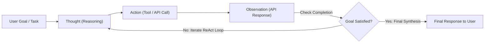

[Home](../README.md) > [01-ai-literacy](README.md) > 06_agents_and_architecture.md

# 06. AI Agents, Tool Calling & Structured System Architectures

## Learn

### 1. What is an AI Agent?
- **1-Line Definition**: An AI Agent is an autonomous system that uses an LLM as its central reasoning engine to perceive its environment, break down complex goals, choose and call external tools, and iteratively complete tasks without constant human prompting.
- **The 4 Core Pillars of an Agent**:
  1. **Brain**: The foundation LLM generating thoughts, decisions, and evaluations.
  2. **Planning**: Decomposing large goals into subtasks (e.g. Plan-and-Solve, Reflexion).
  3. **Memory**: Short-term (in-context conversation) and Long-term (vector database past episodic memory).
  4. **Tools / Actuators**: External APIs, SQL database connectors, Python interpreters, and web scrapers.
- **Real-Life Analogy**: A standard chatbot is a consultant giving advice on the phone. An **AI Agent** is an executive assistant who takes your flight booking request, checks your calendar, logs into the airline API, compares prices, books the ticket, and adds it to your calendar.

### 2. The ReAct Framework (Reason + Act)
- Rather than outputting actions blindly, the model interleaves reasoning and execution:
  - **Thought**: What is the current situation and what information do I need?
  - **Action**: Call a specific registered tool (e.g. `query_database(user_id=402)`).
  - **Observation**: Output returned by the execution runtime.
  - **Thought**: Analyze the observation to determine next step or final response.

### 3. Function Calling & Guided Structured Output
- **Function Calling**: The developer provides JSON schemas defining available tools. When a user asks a query, the LLM emits a JSON object matching the function signature (e.g. `{"tool": "get_weather", "args": {"city": "Paris"}}`). The model itself *does not execute code*—the host application executes it and returns the output to the LLM.
- **Guided Decoding / Grammar Masking**: At each generation step, the engine masks out logits for any tokens that would violate the strict JSON schema grammar, guaranteeing 100% syntactically valid JSON outputs without parser crashes.

---

## Practice
### AI-019: Downstream JSON Parser Crashes

**Tag**: [CHAT] | **Difficulty**: Medium | **Topic**: Structured Output

#### Question
An automated backend pipeline crashes because an LLM occasionally prepends conversational remarks ('Certainly, here is the JSON:') before the requested JSON object. What production solution permanently prevents this?

- **A**: Begging the model in the prompt to never output conversational text
- **B**: Enforcing constrained structured decoding / JSON Schema mode at the API inference level (grammar-based logit masking)
- **C**: Increasing model temperature to 1.5
- **D**: Running regex matching on user inputs

**Correct Answer**: **B**

#### Why
Prompt instructions alone cannot mathematically guarantee JSON syntax. Grammar-based constrained decoding restricts vocabulary logits at each generation step, mathematically guaranteeing 100% compliant JSON parseable by downstream systems.

- **5-Second Shortcut**: Constrained decoding / JSON mode guarantees valid syntax; prompt begging fails.
- **Trap**: Relying on prompt text alone for critical machine-to-machine JSON pipelines.
- **Source**: Capgemini Candidate Exam Debriefs

---

### AI-040: RAG Coding Assistant Security Annotation Loss & Lost-in-the-Middle

**Tag**: [CHAT] | **Difficulty**: Hard | **Topic**: Attention Architecture

#### Question
In a 10,000-token repository context window containing 15 source code files, an AI coding assistant fails to detect a security vulnerability located in file 8 (in the exact center of the prompt). What phenomenon explains this?

- **A**: The U-shaped attention distribution ('Lost in the Middle') where Transformer attention heads prioritize tokens at the start and end of the context while deprioritizing the middle
- **B**: The GPU ran out of power during file 8
- **C**: File 8 was encrypted
- **D**: The compiler omitted file 8

**Correct Answer**: **A**

#### Why
Liu et al. demonstrated that Transformer performance follows a U-shaped curve across long contexts: models attend strongly to the beginning (primacy effect) and end (recency effect), while performance on facts placed in the middle degrades significantly.

- **5-Second Shortcut**: Lost in the middle = middle tokens receive lowest attention weight.
- **Trap**: Assuming attention is equally distributed across every line of a 10k-token prompt.
- **Source**: Capgemini Candidate Exam Debriefs

---

### AI-043: Structured Output & JSON Schema Enforcement

**Tag**: [VIDEO] | **Difficulty**: Easy | **Topic**: API Integration

#### Question
Which mechanism guarantees that an LLM API output can be deserialized directly into a strongly-typed Java or Python object without parsing errors?

- **A**: Setting Top-p to 1.0
- **B**: Using JSON Schema / Pydantic constrained decoding where the runtime enforces structural grammar rules during token generation
- **C**: Increasing the context window to 128k tokens
- **D**: Using prompt chaining exclusively

**Correct Answer**: **B**

#### Why
JSON Schema constrained decoding restricts the token sampling space to only those tokens that preserve grammatical conformity with the defined Pydantic or JSON schema specification.

- **5-Second Shortcut**: JSON Schema mode = 100% reliable programmatic deserialization.
- **Trap**: Trusting unconstrained natural language outputs for automated microservice APIs.
- **Source**: KN Academy Video: https://youtu.be/o5TbT3kzEnA

---

### AI-109: Function Calling Execution Responsibility

**Tag**: [PATTERN] | **Difficulty**: Easy | **Topic**: Function Calling

#### Question
When an LLM performs 'Function Calling', who actually executes the function code (e.g. running the SQL query or calling the payment API)?

- **A**: The LLM neural network executes the SQL query on its internal GPU registers
- **B**: The client application / host environment executes the function using the arguments structured by the LLM and feeds the result back
- **C**: The internet router automatically runs the code
- **D**: The tokenizer compiles the code into machine bytecode

**Correct Answer**: **B**

#### Why
The LLM is strictly a text-in, text-out neural model. It does not possess direct operating system or database access. It outputs the structured name and arguments; the client runtime executes the code and returns the observation.

- **5-Second Shortcut**: LLM chooses and structures the call; the host application executes the code.
- **Trap**: Believing the LLM directly connects to the database and runs the query itself.
- **Source**: Pattern practice: Tool execution mechanics

---

### AI-110: ReAct Framework Infinite Loop Prevention

**Tag**: [PATTERN] | **Difficulty**: Medium | **Topic**: Agent Design

#### Question
During an autonomous ReAct loop, an agent repeatedly calls the same failing search query 50 times in a row. What safeguard must be implemented?

- **A**: A hard iteration limit (e.g. max 5-10 turns) and error reflection loop
- **B**: Increasing the context window size
- **C**: Lowering GPU cooling fan speed
- **D**: Deleting the database

**Correct Answer**: **A**

#### Why
Autonomous agent workflows require defensive guardrails: a maximum turn threshold (e.g. max_iterations=5), timeout limits, and failure reflection prompts to break infinite action-observation loops.

- **5-Second Shortcut**: Always enforce max iteration limits on autonomous ReAct agent loops.
- **Trap**: Letting agents run with unlimited loop iterations. A broken tool causes runaway API costs.
- **Source**: Pattern practice: Agent guardrails

---

### AI-111: Plan-and-Solve Prompting Strategy

**Tag**: [ADDED] | **Difficulty**: Medium | **Topic**: Agent Planning

#### Question
How does 'Plan-and-Solve' prompting improve upon traditional step-by-step Chain-of-Thought for complex multi-agent tasks?

- **A**: It eliminates the need for prompt text
- **B**: It first generates a complete structured roadmap of all necessary subtasks, and then sequentially executes each subtask with dedicated verification steps
- **C**: It converts all problems into binary numbers
- **D**: It runs 10 models in parallel at all times

**Correct Answer**: **B**

#### Why
Plan-and-Solve decouples planning from execution. By laying out the comprehensive dependency plan first, the model avoids getting sidetracked during long multi-step execution chains.

- **5-Second Shortcut**: Plan first $\to$ execute each step sequentially.
- **Trap**: Mixing planning and execution in a single unstructured stream. Complex tasks derail easily.
- **Source**: Added practice: Agent planning paradigms

---

### AI-112: Grammar-Guided Decoding Logit Masking

**Tag**: [PATTERN] | **Difficulty**: Hard | **Topic**: Structured Decoding

#### Question
How does Grammar-Guided Decoding physically prevent an LLM from generating an invalid character in a JSON string?

- **A**: It re-trains the model weights during each token pass
- **B**: It parses the partially generated text against a Context-Free Grammar (CFG) and sets the logits of all invalid next tokens to $-\infty$ before the softmax step
- **C**: It deletes invalid words after generation finishes
- **D**: It lowers the temperature to 0.0

**Correct Answer**: **B**

#### Why
Logit masking tracks state in a grammar state machine. If the model is expecting a key name, tokens like numbers or closing brackets are masked to $-\infty$. When softmax is applied, the probability of selecting an illegal token is exactly zero.

- **5-Second Shortcut**: Logit masking: sets logits of grammar-violating tokens to $-\infty$ before softmax.
- **Trap**: Assuming post-generation regex parsing is the same as grammar decoding. Grammar decoding prevents bad tokens from ever being generated.
- **Source**: Pattern practice: Constrained generation mechanics

---

### AI-113: Agent Episodic Memory via Vector Stores

**Tag**: [ADDED] | **Difficulty**: Medium | **Topic**: Agent Memory

#### Question
Why do long-running autonomous agents store past task reflections in an external vector database rather than keeping everything in the prompt context?

- **A**: Vector databases cost more money
- **B**: The prompt context window is limited in size and cost-prohibitive for thousands of historical actions; vector search allows dynamic retrieval of only relevant past experiences
- **C**: Embeddings run faster than CPU memory
- **D**: LLMs cannot remember text for more than 5 seconds

**Correct Answer**: **B**

#### Why
Agent episodic memory requires long-term persistence. Storing past plans and outcomes in a vector database allows the agent to retrieve similar past mistakes or solutions on-demand without bloating the active prompt context.

- **5-Second Shortcut**: Vector store = long-term episodic memory for autonomous agents.
- **Trap**: Stuffing 100 past interaction logs into the active prompt. It overflows context and degrades attention.
- **Source**: Added practice: Agent memory architectures

---

### AI-114: Supervisor-Worker Multi-Agent Pattern

**Tag**: [PATTERN] | **Difficulty**: Medium | **Topic**: Multi-Agent Systems

#### Question
In a multi-agent software engineering framework, what is the role of the 'Supervisor' agent?

- **A**: To compile the C++ source code
- **B**: To parse the initial user request, decompose it into modular tasks, delegate them to specialized worker agents (e.g. Coder, Tester, Documenter), and synthesize final deliverables
- **C**: To handle user billing payments
- **D**: To reset the GPU server

**Correct Answer**: **B**

#### Why
The supervisor agent acts as an orchestrator. It manages task dispatch, evaluates worker agent outputs, routes feedback for code revisions, and decides when the overall user goal is successfully satisfied.

- **5-Second Shortcut**: Supervisor = orchestrates, delegates to specialized workers, and validates final output.
- **Trap**: Having 5 worker agents talk to each other simultaneously without a centralized coordinator. Chaos ensues.
- **Source**: Pattern practice: Multi-agent coordination

---

### AI-115: Self-Reflexion in Autonomous Agents

**Tag**: [ADDED] | **Difficulty**: Hard | **Topic**: Agent Self-Correction

#### Question
How does the 'Reflexion' framework enable autonomous agents to self-correct after failing a task?

- **A**: It reboots the server operating system
- **B**: The agent evaluates its execution trace against feedback or test failures, generates a natural language self-critique summarizing why it failed, and stores this reflection in memory to guide the next trial
- **C**: It deletes the user account
- **D**: It reduces temperature to zero

**Correct Answer**: **B**

#### Why
Shinn et al. introduced Reflexion: when an agent's code fails automated unit tests, it generates a verbal self-critique ('I failed because I forgot to check for empty strings') and incorporates this critique as context in the subsequent retry attempt.

- **5-Second Shortcut**: Reflexion = verbal self-critique from errors stored as context for retries.
- **Trap**: Assuming agents need backpropagation to learn from mistakes. Natural language reflection in context achieves rapid adaptation.
- **Source**: Added practice: Agent self-correction architectures

---

### AI-116: Semantic Router Pattern

**Tag**: [PATTERN] | **Difficulty**: Medium | **Topic**: System Architecture

#### Question
What is the primary function of a 'Semantic Router' deployed in front of an enterprise LLM gateway?

- **A**: Routing physical Ethernet cables
- **B**: Classifying user query embeddings against pre-defined intent clusters to route the request to the optimal specialized model or deterministic handler instantly
- **C**: Encrypting network packets using TLS
- **D**: Translating prompts into binary

**Correct Answer**: **B**

#### Why
A semantic router compares the query embedding against vector clusters representing intents (e.g. 'coding', 'chitchat', 'billing'). It routes the query to an inexpensive small model, a large reasoning model, or a hardcoded database lookup in sub-10 milliseconds.

- **5-Second Shortcut**: Semantic Router = fast vector-based intent classification for intelligent model routing.
- **Trap**: Sending every simple query to the largest, most expensive LLM. Routing saves 80% of costs.
- **Source**: Pattern practice: Gateway optimization

---

### AI-117: Tool Definition via JSON Schema

**Tag**: [ADDED] | **Difficulty**: Easy | **Topic**: Function Calling Specifications

#### Question
When registering a tool for an LLM agent, which field in the JSON Schema is most critical for helping the model understand *when* to invoke the tool?

- **A**: `"type": "object"`
- **B**: `"description": "Fetches real-time stock quotes given a ticker symbol"`
- **C**: `"additionalProperties": false`
- **D**: `"version": 1.0`

**Correct Answer**: **B**

#### Why
The `description` field is read directly by the LLM's attention mechanism to evaluate whether the tool matches the user's intent. Clear, unambiguous descriptions are essential for accurate tool selection.

- **5-Second Shortcut**: Tool selection depends on clear natural language `description` strings.
- **Trap**: Leaving the tool description blank or generic. The model won't know when to call it.
- **Source**: Added practice: Tool definition standards

---

### AI-118: Human-in-the-Loop Tool Approval Pattern

**Tag**: [PATTERN] | **Difficulty**: Easy | **Topic**: Agent Safety

#### Question
When building an agent with database write permissions (`DROP TABLE`, `UPDATE_SALARY`), what architectural pattern is mandatory for enterprise security?

- **A**: Running the agent at 3 AM
- **B**: Implementing a Human-in-the-Loop (HITL) approval pause where destructive actions require explicit user confirmation before host execution
- **C**: Using temperature = 0.9
- **D**: Running on Linux instead of Windows

**Correct Answer**: **B**

#### Why
Destructive, state-changing, or financial actions must never execute fully autonomously. The agent generates the proposed tool payload, pauses execution, and prompts a human operator for cryptographic or UI approval before execution.

- **5-Second Shortcut**: Destructive actions require explicit Human-in-the-Loop authorization.
- **Trap**: Allowing agents autonomous write permissions to production databases without human verification.
- **Source**: Pattern practice: Agent security controls

---

### AI-050: Multi-Turn Query Rewriting & Contextualization

**Tag**: [VIDEO] | **Difficulty**: Medium | **Topic**: Conversational RAG

#### Question
User Turn 1: 'What is Capgemini's leave policy?' Assistant answers. User Turn 2: 'How many days do I get for it?' Why will a naive vector search for Turn 2 fail?

- **A**: The database only accepts single-word queries
- **B**: Turn 2 contains an anaphoric pronoun ('it') lacking explicit context ('Capgemini leave policy'); query rewriting must resolve references before vector retrieval
- **C**: The word 'days' cannot be embedded
- **D**: Vector search cannot process questions

**Correct Answer**: **B**

#### Why
In conversational search, follow-up queries reference prior turns using pronouns ('it', 'that'). A standalone embedding of 'How many days do I get for it?' misses the subject. A query contextualizer rewrites it to 'How many days of leave does Capgemini grant?' before searching.

- **5-Second Shortcut**: Multi-turn conversational RAG requires query contextualization/rewriting.
- **Trap**: Passing pronoun-heavy follow-up questions directly to vector search without context resolution.
- **Source**: KN Academy Video: https://youtu.be/o5TbT3kzEnA

---

### AI-081: Parent-Document Retrieval Pattern

**Tag**: [PATTERN] | **Difficulty**: Medium | **Topic**: Advanced RAG

#### Question
What is the core benefit of the 'Parent-Document Retriever' (or Small-to-Big) pattern in RAG?

- **A**: It reduces database storage costs by 90%
- **B**: It uses small chunks (e.g. 100 tokens) for highly accurate vector embedding matching, but returns the larger parent chunk (e.g. 1000 tokens) to the LLM to provide complete surrounding context
- **C**: It allows parents to monitor child queries
- **D**: It replaces the vector database with an Excel spreadsheet

**Correct Answer**: **B**

#### Why
Small chunks produce distinct, accurate embedding vectors without semantic dilution. However, LLMs generate better answers when given full context. Small-to-Big indexing matches on small child chunks but injects the larger parent document.

- **5-Second Shortcut**: Match on small chunks for precision; send large parent chunks to LLM for context.
- **Trap**: Assuming the chunk used for embedding search must be the exact same chunk sent to the LLM.
- **Source**: Pattern practice: Advanced RAG retrieval patterns

---

### AI-079: HNSW M and efSearch Parameters

**Tag**: [PATTERN] | **Difficulty**: Hard | **Topic**: Vector Database Tuning

#### Question
In HNSW vector indexing, what is the trade-off of increasing the `efSearch` parameter during query execution?

- **A**: It decreases query memory and reduces accuracy
- **B**: It increases recall (search accuracy) by evaluating more candidate neighbors at the cost of higher query latency
- **C**: It permanently rebuilds the graph from scratch
- **D**: It limits the maximum vector dimension to 128

**Correct Answer**: **B**

#### Why
`efSearch` controls the size of the dynamic candidate list evaluated during graph traversal. Higher `efSearch` explores more branches, finding closer approximate neighbors but increasing CPU/GPU search time.

- **5-Second Shortcut**: Higher `efSearch` = higher recall accuracy, slightly higher latency.
- **Trap**: Thinking HNSW accuracy cannot be tuned at query time. `efSearch` controls runtime accuracy vs speed.
- **Source**: Pattern practice: Vector database operational tuning

---

## Sources for This File
- KN Academy Video: [Capgemini Complete Recruitment Pattern](https://youtu.be/o5TbT3kzEnA)
- KN Academy Playlist: [Capgemini 2026/2027 Masterclass](https://www.youtube.com/watch?v=mLaYLknw4KU&list=PLGFjgYQtw1UjDBEkL2Edqej2kXbxGA1NO)
- Gemini candidate chat archives in `Capgemini Candidate Exam Debriefs`

---

Previous: [05_fine_tuning_and_evals.md](05_fine_tuning_and_evals.md) | Next: [07_failure_modes_and_traps.md](07_failure_modes_and_traps.md)
