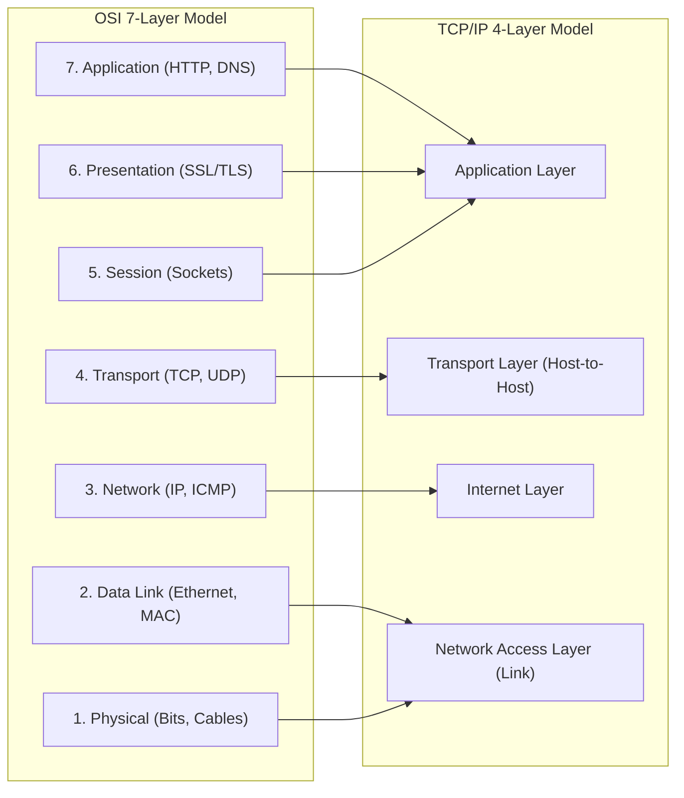

[Home](../README.md) > [02-cs-fundamentals](README.md) > 01_networking.md

# 01. Computer Networks & Subnetting

## Learn

### 1. The OSI vs. TCP/IP Architecture
- **OSI 7 Layers**:
  1. *Physical*: Bits over wire (Hubs, Cables).
  2. *Data Link*: Frames, MAC addresses, error detection (Switches).
  3. *Network*: Packets, IP addresses, routing (Routers).
  4. *Transport*: End-to-end delivery, ports (TCP, UDP).
  5. *Session*: Session setup and checkpointing.
  6. *Presentation*: Encryption, data formatting (SSL/TLS).
  7. *Application*: User protocols (HTTP, DNS, SMTP).
- **Mnemonic**: "**P**lease **D**o **N**ot **T**hrow **S**ausage **P**izza **A**way".

### 2. TCP vs. UDP Mechanics
- **TCP**: Connection-oriented via 3-way handshake (`SYN` $\to$ `SYN-ACK` $\to$ `ACK`). Reliable, ordered, with flow and congestion control.
- **UDP**: Connectionless, unreliable, unordered, lightweight. Used in VoIP, gaming, DNS, and video streaming.

### 3. Subnetting & CIDR Formula
- Total IP addresses in `/n` = $2^{32 - n}$.
- **Usable Host Addresses** = $2^{32 - n} - 2$ (subtract Network ID and Broadcast Address).
- **Quick CIDR Table**:
  - `/24` $\to 254$ hosts ($255.255.255.0$)
  - `/25` $\to 126$ hosts ($255.255.255.128$)
  - `/26` $\to 62$ hosts ($255.255.255.192$)
  - `/27` $\to 30$ hosts ($255.255.255.224$)
  - `/28` $\to 14$ hosts ($255.255.255.240$)
  - `/29` $\to 6$ hosts ($255.255.255.248$)
  - `/30` $\to 2$ hosts ($255.255.255.252$)

---

## Practice
### NET-001: Usable Host Calculation in Subnetting

**Tag**: [VIDEO] | **Difficulty**: Easy | **Topic**: Subnetting

#### Question
How many assignable, usable host IP addresses are available in a `/26` IPv4 subnet?

- **A**: 64
- **B**: 62
- **C**: 30
- **D**: 126

**Correct Answer**: **B**

#### Why
IPv4 has 32 bits total. A `/26` leaves $32 - 26 = 6$ host bits ($2^6 = 64$ total addresses). Subtracting the Network ID (all 0s) and Broadcast Address (all 1s) leaves $64 - 2 = 62$ usable IPs.

- **5-Second Shortcut**: Usable hosts = $2^{32-n} - 2$. For /26: $2^6 - 2 = 62$.
- **Trap**: Forgetting to subtract 2 for Network ID and Broadcast Address.
- **Source**: KN Academy Video: https://youtu.be/o5TbT3kzEnA

---

### NET-002: Subnetting Host Capacity for Given Network Size

**Tag**: [ADDED] | **Difficulty**: Easy | **Topic**: CIDR Notation

#### Question
A branch office needs to connect exactly 28 workstations with unique IPs. What is the smallest subnet mask that works?

- **A**: /28
- **B**: /27
- **C**: /26
- **D**: /25

**Correct Answer**: **B**

#### Why
A `/28` subnet provides $2^4 - 2 = 14$ hosts, which is insufficient. A `/27` provides $2^5 - 2 = 30$ usable hosts, accommodating 28 workstations with minimal wasted addresses.

- **5-Second Shortcut**: Need 28 hosts: $2^h - 2 \ge 28 \implies h=5 \implies 32 - 5 = /27$.
- **Trap**: Choosing /28 because $2^4 = 16$, forgetting $16 - 2 = 14 < 28$.
- **Source**: Capgemini Candidate Exam Debriefs

---

### NET-003: Subnetting Network ID & Broadcast Address Calculation

**Tag**: [ADDED] | **Difficulty**: Medium | **Topic**: IP Addressing

#### Question
For IP `192.168.10.138` with mask `255.255.255.192` (`/26`), what are the Network ID and Broadcast Address?

- **A**: Network: 192.168.10.0, Broadcast: 192.168.10.255
- **B**: Network: 192.168.10.128, Broadcast: 192.168.10.191
- **C**: Network: 192.168.10.64, Broadcast: 192.168.10.127
- **D**: Network: 192.168.10.138, Broadcast: 192.168.10.192

**Correct Answer**: **B**

#### Why
Block size is $256 - 192 = 64$. Subnets in 4th octet are 0, 64, 128, 192. The value 138 falls in range 128-191. Network ID is .128 and Broadcast is .191.

- **5-Second Shortcut**: Block size = 64. Subnet ranges: 0-63, 64-127, 128-191. 138 is in 128-191.
- **Trap**: Assuming default Class C boundaries 0 and 255.
- **Source**: Capgemini Candidate Exam Debriefs

---

### NET-004: TCP 3-Way Handshake Connection Establishment

**Tag**: [ADDED] | **Difficulty**: Easy | **Topic**: Transport Layer

#### Question
Which packet flag sequence establishes a reliable TCP connection?

- **A**: ACK $\to$ SYN $\to$ SYN-ACK
- **B**: SYN $\to$ SYN-ACK $\to$ ACK
- **C**: FIN $\to$ ACK $\to$ FIN-ACK
- **D**: SYN $\to$ ACK $\to$ FIN

**Correct Answer**: **B**

#### Why
TCP opens via 3 steps: Client sends SYN (synchronize). Server replies with SYN-ACK. Client sends ACK (acknowledgment). Data transfer begins only after this handshake.

- **5-Second Shortcut**: SYN $\to$ SYN-ACK $\to$ ACK.
- **Trap**: Confusing connection setup (SYN) with teardown (FIN).
- **Source**: Added practice: Standard networking protocols

---

### NET-005: TCP 4-Way Handshake Connection Termination

**Tag**: [PATTERN] | **Difficulty**: Medium | **Topic**: Transport Layer

#### Question
How is a standard TCP connection gracefully closed between two endpoints?

- **A**: RST packet broadcast
- **B**: FIN $\to$ ACK $\to$ FIN $\to$ ACK
- **C**: Immediate disconnection without notification
- **D**: SYN-ACK in reverse

**Correct Answer**: **B**

#### Why
TCP closes in 4 steps because it is full-duplex: Active closer sends FIN, peer replies ACK. Peer finishes remaining sends, sends its own FIN, and active closer replies final ACK.

- **5-Second Shortcut**: FIN $\to$ ACK $\to$ FIN $\to$ ACK (4 steps total).
- **Trap**: Assuming TCP closes in 3 steps like opening.
- **Source**: Pattern practice: TCP state transitions

---

### NET-006: DNS Resolution Protocol (UDP vs TCP)

**Tag**: [ADDED] | **Difficulty**: Easy | **Topic**: Application Layer

#### Question
Which transport protocol is used for standard client DNS queries, and why?

- **A**: TCP on port 80 for encryption
- **B**: UDP on port 53 for speed and minimal overhead
- **C**: HTTP on port 443
- **D**: ICMP ping

**Correct Answer**: **B**

#### Why
Standard DNS lookups fit in a single packet. UDP avoids 3-way handshake delay, making lookups fast. (TCP is used only for zone transfers or responses over 512 bytes).

- **5-Second Shortcut**: DNS = UDP port 53 (fast, stateless).
- **Trap**: Assuming DNS always uses TCP for reliability.
- **Source**: Added practice: Application layer fundamentals

---

### NET-007: OSI Layer for MAC Addressing

**Tag**: [ADDED] | **Difficulty**: Easy | **Topic**: Data Link Layer

#### Question
At which OSI layer do MAC (Media Access Control) addresses operate?

- **A**: Physical Layer (Layer 1)
- **B**: Data Link Layer (Layer 2)
- **C**: Network Layer (Layer 3)
- **D**: Transport Layer (Layer 4)

**Correct Answer**: **B**

#### Why
Layer 2 (Data Link) handles framing and physical hardware addressing (MAC addresses) across a local segment using switches.

- **5-Second Shortcut**: MAC = Layer 2 (Data Link); IP = Layer 3 (Network).
- **Trap**: Thinking MAC is Layer 1 because network cards are physical.
- **Source**: Added practice: OSI layer roles

---

### NET-008: Address Resolution Protocol (ARP) Function

**Tag**: [PATTERN] | **Difficulty**: Medium | **Topic**: Network Protocols

#### Question
What is the core function of the Address Resolution Protocol (ARP)?

- **A**: Translating domain names into IP addresses
- **B**: Resolving a known IPv4 address into its physical MAC address on a local network
- **C**: Assigning dynamic IP addresses
- **D**: Routing packets across wide networks

**Correct Answer**: **B**

#### Why
When a host needs to send a packet to an IP on the local subnet, it broadcasts an ARP request. The owner of that IP replies with its Layer 2 MAC address.

- **5-Second Shortcut**: ARP maps IP $\to$ MAC; DNS maps Domain $\to$ IP.
- **Trap**: Confusing ARP with DNS.
- **Source**: Pattern practice: Local segment resolution

---

### NET-009: TCP Sliding Window Flow Control

**Tag**: [PATTERN] | **Difficulty**: Medium | **Topic**: Flow Control

#### Question
What is the purpose of the 'Receive Window' (rwnd) field in TCP headers?

- **A**: Measuring cable latency
- **B**: Preventing a fast sender from overflowing a slow receiver's buffer
- **C**: Preventing router congestion across the internet
- **D**: Encrypting payloads

**Correct Answer**: **B**

#### Why
The receiver advertises available buffer space in `rwnd`. The sender cannot send more bytes than `rwnd` without an ACK, providing end-to-end Flow Control.

- **5-Second Shortcut**: Flow control (`rwnd`) protects the receiver; Congestion control protects the network.
- **Trap**: Confusing Flow Control with Congestion Control.
- **Source**: Pattern practice: Transport layer mechanics

---

### NET-010: HTTP Status Codes (4xx vs 5xx)

**Tag**: [ADDED] | **Difficulty**: Easy | **Topic**: HTTP Protocol

#### Question
Which HTTP code indicates a request lacking valid authentication credentials?

- **A**: 500 Internal Server Error
- **B**: 401 Unauthorized
- **C**: 403 Forbidden
- **D**: 404 Not Found

**Correct Answer**: **B**

#### Why
4xx codes indicate client errors. 401 Unauthorized means authentication credentials are missing or invalid. 403 Forbidden means credentials are valid but access is denied.

- **5-Second Shortcut**: 401 = Missing/bad login; 403 = Authenticated but no permission.
- **Trap**: Confusing 401 (not logged in) with 403 (logged in, but forbidden).
- **Source**: Added practice: Web protocols

---

### NET-011: HTTPS TLS Handshake Encryption Types

**Tag**: [PATTERN] | **Difficulty**: Hard | **Topic**: Security Protocols

#### Question
How does HTTPS use asymmetric and symmetric encryption together?

- **A**: Asymmetric for all transmitted packets
- **B**: Asymmetric for server authentication and session key exchange; symmetric for bulk data transfer
- **C**: Symmetric encryption exclusively
- **D**: Plain MD5 hashing

**Correct Answer**: **B**

#### Why
Asymmetric encryption (RSA/ECC) is slow and used only during the handshake to verify identity and exchange a secret key. Fast symmetric encryption (AES) then encrypts all actual payload data.

- **5-Second Shortcut**: Handshake = Asymmetric; Bulk Data = Symmetric (AES).
- **Trap**: Assuming HTTPS uses slow RSA for all data.
- **Source**: Pattern practice: Transport security protocols

---

### NET-012: Difference Between Router and Switch

**Tag**: [ADDED] | **Difficulty**: Easy | **Topic**: Hardware Devices

#### Question
What is the difference in operating layer between a standard network switch and a router?

- **A**: Switch is Layer 2 (MAC frames); Router is Layer 3 (IP packets)
- **B**: Switch is Layer 4; Router is Layer 1
- **C**: Switch routes between cities; Router works in one room
- **D**: Router cannot read IP addresses

**Correct Answer**: **A**

#### Why
Switches forward Layer 2 frames within a single local network using MAC tables. Routers forward Layer 3 packets between different networks using IP routing tables.

- **5-Second Shortcut**: Switch = Layer 2 (MAC within LAN); Router = Layer 3 (IP between LANs).
- **Trap**: Thinking switches and routers operate at the same layer.
- **Source**: Added practice: Networking hardware

---

### NET-013: CIDR Subnet Mask Representation

**Tag**: [ADDED] | **Difficulty**: Easy | **Topic**: CIDR Math

#### Question
What is the dotted-decimal subnet mask for a `/28` network?

- **A**: 255.255.255.224
- **B**: 255.255.255.240
- **C**: 255.255.255.248
- **D**: 255.255.255.252

**Correct Answer**: **B**

#### Why
A `/28` mask has 28 ones and 4 zeros. Fourth octet has 4 ones: $128 + 64 + 32 + 16 = 240$. Mask is $255.255.255.240$.

- **5-Second Shortcut**: /28: 4 host bits $\implies 256 - 16 = 240$.
- **Trap**: Selecting 224 (/27) instead of 240 (/28).
- **Source**: Added practice: CIDR conversion

---

### NET-014: DHCP DORA Process

**Tag**: [PATTERN] | **Difficulty**: Medium | **Topic**: Network Services

#### Question
What is the 4-step sequence used by DHCP to allocate an IP address?

- **A**: Discover $\to$ Offer $\to$ Request $\to$ Acknowledge (DORA)
- **B**: Demand $\to$ Order $\to$ Receive $\to$ Apply
- **C**: Detect $\to$ Open $\to$ Register $\to$ Accept
- **D**: Direct $\to$ Obtain $\to$ Reassign $\to$ Allocate

**Correct Answer**: **A**

#### Why
Client broadcasts Discover. Server replies with Offer. Client broadcasts Request to accept. Server responds with Acknowledge (DORA).

- **5-Second Shortcut**: DORA: Discover $\to$ Offer $\to$ Request $\to$ Acknowledge.
- **Trap**: Swapping the order of Request and Offer.
- **Source**: Pattern practice: Dynamic IP allocation

---

### NET-015: ICMP Protocol & The Ping Command

**Tag**: [ADDED] | **Difficulty**: Easy | **Topic**: Diagnostic Protocols

#### Question
Which Layer 3 protocol is used by `ping` and `traceroute`?

- **A**: SNMP
- **B**: ICMP (Internet Control Message Protocol)
- **C**: IGMP
- **D**: BGP

**Correct Answer**: **B**

#### Why
Ping sends ICMP Echo Requests (Type 8) and listens for ICMP Echo Replies (Type 0) at Layer 3 to verify reachability and latency.

- **5-Second Shortcut**: Ping = ICMP (Layer 3, no port numbers).
- **Trap**: Assuming ping runs on TCP port 80.
- **Source**: Added practice: Network diagnostics

---

### NET-016: Traceroute Mechanism (TTL Expiry)

**Tag**: [PATTERN] | **Difficulty**: Hard | **Topic**: Packet Mechanics

#### Question
How does `traceroute` identify intermediate routers on a path?

- **A**: Querying the destination router's memory
- **B**: Sending packets with incrementing TTL (1, 2, 3...) to trigger ICMP Time Exceeded messages from each hop
- **C**: Using satellite GPS
- **D**: Scanning port 80 on all IPs

**Correct Answer**: **B**

#### Why
Each router decrements TTL by 1. When TTL reaches 0, the router drops the packet and sends back `ICMP Time Exceeded`. Incrementing TTL reveals each successive router.

- **5-Second Shortcut**: Traceroute: increment TTL $\to$ get ICMP Time Exceeded from each hop.
- **Trap**: Assuming routers append their IP to the packet payload automatically.
- **Source**: Pattern practice: Diagnostic mechanics

---

### NET-017: NAT (Network Address Translation) Mechanics

**Tag**: [ADDED] | **Difficulty**: Easy | **Topic**: Address Translation

#### Question
Why is NAT used in home and corporate routers?

- **A**: Translating IPv6 into MAC addresses
- **B**: Allowing multiple private IPs to share one public routable IP, conserving IPv4 space
- **C**: Encrypting hard drives
- **D**: Speeding up DNS

**Correct Answer**: **B**

#### Why
Private addresses (RFC 1918) cannot route over the public internet. NAT translates internal private IP/port pairs to a single public IP address.

- **5-Second Shortcut**: NAT maps many private internal IPs to one public IP.
- **Trap**: Assuming private IPs can route directly over the internet without translation.
- **Source**: Added practice: Network address translation

---

### NET-018: Private IP Address Ranges (RFC 1918)

**Tag**: [ADDED] | **Difficulty**: Medium | **Topic**: IP Standards

#### Question
Which is a non-routable private IP under RFC 1918?

- **A**: 8.8.8.8
- **B**: 172.20.14.5
- **C**: 128.0.0.1
- **D**: 208.67.222.222

**Correct Answer**: **B**

#### Why
RFC 1918 private ranges: `10.0.0.0/8`, `172.16.0.0/12` (172.16.0.0 to 172.31.255.255), and `192.168.0.0/16`. `172.20.14.5` falls inside the Class B range.

- **5-Second Shortcut**: Private ranges: 10.x, 172.16-31.x, 192.168.x.
- **Trap**: Thinking all 172.x addresses are private. Only 172.16 to 172.31 are private.
- **Source**: Added practice: RFC 1918 standards

---

### NET-019: Default Subnet Masks for IPv4 Classes

**Tag**: [ADDED] | **Difficulty**: Easy | **Topic**: Classful Networking

#### Question
What is the default subnet mask for a legacy Class B IPv4 network?

- **A**: 255.0.0.0
- **B**: 255.255.0.0 (/16)
- **C**: 255.255.255.0
- **D**: 255.255.255.240

**Correct Answer**: **B**

#### Why
Class A uses `/8` (`255.0.0.0`). Class B uses `/16` (`255.255.0.0`). Class C uses `/24` (`255.255.255.0`).

- **5-Second Shortcut**: Class A = /8, Class B = /16, Class C = /24.
- **Trap**: Confusing Class B (/16) with Class C (/24).
- **Source**: Added practice: Classful networking

---

### NET-020: Port Numbers for Common Internet Protocols

**Tag**: [ADDED] | **Difficulty**: Easy | **Topic**: Transport Ports

#### Question
Which port pair correctly lists default ports for SSH and HTTPS?

- **A**: SSH: 21, HTTPS: 80
- **B**: SSH: 22, HTTPS: 443
- **C**: SSH: 23, HTTPS: 8080
- **D**: SSH: 25, HTTPS: 53

**Correct Answer**: **B**

#### Why
SSH defaults to port 22. HTTPS defaults to port 443. (FTP is 20/21, Telnet is 23, SMTP is 25, HTTP is 80, DNS is 53).

- **5-Second Shortcut**: SSH = 22; HTTPS = 443; HTTP = 80.
- **Trap**: Confusing SSH (22) with Telnet (23) or FTP (21).
- **Source**: Added practice: Standard service ports

---

### NET-021: HTTP Keep-Alive & Persistent Connections

**Tag**: [PATTERN] | **Difficulty**: Medium | **Topic**: HTTP Protocol

#### Question
What benefit does HTTP persistent connections (`keep-alive`) provide over HTTP/1.0?

- **A**: Eliminates DNS lookup latency
- **B**: Reuses a single TCP connection for multiple HTTP requests, eliminating repeated handshake delays
- **C**: Compresses images automatically
- **D**: Encrypts cookies

**Correct Answer**: **B**

#### Why
HTTP/1.0 opened a new TCP connection for every single asset. Persistent connections keep the socket open, reusing one TCP stream for all page files.

- **5-Second Shortcut**: Keep-Alive = one TCP connection re-used for multiple HTTP requests.
- **Trap**: Thinking HTTP/1.0 reused connections by default.
- **Source**: Pattern practice: Web architecture

---

### NET-022: TCP Congestion Window & Slow Start

**Tag**: [PATTERN] | **Difficulty**: Hard | **Topic**: Congestion Control

#### Question
During TCP Slow Start, at what rate does the congestion window (`cwnd`) grow?

- **A**: Increases linearly by 1 MSS per RTT
- **B**: Doubles exponentially every RTT ($2, 4, 8, 16 \dots$) until `ssthresh` is reached
- **C**: Decreases by half
- **D**: Remains constant

**Correct Answer**: **B**

#### Why
Slow Start starts with a small window and doubles `cwnd` every Round Trip Time (adding 1 MSS per ACK) until reaching `ssthresh`, then switches to linear growth.

- **5-Second Shortcut**: Slow Start = exponential doubling; Congestion Avoidance = linear +1.
- **Trap**: Assuming Slow Start grows slowly. It grows exponentially.
- **Source**: Pattern practice: TCP congestion mechanics

---

### NET-023: Broadcast vs Multicast vs Unicast

**Tag**: [ADDED] | **Difficulty**: Easy | **Topic**: Transmission Modes

#### Question
What distinguishes Multicast from Broadcast transmission?

- **A**: Multicast sends to all hosts on the wire
- **B**: Broadcast sends to all hosts on the subnet; Multicast sends only to a subscribed group of hosts
- **C**: Broadcast is only on IPv6
- **D**: Multicast requires satellites

**Correct Answer**: **B**

#### Why
Unicast is one-to-one. Broadcast is one-to-all hosts on local network. Multicast is one-to-many (only delivered to hosts that explicitly joined that multicast group).

- **5-Second Shortcut**: Unicast = 1:1; Broadcast = 1:All; Multicast = 1:Subscribed Group.
- **Trap**: Thinking IPv6 uses broadcast. IPv6 replaced broadcast with multicast.
- **Source**: Added practice: Transmission modes

---

### NET-024: Subnetting a Subnet (/24 into four /26s)

**Tag**: [PATTERN] | **Difficulty**: Medium | **Topic**: Subnet Design

#### Question
Dividing `192.168.1.0/24` into 4 equal subnets yields what prefix length and host capacity per subnet?

- **A**: Prefix /25; 126 hosts each
- **B**: Prefix /26; 62 usable hosts each
- **C**: Prefix /27; 30 usable hosts each
- **D**: Prefix /28; 14 usable hosts each

**Correct Answer**: **B**

#### Why
To make 4 subnets, borrow $\log_2 4 = 2$ bits: $24 + 2 = /26$. Each `/26` has 6 host bits: $2^6 - 2 = 62$ usable hosts per subnet.

- **5-Second Shortcut**: 4 subnets $\implies$ borrow 2 bits: $/24 + 2 = /26 \implies 2^6 - 2 = 62$ hosts.
- **Trap**: Thinking dividing into 4 subnets borrows 4 bits. Borrow $\log_2 N$ bits.
- **Source**: Pattern practice: Subnet division calculations

---

### NET-025: VLANs & 802.1Q Trunking

**Tag**: [ADDED] | **Difficulty**: Medium | **Topic**: Switching

#### Question
What is the function of the IEEE 802.1Q standard on switch trunk links?

- **A**: Encrypting Wi-Fi passwords
- **B**: Inserting a 4-byte VLAN tag into Ethernet frames so multiple VLANs can share one physical cable
- **C**: Doubling cable bandwidth
- **D**: Replacing IP routing

**Correct Answer**: **B**

#### Why
802.1Q inserts a 12-bit VLAN tag into Ethernet frame headers across trunk links, letting switches route frames to the proper virtual LAN across a single shared link.

- **5-Second Shortcut**: 802.1Q = VLAN tagging across switch trunk links.
- **Trap**: Thinking each VLAN requires its own dedicated physical wire.
- **Source**: Added practice: Enterprise switching

---

### NET-026: Link-Local IPv6 Address Prefix

**Tag**: [ADDED] | **Difficulty**: Easy | **Topic**: IPv6 Addressing

#### Question
What prefix is reserved for auto-configured IPv6 Link-Local addresses?

- **A**: `fe80::/10`
- **B**: `2001::/16`
- **C**: `::1/128`
- **D**: `fc00::/7`

**Correct Answer**: **A**

#### Why
Every IPv6 interface automatically generates a Link-Local address starting with `fe80::/10` for communication within its local segment without a DHCP server. (`::1` is loopback).

- **5-Second Shortcut**: IPv6 Link-Local = `fe80::/10`.
- **Trap**: Confusing Link-Local (`fe80::`) with Loopback (`::1`).
- **Source**: Added practice: IPv6 standards

---

### NET-027: MTU & IP Fragmentation

**Tag**: [PATTERN] | **Difficulty**: Hard | **Topic**: Packet Sizing

#### Question
What happens when a 2,000-byte packet hits a 1,500-byte MTU interface with the DF (Don't Fragment) flag set?

- **A**: Packet is compressed with GZIP
- **B**: Router drops packet and sends back `ICMP Fragmentation Needed`
- **C**: Packet is split into two 1,000-byte packets
- **D**: Packet passes unfragmented

**Correct Answer**: **B**

#### Why
If packet > MTU and DF=1, the router cannot fragment. It drops the packet and sends an ICMP error, allowing the sender to lower packet size (Path MTU Discovery).

- **5-Second Shortcut**: Packet > MTU and DF=1 $\implies$ Drop + ICMP Fragmentation Needed.
- **Trap**: Assuming routers fragment all packets. DF=1 forbids fragmentation.
- **Source**: Pattern practice: Packet fragmentation mechanics

---

### NET-028: RIP Hop Count Limit

**Tag**: [ADDED] | **Difficulty**: Easy | **Topic**: Routing Protocols

#### Question
What is the maximum hop count in RIP before a route is declared unreachable?

- **A**: 15 hops (16 = unreachable)
- **B**: 255 hops
- **C**: 100 hops
- **D**: Unlimited

**Correct Answer**: **A**

#### Why
RIP uses hop count as its metric. To prevent count-to-infinity routing loops, RIP caps hops at 15; a count of 16 means unreachable/infinity.

- **5-Second Shortcut**: RIP max hops = 15; 16 = unreachable.
- **Trap**: Guessing 255. RIP has a strict 15-hop limit.
- **Source**: Added practice: Distance-vector routing

---

### NET-029: BGP Autonomous Systems

**Tag**: [ADDED] | **Difficulty**: Medium | **Topic**: Routing Protocols

#### Question
Which routing protocol routes traffic between distinct Autonomous Systems (AS) across the global Internet?

- **A**: OSPF
- **B**: BGP (Border Gateway Protocol)
- **C**: RIP
- **D**: IS-IS

**Correct Answer**: **B**

#### Why
OSPF and RIP are Interior Gateway Protocols for routing inside one organization. BGP is the Exterior Gateway Protocol that connects different Autonomous Systems on the global internet.

- **5-Second Shortcut**: BGP = routes traffic BETWEEN Autonomous Systems across the internet.
- **Trap**: Confusing internal OSPF with external internet routing BGP.
- **Source**: Added practice: Internet routing architecture

---

### NET-030: SYN Flood Attack & SYN Cookies

**Tag**: [PATTERN] | **Difficulty**: Hard | **Topic**: Network Security

#### Question
How does the 'SYN Cookie' defense protect servers during a SYN Flood DDoS attack?

- **A**: Blocks all incoming TCP connections
- **B**: Encodes connection state into the SYN-ACK sequence number, allocating zero server memory until the final ACK arrives
- **C**: Prompts users with a CAPTCHA
- **D**: Switches the server to UDP

**Correct Answer**: **B**

#### Why
In a SYN flood, bogus SYNs fill the server's backlog queue. SYN Cookies hash client IP/port and timestamp into the sequence number, allocating zero memory until the handshake finishes.

- **5-Second Shortcut**: SYN Cookies = allocate zero memory until 3-way handshake finishes.
- **Trap**: Assuming servers must allocate memory for every incoming SYN.
- **Source**: Pattern practice: TCP security defenses

---

## Sources for This File
- KN Academy Video: [Capgemini Complete Recruitment Pattern](https://youtu.be/o5TbT3kzEnA)
- - Gemini candidate chat archives in `Capgemini Candidate Exam Debriefs`

---

Previous: [02-cs-fundamentals README](README.md) | Next: [02_sql.md](02_sql.md)
