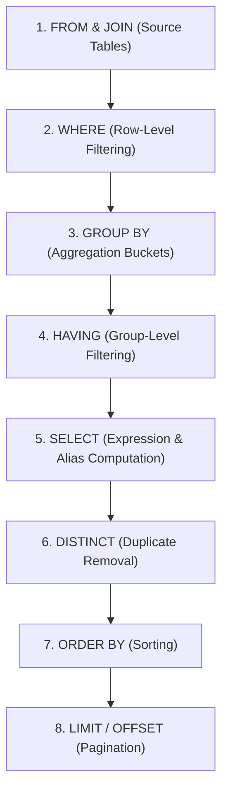

[Home](../README.md) > [02-cs-fundamentals](README.md) > 02_sql.md

# 02. Structured Query Language (SQL)

## Learn

### 1. SQL Execution Order (Logical Query Processing)

### 2. Three-Valued Logic & The NULL Trap
- In SQL, logic has 3 values: `TRUE`, `FALSE`, and `UNKNOWN`.
- Any comparison with `NULL` using `=`, `<>`, `<`, `>` evaluates to `UNKNOWN`, never `TRUE` or `FALSE`!
  - `NULL = NULL` $\to$ `UNKNOWN`.
  - `NULL <> 5` $\to$ `UNKNOWN`.
- A `WHERE` clause filters out any row where the condition is NOT `TRUE` (meaning rows evaluating to `FALSE` or `UNKNOWN` are dropped).
- To check for NULL, always use `IS NULL` or `IS NOT NULL`.

### 3. WHERE vs. HAVING
- **`WHERE`**: Filters raw rows *before* grouping. Cannot contain aggregate functions (e.g. `WHERE AVG(salary) > 5000` is illegal!).
- **`HAVING`**: Filters grouped rows *after* grouping. Operates on aggregated values (e.g. `HAVING COUNT(*) > 5`).

### 4. COUNT(*) vs. COUNT(column)
- `COUNT(*)`: Counts every row in the table, including rows where columns are `NULL`.
- `COUNT(col)`: Counts only rows where `col IS NOT NULL`.
- `SUM(col)`, `AVG(col)`, `MIN(col)`, `MAX(col)` ignore `NULL` values.

---

## Practice
### SQL-001: SQL Three-Valued Logic (NULL Comparison)

**Tag**: [VIDEO] | **Difficulty**: Medium | **Topic**: NULL Logic

#### Question
Table `Employees` has 10 rows. Column `commission` is NULL for 4 rows and positive for 6 rows. How many rows are returned by: `SELECT * FROM Employees WHERE commission = NULL;`?

- **A**: 4 rows
- **B**: 0 rows
- **C**: 6 rows
- **D**: 10 rows

**Correct Answer**: **B**

#### Why
In SQL, comparing any value with NULL using `=` produces `UNKNOWN`. The `WHERE` clause only returns rows where the filter evaluates to `TRUE`. Since `commission = NULL` evaluates to `UNKNOWN` for every row, 0 rows are returned. Use `WHERE commission IS NULL` instead.

- **5-Second Shortcut**: `col = NULL` always returns 0 rows. Use `col IS NULL`.
- **Trap**: Thinking `NULL = NULL` returns TRUE for the 4 rows with NULLs.
- **Source**: KN Academy Video: https://youtu.be/o5TbT3kzEnA

---

### SQL-002: Aggregation Filtering: WHERE vs HAVING Clause

**Tag**: [VIDEO] | **Difficulty**: Easy | **Topic**: Query Filtering

#### Question
Which SQL statement correctly finds all departments with an average salary exceeding $75,000?

- **A**: SELECT dept_id FROM Emp WHERE AVG(salary) > 75000 GROUP BY dept_id;
- **B**: SELECT dept_id FROM Emp GROUP BY dept_id HAVING AVG(salary) > 75000;
- **C**: SELECT dept_id FROM Emp WHERE salary > 75000;
- **D**: SELECT dept_id FROM Emp GROUP BY dept_id WHERE AVG(salary) > 75000;

**Correct Answer**: **B**

#### Why
Aggregate functions like `AVG()` cannot appear in a `WHERE` clause because `WHERE` filters rows before grouping occurs. To filter aggregated results, the condition must appear in a `HAVING` clause after `GROUP BY`.

- **5-Second Shortcut**: Aggregate filter = `HAVING`. Raw row filter = `WHERE`.
- **Trap**: Putting `AVG(salary) > 75000` in the `WHERE` clause.
- **Source**: KN Academy Video: https://youtu.be/o5TbT3kzEnA

---

### SQL-003: Second Highest Salary in SQL

**Tag**: [VIDEO] | **Difficulty**: Medium | **Topic**: Subqueries

#### Question
Which query reliably returns the exact second highest distinct salary from the `Employee` table without using window functions?

- **A**: SELECT MAX(salary) FROM Employee WHERE salary < (SELECT MAX(salary) FROM Employee);
- **B**: SELECT salary FROM Employee ORDER BY salary DESC LIMIT 2;
- **C**: SELECT salary FROM Employee WHERE ROWNUM = 2;
- **D**: SELECT MIN(salary) FROM Employee WHERE salary > MAX(salary);

**Correct Answer**: **A**

#### Why
The inner query `(SELECT MAX(salary) FROM Employee)` finds the overall maximum salary. The outer query finds the maximum salary strictly less than that peak, which is guaranteed to be the second highest distinct salary.

- **5-Second Shortcut**: 2nd highest = `MAX(salary) WHERE salary < MAX(salary)`.
- **Trap**: Using `LIMIT 1 OFFSET 1` without `DISTINCT`, which fails if two employees share the top salary.
- **Source**: KN Academy Video: https://youtu.be/o5TbT3kzEnA

---

### SQL-004: Self Join Mechanics & Employee-Manager Hierarchy

**Tag**: [VIDEO] | **Difficulty**: Medium | **Topic**: Joins

#### Question
Given table `Emp(emp_id, emp_name, manager_id)` where `manager_id` references `emp_id`. Which query lists every employee and their manager, including the CEO who has a NULL `manager_id`?

- **A**: SELECT e.emp_name, m.emp_name FROM Emp e INNER JOIN Emp m ON e.manager_id = m.emp_id;
- **B**: SELECT e.emp_name, m.emp_name FROM Emp e LEFT JOIN Emp m ON e.manager_id = m.emp_id;
- **C**: SELECT e.emp_name, m.emp_name FROM Emp e RIGHT JOIN Emp m ON e.manager_id = m.emp_id;
- **D**: SELECT e.emp_name, m.emp_name FROM Emp e CROSS JOIN Emp m;

**Correct Answer**: **B**

#### Why
An `INNER JOIN` discards any employee whose `manager_id` is NULL (such as the CEO). A `LEFT JOIN` preserves all rows from the left table (`Emp e`), outputting the CEO with a NULL manager column.

- **5-Second Shortcut**: To preserve employees with no manager (CEO), use `LEFT JOIN` on manager table.
- **Trap**: Using `INNER JOIN`, which silently drops the top-level executive.
- **Source**: KN Academy Video: https://youtu.be/o5TbT3kzEnA

---

### SQL-005: SQL Three-Valued Logic: NULL Arithmetic & Expressions

**Tag**: [VIDEO] | **Difficulty**: Easy | **Topic**: NULL Arithmetic

#### Question
If column `bonus` is NULL for an employee with `salary = 50000`, what is the result of evaluating `salary + bonus` in standard SQL?

- **A**: 50000
- **B**: NULL
- **C**: 0
- **D**: SQL Syntax Error

**Correct Answer**: **B**

#### Why
In SQL arithmetic, any mathematical operation involving NULL evaluates to NULL (`50000 + NULL = NULL`). To treat NULL as zero, use `COALESCE(bonus, 0)` or `NVL(bonus, 0)`.

- **5-Second Shortcut**: Number + NULL = NULL. Use `COALESCE(val, 0)` to handle nulls.
- **Trap**: Assuming NULL acts as 0 in addition. In standard SQL, it poisons the result to NULL.
- **Source**: KN Academy Video: https://youtu.be/o5TbT3kzEnA

---

### SQL-006: Unmatched Rows in SQL Joins

**Tag**: [ADDED] | **Difficulty**: Easy | **Topic**: Joins

#### Question
Table `Orders` has 100 rows. Table `Customers` has 50 rows. Every order links to a valid customer, but 10 customers have placed zero orders. How many rows are returned by: `SELECT * FROM Customers c LEFT JOIN Orders o ON c.id = o.customer_id;`?

- **A**: 100
- **B**: 110
- **C**: 50
- **D**: 40

**Correct Answer**: **B**

#### Why
The 40 customers who placed orders match all 100 orders (100 rows). The 10 customers with zero orders are preserved by the `LEFT JOIN`, each generating 1 row with NULL order columns. Total rows = $100 + 10 = 110$.

- **5-Second Shortcut**: LEFT JOIN rows = All matched orders (100) + Unmatched left customers (10) = 110.
- **Trap**: Assuming the result is simply 100 or 50. Unmatched left rows are added to matched rows.
- **Source**: Capgemini Candidate Exam Debriefs

---

### SQL-007: DENSE_RANK() vs RANK() Window Functions

**Tag**: [PATTERN] | **Difficulty**: Medium | **Topic**: Window Functions

#### Question
Salaries are: 100, 100, 80, 70. What ranks are assigned to 80 by `RANK()` and `DENSE_RANK()` ordered by salary descending?

- **A**: RANK: 2, DENSE_RANK: 2
- **B**: RANK: 3, DENSE_RANK: 2
- **C**: RANK: 2, DENSE_RANK: 3
- **D**: RANK: 3, DENSE_RANK: 3

**Correct Answer**: **B**

#### Why
`RANK()` skips rank values after ties: 100 gets 1, 100 gets 1, 80 gets 3. `DENSE_RANK()` does not skip ranks: 100 gets 1, 100 gets 1, 80 gets 2.

- **5-Second Shortcut**: `RANK()` leaves gaps after ties (1, 1, 3); `DENSE_RANK()` has no gaps (1, 1, 2).
- **Trap**: Thinking `RANK()` and `DENSE_RANK()` behave identically.
- **Source**: Pattern practice: Window function rankings

---

### SQL-008: COUNT(*) vs COUNT(column_name)

**Tag**: [ADDED] | **Difficulty**: Easy | **Topic**: Aggregate Functions

#### Question
Table `T` has 5 rows. Column `val` contains values: `[10, NULL, 20, NULL, 30]`. What are the results of `COUNT(*)` and `COUNT(val)`?

- **A**: COUNT(*) = 3, COUNT(val) = 3
- **B**: COUNT(*) = 5, COUNT(val) = 3
- **C**: COUNT(*) = 5, COUNT(val) = 5
- **D**: COUNT(*) = 3, COUNT(val) = 5

**Correct Answer**: **B**

#### Why
`COUNT(*)` counts all physical rows in the table (5). `COUNT(column)` counts only rows where the column is NOT NULL (3 non-null values: 10, 20, 30).

- **5-Second Shortcut**: `COUNT(*)` = total rows (5); `COUNT(col)` = non-null rows (3).
- **Trap**: Assuming `COUNT(*)` ignores rows with NULL columns. `COUNT(*)` counts every row.
- **Source**: Added practice: SQL aggregation mechanics

---

### SQL-009: UNION vs UNION ALL Performance

**Tag**: [ADDED] | **Difficulty**: Easy | **Topic**: Set Operators

#### Question
Why is `UNION ALL` significantly faster than `UNION` when combining two large result sets?

- **A**: UNION ALL encrypts data
- **B**: UNION performs an expensive sorting and de-duplication pass to eliminate duplicate rows; UNION ALL concatenates results directly without sorting
- **C**: UNION ALL only works on integer columns
- **D**: UNION only returns the first 100 rows

**Correct Answer**: **B**

#### Why
`UNION` removes duplicate rows by sorting the entire combined dataset or building a hash set. `UNION ALL` simply appends rows without checking for duplicates, executing much faster.

- **5-Second Shortcut**: `UNION` = de-duplicates (slow sort); `UNION ALL` = raw concatenation (fast).
- **Trap**: Using `UNION` when duplicates are impossible or acceptable.
- **Source**: Added practice: Set operators

---

### SQL-010: DELETE vs TRUNCATE vs DROP

**Tag**: [PATTERN] | **Difficulty**: Medium | **Topic**: DDL vs DML

#### Question
What is the difference between `DELETE FROM TableName` and `TRUNCATE TABLE TableName`?

- **A**: DELETE is DDL; TRUNCATE is DML
- **B**: DELETE is a DML operation that deletes rows one-by-one logging each row and can be rolled back; TRUNCATE is a DDL operation that deallocates data pages, is faster, and resets identity seeds
- **C**: TRUNCATE removes the table definition from schema
- **D**: DELETE cannot have a WHERE clause

**Correct Answer**: **B**

#### Why
`DELETE` is DML, fires triggers, logs individual row deletions, and supports `WHERE`. `TRUNCATE` is DDL, deallocates entire data pages, cannot use `WHERE`, resets auto-increment counters, and runs much faster.

- **5-Second Shortcut**: DELETE = DML (row-by-row, triggers, WHERE); TRUNCATE = DDL (fast page deallocation).
- **Trap**: Confusing TRUNCATE with DROP. DROP deletes table definition; TRUNCATE empties data.
- **Source**: Pattern practice: DDL vs DML commands

---

### SQL-011: Clustered vs Non-Clustered Index

**Tag**: [PATTERN] | **Difficulty**: Medium | **Topic**: Indexing

#### Question
How many clustered indexes can exist on a single database table, and why?

- **A**: Unlimited
- **B**: Exactly 1, because a clustered index dictates the physical on-disk sorting order of data rows
- **C**: Exactly 2 (one ascending, one descending)
- **D**: 16

**Correct Answer**: **B**

#### Why
A clustered index sorts and stores the actual table data rows physically on disk in index order. Since physical rows can only be stored in one sorted order, only one clustered index can exist per table.

- **5-Second Shortcut**: Clustered index = physical on-disk row order (maximum 1 per table).
- **Trap**: Assuming a table can have multiple clustered indexes. Multiple non-clustered indexes are allowed, but only one clustered index.
- **Source**: Pattern practice: Database indexing architecture

---

### SQL-012: NOT IN with NULL Subquery Trap

**Tag**: [PATTERN] | **Difficulty**: Hard | **Topic**: Subquery Logic

#### Question
Table `Dept` has department IDs `[1, 2, 3, NULL]`. What does: `SELECT * FROM Emp WHERE dept_id NOT IN (SELECT dept_id FROM Dept);` return?

- **A**: All employees with valid departments
- **B**: 0 rows (empty set)
- **C**: Employees with dept_id 1, 2, and 3
- **D**: Employees with dept_id NULL

**Correct Answer**: **B**

#### Why
`NOT IN (1, 2, 3, NULL)` expands to `(dept_id <> 1 AND dept_id <> 2 AND dept_id <> 3 AND dept_id <> NULL)`. Since `dept_id <> NULL` is `UNKNOWN`, the entire `AND` chain evaluates to `UNKNOWN` or `FALSE`. Zero rows are returned! Use `NOT EXISTS` instead.

- **5-Second Shortcut**: `NOT IN` with ANY null in the subquery returns ZERO rows! Use `NOT EXISTS`.
- **Trap**: Using `NOT IN` with subqueries containing nullable columns.
- **Source**: Pattern practice: Subquery NULL traps

---

### SQL-013: Correlated vs Non-Correlated Subquery

**Tag**: [ADDED] | **Difficulty**: Medium | **Topic**: Subquery Performance

#### Question
What distinguishes a correlated subquery from a standard non-correlated subquery?

- **A**: A correlated subquery references columns from the outer query and must execute once for every candidate row evaluated by the outer query
- **B**: A correlated subquery executes only once before the outer query runs
- **C**: A correlated subquery cannot return numbers
- **D**: A correlated subquery requires a temporary table

**Correct Answer**: **A**

#### Why
Non-correlated subqueries execute once independently. Correlated subqueries reference outer row columns (e.g. `WHERE e.salary > (SELECT AVG(salary) FROM Emp WHERE dept = e.dept)`), executing iteratively for each outer row ($O(N \times M)$ complexity).

- **5-Second Shortcut**: Correlated subquery = inner query depends on outer row (executes row-by-row).
- **Trap**: Assuming all subqueries execute only once. Correlated subqueries execute per row.
- **Source**: Added practice: Subquery evaluation models

---

### SQL-014: EXISTS vs IN Optimization

**Tag**: [PATTERN] | **Difficulty**: Medium | **Topic**: Query Tuning

#### Question
When checking whether matching records exist in a large secondary table with millions of rows, why is `EXISTS` generally preferred over `IN`?

- **A**: IN cannot use indexes
- **B**: EXISTS stops scanning as soon as the first matching row is found (short-circuit boolean), whereas IN may evaluate and materialize the entire subquery result set
- **C**: EXISTS only works with numbers
- **D**: IN requires database administrator permissions

**Correct Answer**: **B**

#### Why
`EXISTS` operates as a boolean short-circuit: the database stops scanning the inner table as soon as one match is located. `IN` materializes the full list of matching IDs before filtering.

- **5-Second Shortcut**: `EXISTS` short-circuits on first match; `IN` materializes all matches.
- **Trap**: Using `IN` when the subquery returns thousands of IDs.
- **Source**: Pattern practice: Query optimization

---

### SQL-015: Foreign Key ON DELETE CASCADE Behavior

**Tag**: [ADDED] | **Difficulty**: Easy | **Topic**: Referential Integrity

#### Question
If a foreign key constraint is created with `ON DELETE CASCADE`, what happens when a parent row is deleted from the primary table?

- **A**: The deletion is blocked with a foreign key error
- **B**: All child rows in the foreign key table referencing that parent row are automatically deleted
- **C**: Child rows are updated to have NULL foreign keys
- **D**: The entire database is deleted

**Correct Answer**: **B**

#### Why
`ON DELETE CASCADE` automatically removes all dependent child records whenever the referenced parent row is deleted, preserving referential integrity without manual child cleanup.

- **5-Second Shortcut**: `ON DELETE CASCADE` = deleting parent automatically deletes all child rows.
- **Trap**: Confusing `CASCADE` with `SET NULL` or `RESTRICT`.
- **Source**: Added practice: Foreign key constraints

---

### SQL-016: ROW_NUMBER() vs RANK()

**Tag**: [PATTERN] | **Difficulty**: Easy | **Topic**: Window Functions

#### Question
What does `ROW_NUMBER() OVER (ORDER BY score DESC)` guarantee that `RANK()` does NOT?

- **A**: It guarantees unique, strictly sequential integers ($1, 2, 3, 4 \dots$) with zero ties or duplicates
- **B**: It runs faster on CPUs
- **C**: It sorts in ascending order only
- **D**: It filters out odd numbers

**Correct Answer**: **A**

#### Why
`ROW_NUMBER()` assigns a unique, contiguous integer to every row regardless of duplicate values. `RANK()` assigns identical rank numbers to tied rows.

- **5-Second Shortcut**: `ROW_NUMBER()` = strictly unique integers ($1, 2, 3, 4$); `RANK()` = ties share numbers.
- **Trap**: Expecting `RANK()` to provide unique row identifiers.
- **Source**: Pattern practice: Analytic functions

---

### SQL-017: CROSS JOIN Row Count Calculation

**Tag**: [ADDED] | **Difficulty**: Easy | **Topic**: Joins

#### Question
Table `Colors` has 4 rows. Table `Sizes` has 3 rows. How many rows are returned by: `SELECT * FROM Colors CROSS JOIN Sizes;`?

- **A**: 7
- **B**: 12
- **C**: 1
- **D**: 0

**Correct Answer**: **B**

#### Why
A `CROSS JOIN` produces the Cartesian product of two tables. Every row from the first table pairs with every row from the second table: $4 \times 3 = 12$ rows.

- **5-Second Shortcut**: CROSS JOIN rows = $Rows(A) \times Rows(B) = 4 \times 3 = 12$.
- **Trap**: Adding rows ($4 + 3 = 7$) instead of multiplying.
- **Source**: Added practice: Cartesian joins

---

### SQL-018: SQL Injection via String Concatenation

**Tag**: [ADDED] | **Difficulty**: Medium | **Topic**: SQL Security

#### Question
Why is code like `query = "SELECT * FROM users WHERE name = '" + userInput + "';"` vulnerable to SQL injection?

- **A**: String concatenation crashes Python
- **B**: An attacker entering `' OR '1'='1` alters the SQL syntax tree, executing unintended boolean logic to bypass authentication
- **C**: The database cannot read quotation marks
- **D**: Concatenation slows down network speed

**Correct Answer**: **B**

#### Why
Concatenating unescaped user input allows attackers to break out of data literals into SQL commands. Using Parameterized Queries (Prepared Statements) treats user input strictly as data, preventing SQL injection.

- **5-Second Shortcut**: Use Parameterized Queries (Prepared Statements); never concatenate strings into SQL.
- **Trap**: Thinking client-side input validation is sufficient. Parameterized queries are mandatory.
- **Source**: Added practice: Database security fundamentals

---

### SQL-019: CASE WHEN Expression Syntax

**Tag**: [ADDED] | **Difficulty**: Easy | **Topic**: Conditional Logic

#### Question
In standard SQL, what is returned if no `WHEN` condition is met in a `CASE` statement and the `ELSE` clause is omitted?

- **A**: 0
- **B**: NULL
- **C**: Empty string
- **D**: SQL Syntax Error

**Correct Answer**: **B**

#### Why
If no condition in a `CASE` expression evaluates to `TRUE` and there is no explicit `ELSE` clause, SQL defaults to returning `NULL`.

- **5-Second Shortcut**: `CASE` with no matching condition and no `ELSE` returns `NULL`.
- **Trap**: Assuming it defaults to 0 or throws an error. It returns NULL.
- **Source**: Added practice: SQL conditional expressions

---

### SQL-020: Composite Primary Key Definition

**Tag**: [ADDED] | **Difficulty**: Easy | **Topic**: Keys

#### Question
What is a Composite Primary Key in a relational table?

- **A**: A primary key made of binary data
- **B**: A primary key composed of two or more columns that together uniquely identify each table row
- **C**: A primary key that changes automatically every day
- **D**: A foreign key referencing two different tables

**Correct Answer**: **B**

#### Why
A composite primary key combines multiple columns (e.g. `order_id` + `product_id` in an order line items table) where no single column is unique alone, but their combination is guaranteed unique.

- **5-Second Shortcut**: Composite Primary Key = 2 or more columns combined for uniqueness.
- **Trap**: Confusing a composite key with having multiple independent primary keys (which is illegal).
- **Source**: Added practice: Relational key definitions

---

### SQL-021: HAVING Clause Without GROUP BY

**Tag**: [PATTERN] | **Difficulty**: Medium | **Topic**: Aggregation Quirks

#### Question
Is the query `SELECT AVG(salary) FROM Emp HAVING AVG(salary) > 50000;` syntactically valid in standard SQL?

- **A**: No, HAVING requires an explicit GROUP BY clause
- **B**: Yes, when GROUP BY is omitted, HAVING treats the entire table as a single aggregate group
- **C**: No, HAVING only works with COUNT
- **D**: Yes, but it returns all rows

**Correct Answer**: **B**

#### Why
If `GROUP BY` is omitted, the entire table is treated as a single implicit group. The `HAVING` clause evaluates the aggregate condition on that single group.

- **5-Second Shortcut**: `HAVING` without `GROUP BY` treats the entire table as 1 group.
- **Trap**: Assuming HAVING strictly requires an explicit GROUP BY statement.
- **Source**: Pattern practice: SQL grammar nuances

---

### SQL-022: COALESCE vs IFNULL / NVL

**Tag**: [ADDED] | **Difficulty**: Easy | **Topic**: NULL Functions

#### Question
What is the standard ANSI SQL function that accepts multiple arguments and returns the first non-NULL value?

- **A**: NVL
- **B**: IFNULL
- **C**: COALESCE
- **D**: ISNULL

**Correct Answer**: **C**

#### Why
`COALESCE(val1, val2, ...)` is the standard ANSI SQL function that evaluates arguments in order and returns the first non-null expression. (`NVL` is Oracle-specific; `IFNULL` is MySQL-specific).

- **5-Second Shortcut**: ANSI standard = `COALESCE` (returns first non-NULL argument).
- **Trap**: Using vendor-specific `NVL` or `IFNULL` in ANSI SQL exams.
- **Source**: Added practice: Standard SQL functions

---

### SQL-023: LIKE Operator Wildcards (% vs _)

**Tag**: [ADDED] | **Difficulty**: Easy | **Topic**: String Pattern Matching

#### Question
In a SQL `LIKE` query, what is the difference between `%` and `_` wildcards?

- **A**: `%` matches exactly one character; `_` matches zero or more characters
- **B**: `%` matches zero or more characters; `_` matches exactly one single character
- **C**: `%` matches numbers; `_` matches letters
- **D**: `%` matches whitespace only

**Correct Answer**: **B**

#### Why
`%` represents any string of zero, one, or multiple characters (e.g. `'A%'` matches 'A', 'Apple'). `_` represents exactly one single character (e.g. `'A_'` matches 'At', but not 'Apple').

- **5-Second Shortcut**: `%` = 0 or more characters; `_` = exactly 1 character.
- **Trap**: Swapping the meanings of `%` and `_`.
- **Source**: Added practice: String matching

---

### SQL-024: Natural Join Risk

**Tag**: [PATTERN] | **Difficulty**: Medium | **Topic**: Joins

#### Question
Why is `NATURAL JOIN` considered an anti-pattern in enterprise production SQL queries?

- **A**: It executes 10x slower than CROSS JOIN
- **B**: It implicitly joins on ALL columns sharing the same name in both tables; adding an audit column like `updated_at` to both tables silently breaks query results
- **C**: It requires table locks
- **D**: It deletes duplicate rows from the database

**Correct Answer**: **B**

#### Why
A `NATURAL JOIN` automatically joins on every column with matching names. If both tables contain common metadata columns (`created_by`, `status`), the join condition unexpectedly expands to all of them, producing empty or corrupted results.

- **5-Second Shortcut**: `NATURAL JOIN` joins all matching column names implicitly (fragile). Use explicit `ON`.
- **Trap**: Using NATURAL JOIN assuming it only joins on primary/foreign keys.
- **Source**: Pattern practice: Enterprise SQL anti-patterns

---

### SQL-025: B+ Tree Index Scan vs Seek

**Tag**: [PATTERN] | **Difficulty**: Medium | **Topic**: Query Performance

#### Question
In database query execution plans, what is the difference between an 'Index Seek' and an 'Index Scan'?

- **A**: Index Scan is faster than Index Seek
- **B**: Index Seek navigates the B+ tree from root to leaf to locate specific target keys ($O(\log N)$); Index Scan traverses all leaf pages of the index ($O(N)$)
- **C**: Index Seek only works on primary keys
- **D**: Index Scan modifies the data

**Correct Answer**: **B**

#### Why
Index Seek uses the tree structure to jump directly to matching rows in $O(\log N)$ time. Index Scan reads through the entire index leaf sequence in $O(N)$ time because the query lacked a selective leading key filter.

- **5-Second Shortcut**: Index Seek = fast root-to-leaf search ($O(\log N)$); Index Scan = full index read ($O(N)$).
- **Trap**: Thinking Index Scan is good because it uses an index. An Index Scan is a full read of the index.
- **Source**: Pattern practice: Execution plan analysis

---

### SQL-026: LEAD() and LAG() Window Functions

**Tag**: [PATTERN] | **Difficulty**: Medium | **Topic**: Analytic Functions

#### Question
Which window function accesses data from the previous row within the same result partition without requiring a self-join?

- **A**: LEAD()
- **B**: LAG()
- **C**: FIRST_VALUE()
- **D**: ROW_NUMBER()

**Correct Answer**: **B**

#### Why
`LAG(col, offset)` fetches values from a preceding row at a specified physical offset. `LEAD(col, offset)` accesses subsequent rows ahead in the partition.

- **5-Second Shortcut**: `LAG()` = looks behind (previous row); `LEAD()` = looks ahead (next row).
- **Trap**: Confusing LAG (previous) with LEAD (subsequent).
- **Source**: Pattern practice: Window analytic functions

---

### SQL-027: View vs Materialized View

**Tag**: [ADDED] | **Difficulty**: Medium | **Topic**: Database Objects

#### Question
What is the operational difference between a standard View and a Materialized View?

- **A**: A View is stored on disk; a Materialized View is virtual
- **B**: A standard View is a saved virtual query re-executed on every call; a Materialized View physically caches the computed result set on disk and must be refreshed
- **C**: Materialized views cannot use JOINs
- **D**: Views can only be read by administrators

**Correct Answer**: **B**

#### Why
Standard views store only the SQL query text. Materialized views execute the query and physically store the resulting rows in table storage, providing fast reads on complex aggregations at the cost of refresh maintenance.

- **5-Second Shortcut**: Standard View = virtual query; Materialized View = physically cached result table.
- **Trap**: Assuming standard views store data on disk.
- **Source**: Added practice: View architectures

---

### SQL-028: DISTINCT with Multiple Columns

**Tag**: [ADDED] | **Difficulty**: Easy | **Topic**: Query Mechanics

#### Question
What does `SELECT DISTINCT city, state FROM Customers;` return?

- **A**: Unique city values and all state values
- **B**: Rows where the combination of (city, state) is unique
- **C**: Unique state values only
- **D**: A syntax error because DISTINCT only accepts 1 column

**Correct Answer**: **B**

#### Why
In SQL, `DISTINCT` applies to the entire tuple of columns specified in the `SELECT` list. It returns rows where the combined values of `(city, state)` are distinct.

- **5-Second Shortcut**: `DISTINCT col1, col2` = unique COMBINATIONS of (col1, col2).
- **Trap**: Thinking DISTINCT only applies to the first column listed.
- **Source**: Added practice: Query projections

---

### SQL-029: ORDER BY with NULL Ordering (NULLS FIRST / LAST)

**Tag**: [PATTERN] | **Difficulty**: Medium | **Topic**: Sorting Quirks

#### Question
In standard PostgreSQL and Oracle, where do NULL values appear by default in an `ORDER BY col ASC` query?

- **A**: At the beginning (NULLS FIRST)
- **B**: At the end (NULLS LAST)
- **C**: They are omitted from output
- **D**: Random positions

**Correct Answer**: **B**

#### Why
In standard SQL (PostgreSQL/Oracle), NULLs are treated as larger than any non-null value, so `ORDER BY col ASC` places NULLs at the end (`NULLS LAST`), while `DESC` places them at the top (`NULLS FIRST`).

- **5-Second Shortcut**: In ASC sort, NULLs default to the end (treated as highest value).
- **Trap**: Assuming NULLs are treated as 0 or negative numbers in sorting.
- **Source**: Pattern practice: Sorting behavior

---

### SQL-030: Sargable Queries & Index Invalidation

**Tag**: [PATTERN] | **Difficulty**: Hard | **Topic**: Query Optimization

#### Question
Why does `WHERE YEAR(created_at) = 2024` prevent the database from using an index on `created_at` (Non-Sargable query)?

- **A**: Dates cannot be indexed
- **B**: Wrapping the indexed column inside a function (`YEAR()`) prevents the optimizer from performing a B+ tree index seek, forcing a full table/index scan
- **C**: The year 2024 is out of range
- **D**: Indexes only work with string columns

**Correct Answer**: **B**

#### Why
A query is 'Sargable' (Search Argument Able) if the optimizer can use an index seek. Wrapping an indexed column in a function forces the engine to compute the function on every row. Rewrite as `WHERE created_at >= '2024-01-01' AND created_at < '2025-01-01'`.

- **5-Second Shortcut**: Wrapping columns in functions kills index seeks! Keep the indexed column bare.
- **Trap**: Writing `WHERE UPPER(name) = 'ALICE'` on an un-functional index and expecting an index seek.
- **Source**: Pattern practice: Index tuning & sargability

---

## Sources for This File
- KN Academy Video: [Capgemini Complete Recruitment Pattern](https://youtu.be/o5TbT3kzEnA)
- KN Academy Playlist: [Capgemini 2026/2027 Masterclass](https://www.youtube.com/watch?v=mLaYLknw4KU&list=PLGFjgYQtw1UjDBEkL2Edqej2kXbxGA1NO)
- Gemini candidate chat archives in `Capgemini Candidate Exam Debriefs`

---

Previous: [01_networking.md](01_networking.md) | Next: [03_dbms.md](03_dbms.md)
