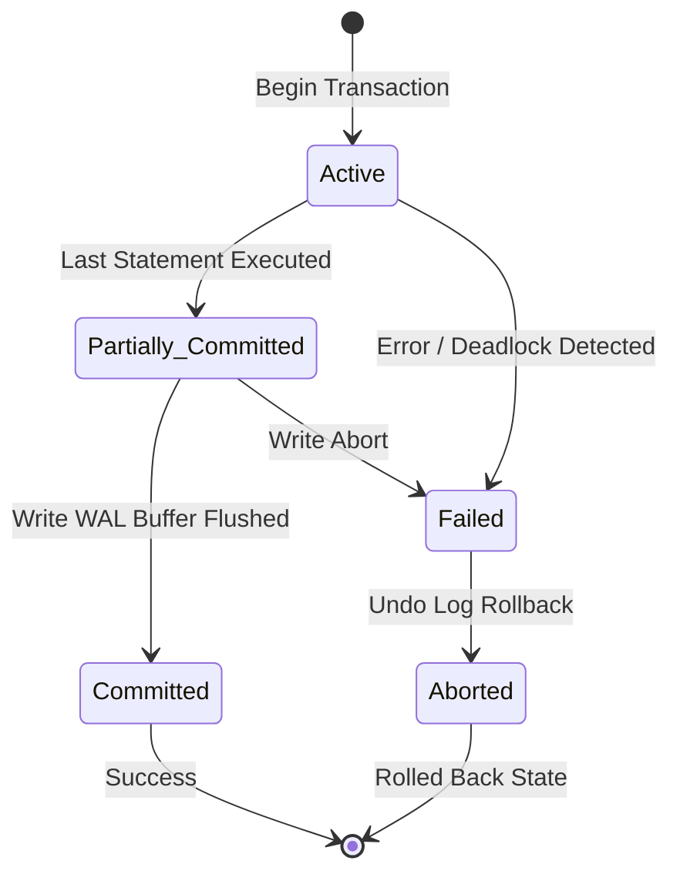

[Home](../README.md) > [02-cs-fundamentals](README.md) > 03_dbms.md

# 03. Database Management Systems (DBMS)

## Learn

### 1. ACID Properties of Transactions
- **Atomicity**: All operations in a transaction succeed, or all are rolled back ("All or Nothing"). Managed via Undo Logs / Write-Ahead Logging (WAL).
- **Consistency**: Database transitions from one valid state to another valid state, preserving all integrity constraints (Foreign keys, uniqueness).
- **Isolation**: Concurrent transactions execute without interfering with one another. Managed via Concurrency Control (Locking / MVCC).
- **Durability**: Once committed, changes survive system crashes or power failures. Managed via Redo Logs in non-volatile storage.

### 2. Normalization Forms Summary
- **1NF**: Atomic values only (no multi-valued sets, arrays, or comma-separated lists).
- **2NF**: In 1NF + **No Partial Dependency** (no non-prime attribute depends on a *subset* of a composite candidate key).
  - *Note*: If the candidate key is a single column, the table is automatically in 2NF!
- **3NF**: In 2NF + **No Transitive Dependency** ($X \to Y \to Z$, where non-key attribute $Z$ depends on non-key attribute $Y$).
- **BCNF (Boyce-Codd)**: For every functional dependency $X \to Y$, $X$ must be a **Super Key**.

### 3. Isolation Levels & Concurrency Anomalies
| Isolation Level | Dirty Read | Non-Repeatable Read | Phantom Read |
| :--- | :---: | :---: | :---: |
| **Read Uncommitted** | **Yes** | **Yes** | **Yes** |
| **Read Committed** | No | **Yes** | **Yes** |
| **Repeatable Read** | No | No | **Yes** |
| **Serializable** | No | No | No |

- **Dirty Read**: Reading uncommitted data written by another transaction that later rolls back.
- **Non-Repeatable Read**: Re-reading a row within the same transaction yields modified values.
- **Phantom Read**: Re-executing a range query returns newly inserted rows matching the filter.

---

## Practice
### DBMS-001: DBMS Transaction Isolation & Dirty Reads

**Tag**: [ADDED] | **Difficulty**: Easy | **Topic**: Concurrency Control

#### Question
Which anomaly occurs when Transaction A reads modifications made by Transaction B before Transaction B has committed, and Transaction B subsequently executes a ROLLBACK?

- **A**: Phantom Read
- **B**: Dirty Read
- **C**: Lost Update
- **D**: Non-Repeatable Read

**Correct Answer**: **B**

#### Why
A Dirty Read occurs when a transaction reads uncommitted, dirty data from a concurrent transaction. If the modifying transaction aborts, the first transaction based decisions on phantom data that never officially existed.

- **5-Second Shortcut**: Dirty Read = reading uncommitted data that later rolls back.
- **Trap**: Confusing Dirty Read with Non-Repeatable Read. Dirty reads involve uncommitted data.
- **Source**: Capgemini Candidate Exam Debriefs

---

### DBMS-002: Database B+ Tree Index Complexity

**Tag**: [ADDED] | **Difficulty**: Medium | **Topic**: Indexing Architecture

#### Question
Why do relational database engines use B+ Trees rather than standard Binary Search Trees (BST) for disk-based indexing?

- **A**: BSTs store duplicate keys faster
- **B**: B+ Trees have high fan-out, drastically reducing tree height and the number of physical disk I/O operations required per search
- **C**: BSTs cannot store text strings
- **D**: B+ Trees eliminate hard drive usage

**Correct Answer**: **B**

#### Why
Disk access is slow. A balanced BST on 10 million rows has height ~24 (requiring 24 disk seeks). A B+ tree with fan-out 100 has height 3-4, locating any record in 3-4 disk reads.

- **5-Second Shortcut**: B+ Tree = wide fan-out, low height, minimal disk I/O.
- **Trap**: Assuming in-memory BST performance translates to disk storage. Disk requires minimizing tree depth.
- **Source**: Capgemini Candidate Exam Debriefs

---

### DBMS-003: Database Normalization - Second Normal Form (2NF)

**Tag**: [ADDED] | **Difficulty**: Medium | **Topic**: Normalization

#### Question
Given relation $R(A, B, C, D)$ with Primary Key $(A, B)$ and functional dependency $A \to C$. What normalization violation exists?

- **A**: Transitive dependency violating 3NF
- **B**: Partial dependency violating 2NF (non-prime attribute C depends on a proper subset of the composite key)
- **C**: Atomic violation in 1NF
- **D**: Multivalued dependency in 4NF

**Correct Answer**: **B**

#### Why
2NF prohibits partial dependencies on composite keys. Since $(A, B)$ is the primary key and $C$ depends strictly on $A$ alone, $C$ has a partial dependency on part of the key. To reach 2NF, decompose into $R_1(A, C)$ and $R_2(A, B, D)$.

- **5-Second Shortcut**: Partial key dependency = violates 2NF.
- **Trap**: Classifying $A \to C$ as transitive. Transitive dependencies involve non-key to non-key attributes.
- **Source**: Capgemini Candidate Exam Debriefs

---

### DBMS-004: Third Normal Form (3NF) Transitive Dependency

**Tag**: [PATTERN] | **Difficulty**: Medium | **Topic**: Normalization

#### Question
Given relation `Employee(emp_id, emp_name, dept_id, dept_name)` with primary key `emp_id`. Functional dependencies are `emp_id -> dept_id` and `dept_id -> dept_name`. What normal form does this table violate?

- **A**: 1NF
- **B**: 2NF
- **C**: 3NF (transitive dependency: emp_id -> dept_id -> dept_name)
- **D**: BCNF

**Correct Answer**: **C**

#### Why
The table is in 2NF because the key `emp_id` is a single column (no partial dependencies). However, `dept_name` depends on `dept_id` (a non-key attribute), forming a transitive dependency $X \to Y \to Z$, violating 3NF.

- **5-Second Shortcut**: Non-key $\to$ Non-key dependency violates 3NF.
- **Trap**: Assuming tables with single-column keys are automatically in 3NF. Single-column keys guarantee 2NF, not 3NF.
- **Source**: Pattern practice: Normalization forms

---

### DBMS-005: Boyce-Codd Normal Form (BCNF) Rule

**Tag**: [PATTERN] | **Difficulty**: Medium | **Topic**: Normalization

#### Question
What is the strict mathematical condition required for a relation to be in BCNF?

- **A**: Every non-prime attribute must depend on all candidate keys
- **B**: For every non-trivial functional dependency $X \to Y$, the determinant $X$ must be a Super Key
- **C**: The table must have no foreign keys
- **D**: All column data types must be strings

**Correct Answer**: **B**

#### Why
BCNF is a stricter version of 3NF. In 3NF, $X \to Y$ is permitted if $Y$ is a prime attribute. In BCNF, this exception is removed: $X$ must *always* be a super key for every functional dependency.

- **5-Second Shortcut**: BCNF: In $X \to Y$, $X$ MUST be a Super Key.
- **Trap**: Thinking 3NF and BCNF are identical. BCNF disallows $X \to Y$ where $Y$ is prime and $X$ is not a super key.
- **Source**: Pattern practice: Normalization rules

---

### DBMS-006: ACID Atomicity Enforcement via WAL

**Tag**: [ADDED] | **Difficulty**: Easy | **Topic**: Transaction Recovery

#### Question
Which database logging mechanism guarantees Atomicity and Durability by ensuring changes are recorded on non-volatile disk before modifying actual data pages?

- **A**: Read-Ahead Buffer
- **B**: Write-Ahead Logging (WAL)
- **C**: B+ Tree Index
- **D**: Hash Table Partition

**Correct Answer**: **B**

#### Why
Write-Ahead Logging (WAL) requires that log records describing data modifications must be flushed to stable disk storage *before* the dirty buffer pages are written to table files, enabling recovery via redo/undo logs after crashes.

- **5-Second Shortcut**: WAL = log changes to disk before updating data pages.
- **Trap**: Assuming data files are updated immediately on every transaction commit.
- **Source**: Added practice: Storage engine recovery

---

### DBMS-007: Repeatable Read Isolation vs Phantom Reads

**Tag**: [PATTERN] | **Difficulty**: Medium | **Topic**: Isolation Levels

#### Question
Transaction A runs: `SELECT COUNT(*) FROM Users WHERE age > 30;` returning 10. Concurrently, Transaction B inserts a new user with `age = 35` and commits. Under REPEATABLE READ isolation, what happens if Transaction A runs the count again?

- **A**: Transaction A always sees 10 in all engines
- **B**: In traditional locking without range locks, Transaction A sees 11 (Phantom Read anomaly)
- **C**: The server deadlocks
- **D**: Transaction A crashes with a syntax error

**Correct Answer**: **B**

#### Why
Repeatable Read prevents dirty reads and non-repeatable reads on existing rows. However, without range/predicate locks (Next-Key locking), newly inserted rows matching the filter appear on re-query, demonstrating a Phantom Read.

- **5-Second Shortcut**: Repeatable Read allows Phantom Reads (new rows appearing in range queries).
- **Trap**: Assuming Repeatable Read locks all future insertions. Preventing phantoms requires Serializable isolation or Next-Key locks.
- **Source**: Pattern practice: Concurrency anomalies

---

### DBMS-008: Two-Phase Locking (2PL) Protocol

**Tag**: [PATTERN] | **Difficulty**: Hard | **Topic**: Concurrency Control

#### Question
What is the operational rule of the basic Two-Phase Locking (2PL) protocol?

- **A**: Transactions lock tables on Mondays and Wednesdays
- **B**: A transaction must acquire all locks during a 'Growing Phase' and once it releases any lock in the 'Shrinking Phase', it can acquire no further locks
- **C**: Transactions execute two identical SQL queries
- **D**: Locks are only held for 2 seconds

**Correct Answer**: **B**

#### Why
2PL guarantees conflict serializability by dividing execution into two distinct phases: 1. Growing Phase (locks may be acquired, none released). 2. Shrinking Phase (locks may be released, no new locks acquired).

- **5-Second Shortcut**: 2PL: Growing (acquire locks) $\to$ Shrinking (release locks). Once you release, you cannot acquire.
- **Trap**: Thinking 2PL prevents deadlocks. Basic 2PL guarantees serializability, but can still deadlock.
- **Source**: Pattern practice: Concurrency protocols

---

### DBMS-009: Strict 2PL vs Basic 2PL

**Tag**: [PATTERN] | **Difficulty**: Medium | **Topic**: Concurrency Control

#### Question
Why do commercial databases implement *Strict* 2PL rather than Basic 2PL?

- **A**: Basic 2PL uses more CPU
- **B**: Strict 2PL holds all exclusive (X) write locks until the end of the transaction (COMMIT or ABORT), preventing cascading aborts
- **C**: Strict 2PL removes all indexes
- **D**: Basic 2PL cannot run on Linux

**Correct Answer**: **B**

#### Why
In Basic 2PL, releasing an exclusive lock before commit lets other transactions read intermediate data. If the transaction later aborts, all dependent transactions must abort (cascading abort). Strict 2PL holds locks until commit, avoiding this.

- **5-Second Shortcut**: Strict 2PL holds write locks until commit $\to$ prevents cascading rollbacks.
- **Trap**: Assuming Basic 2PL holds locks until commit. Basic 2PL can release locks early in the shrinking phase.
- **Source**: Pattern practice: Lock management

---

### DBMS-010: Candidate Key vs Super Key

**Tag**: [ADDED] | **Difficulty**: Easy | **Topic**: Relational Keys

#### Question
What is the formal relationship between a Candidate Key and a Super Key?

- **A**: A Candidate Key is a Minimal Super Key (no redundant attributes)
- **B**: A Super Key is a subset of a Candidate Key
- **C**: Candidate Keys can contain NULL values
- **D**: Super Keys must have exactly 1 attribute

**Correct Answer**: **A**

#### Why
A Super Key is any set of attributes that uniquely identifies a row. A Candidate Key is a minimal super key: removing any attribute from a candidate key destroys its uniqueness property.

- **5-Second Shortcut**: Candidate Key = Minimal Super Key (uniqueness without redundant columns).
- **Trap**: Confusing Candidate Key with Primary Key. A table can have multiple Candidate Keys, but selects one as Primary Key.
- **Source**: Added practice: Relational theory

---

### DBMS-011: Lossless-Join Decomposition Condition

**Tag**: [PATTERN] | **Difficulty**: Hard | **Topic**: Normalization Theory

#### Question
A relation $R(A, B, C)$ is decomposed into $R_1(A, B)$ and $R_2(B, C)$. What condition mathematically guarantees the decomposition is Lossless-Join?

- **A**: $R_1 \cap R_2$ must be empty
- **B**: The common attribute $(R_1 \cap R_2 = B)$ must be a Candidate Key in at least one of the decomposed relations ($B \to A$ or $B \to C$)
- **C**: $B$ must contain NULL values
- **D**: Both tables must have identical row counts

**Correct Answer**: **B**

#### Why
According to relational decomposition theory, a decomposition is lossless if and only if the shared attribute set is a super key for at least one of the sub-relations ($R_1 \cap R_2 \to R_1$ or $R_1 \cap R_2 \to R_2$).

- **5-Second Shortcut**: Lossless decomposition: shared column must be a key in at least one table.
- **Trap**: Believing all decompositions are lossless. If the common attribute is not a key, natural join produces spurious rows.
- **Source**: Pattern practice: Relational mathematics

---

### DBMS-012: Dependency Preservation in Decomposition

**Tag**: [PATTERN] | **Difficulty**: Medium | **Topic**: Normalization Theory

#### Question
What does it mean for a database decomposition to be 'Dependency Preserving'?

- **A**: The database never requires foreign keys
- **B**: All functional dependencies in the original relation can be enforced by checking individual sub-relations without computing expensive joins
- **C**: Tables cannot be modified
- **D**: Indexes are preserved on disk

**Correct Answer**: **B**

#### Why
Dependency preservation ensures that every functional dependency in $F$ can be verified by checking constraints within individual decomposed tables without having to compute a cross-table join.

- **5-Second Shortcut**: Dependency preserving = enforce constraints without cross-table joins.
- **Trap**: Confusing lossless join with dependency preservation. A decomposition can be lossless but not dependency preserving.
- **Source**: Pattern practice: Relational decomposition

---

### DBMS-013: B-Tree vs B+ Tree Leaf Nodes

**Tag**: [ADDED] | **Difficulty**: Easy | **Topic**: Indexing Storage

#### Question
What is the key architectural difference between internal nodes in a B-Tree vs a B+ Tree?

- **A**: B-Trees store data pointers in both internal and leaf nodes; B+ Trees store all actual record pointers exclusively in leaf nodes
- **B**: B+ Trees have no leaf nodes
- **C**: B-Trees only store numbers
- **D**: B+ Trees cannot be sorted

**Correct Answer**: **A**

#### Why
In a B+ Tree, internal nodes store only routing keys, allowing much higher fan-out per page. All actual data pointers reside in leaf nodes, which are linked together in a doubly-linked list for fast range scanning.

- **5-Second Shortcut**: B+ Tree: internal nodes store keys only; leaf nodes store all data pointers & are linked.
- **Trap**: Assuming B-Trees and B+ Trees store data identically. B+ trees store data pointers only at the leaves.
- **Source**: Added practice: Data storage structures

---

### DBMS-014: Deadlock Detection: Wait-For Graph (WFG)

**Tag**: [PATTERN] | **Difficulty**: Medium | **Topic**: Concurrency Control

#### Question
In database transaction management, how is a deadlock identified using a Wait-For Graph (WFG)?

- **A**: By counting the total number of connected nodes
- **B**: By detecting a directed cycle in the graph where nodes represent transactions and edges represent wait dependencies
- **C**: By checking if the graph is bipartite
- **D**: By measuring CPU utilization

**Correct Answer**: **B**

#### Why
In a Wait-For Graph, directed edge $T_1 \to T_2$ means $T_1$ is waiting for a lock held by $T_2$. A directed cycle ($T_1 \to T_2 \to T_1$) indicates that transactions are circularly waiting for each other, proving a deadlock.

- **5-Second Shortcut**: Deadlock in WFG = directed cycle.
- **Trap**: Thinking undirected cycles indicate deadlocks. Lock dependencies are directional.
- **Source**: Pattern practice: Concurrency graph theory

---

### DBMS-015: Wait-Die vs Wound-Wait Deadlock Prevention

**Tag**: [PATTERN] | **Difficulty**: Hard | **Topic**: Deadlock Prevention

#### Question
Under the non-preemptive 'Wait-Die' deadlock prevention scheme based on transaction timestamps (where older transactions have smaller timestamps), what happens when an older transaction $T_{old}$ requests a resource held by a younger transaction $T_{young}$?

- **A**: $T_{old}$ aborts and dies
- **B**: $T_{old}$ is allowed to wait
- **C**: $T_{young}$ is preempted and dies
- **D**: Both transactions commit

**Correct Answer**: **B**

#### Why
In Wait-Die: Older transactions wait for younger ones; younger transactions requesting locks held by older transactions die immediately (non-preemptive). In Wound-Wait: Older transactions 'wound' (preempt) younger ones.

- **5-Second Shortcut**: Wait-Die: Old waits, Young dies. Wound-Wait: Old wounds (preempts), Young waits.
- **Trap**: Confusing Wait-Die with Wound-Wait.
- **Source**: Pattern practice: Deadlock prevention schemes

---

### DBMS-016: Database Checkpointing Purpose

**Tag**: [ADDED] | **Difficulty**: Easy | **Topic**: Recovery Systems

#### Question
What is the primary benefit of periodic 'Checkpoints' in database management systems?

- **A**: Compressing user passwords
- **B**: Flushing dirty buffer pages to disk and writing a sync mark in the log, limiting the amount of log that must be scanned during crash recovery
- **C**: Deleting old table columns
- **D**: Resetting primary keys

**Correct Answer**: **B**

#### Why
Without checkpoints, crash recovery would require replaying log records back to the beginning of the database. Checkpoints write all dirty buffers to disk, allowing recovery to start from the checkpoint position.

- **5-Second Shortcut**: Checkpoint = flush buffers to disk $\to$ shortens crash recovery log replay.
- **Trap**: Assuming crash recovery must replay every log record since database creation.
- **Source**: Added practice: Recovery architecture

---

### DBMS-017: ARIES Recovery Algorithm: 3 Phases

**Tag**: [PATTERN] | **Difficulty**: Hard | **Topic**: Crash Recovery

#### Question
What is the correct execution order of the three phases in the ARIES crash recovery algorithm?

- **A**: Undo $\to$ Redo $\to$ Analysis
- **B**: Analysis $\to$ Redo $\to$ Undo
- **C**: Redo $\to$ Undo $\to$ Analysis
- **D**: Backup $\to$ Restore $\to$ Commit

**Correct Answer**: **B**

#### Why
ARIES operates in 3 distinct phases: 1. Analysis (scans forward from checkpoint to identify active transactions and dirty pages). 2. Redo (repeats history forward to restore exact pre-crash state). 3. Undo (scans backward to roll back active uncommitted transactions).

- **5-Second Shortcut**: ARIES: Analysis $\to$ Redo (repeating history) $\to$ Undo (rolling back uncommitted).
- **Trap**: Putting Undo before Redo. ARIES must repeat history forward before undoing uncommitted changes.
- **Source**: Pattern practice: Industrial recovery protocols

---

### DBMS-018: Referential Integrity & Foreign Key Rules

**Tag**: [ADDED] | **Difficulty**: Easy | **Topic**: Integrity Constraints

#### Question
What does the Referential Integrity constraint require regarding Foreign Key values?

- **A**: Foreign key values can never be NULL
- **B**: Every non-null foreign key value must match an existing primary key value in the referenced parent table
- **C**: Foreign keys must have identical names to primary keys
- **D**: A table can only have one foreign key

**Correct Answer**: **B**

#### Why
Referential integrity guarantees that relationships between tables remain consistent. A foreign key value must either be NULL or correspond to an existing primary key value in the referenced table.

- **5-Second Shortcut**: Foreign key must be NULL or match an existing parent primary key.
- **Trap**: Believing foreign keys can never be NULL. Foreign keys are nullable unless declared NOT NULL.
- **Source**: Added practice: Integrity constraints

---

### DBMS-019: View Serializability vs Conflict Serializability

**Tag**: [PATTERN] | **Difficulty**: Hard | **Topic**: Serializability Theory

#### Question
What is the relationship between Conflict Serializability and View Serializability?

- **A**: Every View Serializable schedule is also Conflict Serializable
- **B**: Every Conflict Serializable schedule is also View Serializable, but some View Serializable schedules are not Conflict Serializable
- **C**: They are mutually exclusive
- **D**: Conflict serializability cannot be tested with graphs

**Correct Answer**: **B**

#### Why
Conflict serializability is a stricter condition checked via acyclic precedence graphs. View serializability is broader (allowing blind writes), so all conflict-serializable schedules are view-serializable, but not vice-versa.

- **5-Second Shortcut**: Conflict Serializable $\subset$ View Serializable.
- **Trap**: Assuming the two concepts are identical. View serializability allows blind writes that conflict testing rejects.
- **Source**: Pattern practice: Serializability hierarchies

---

### DBMS-020: Blind Write Definition

**Tag**: [ADDED] | **Difficulty**: Medium | **Topic**: Transaction Scheduling

#### Question
In database transaction schedules, what is a 'Blind Write'?

- **A**: Writing data with the screen turned off
- **B**: A transaction writing a value to an item without reading it first ($W(X)$ without preceding $R(X)$)
- **C**: Writing encrypted data
- **D**: Writing data to a corrupted disk sector

**Correct Answer**: **B**

#### Why
A blind write occurs when a transaction overwrites a data item without first reading its current value. Schedules with blind writes can be view-serializable without being conflict-serializable.

- **5-Second Shortcut**: Blind Write = Writing an item without reading it first ($W(X)$ without $R(X)$).
- **Trap**: Thinking every write must be preceded by a read.
- **Source**: Added practice: Transaction schedules

---

### DBMS-021: Shared (S) vs Exclusive (X) Locks

**Tag**: [ADDED] | **Difficulty**: Easy | **Topic**: Locking Mechanics

#### Question
Which lock compatibility rule governs Shared (S) and Exclusive (X) locks?

- **A**: Multiple transactions can hold X locks concurrently
- **B**: Multiple transactions can hold Shared (S) locks on the same item, but an Exclusive (X) lock conflicts with all other locks
- **C**: S locks block other S locks
- **D**: X locks cannot be released

**Correct Answer**: **B**

#### Why
Shared locks (for reading) are compatible with other Shared locks. Exclusive locks (for writing) require complete isolation and conflict with both S and X locks.

- **5-Second Shortcut**: Shared + Shared = OK; Exclusive + Anything = Conflict.
- **Trap**: Thinking read locks block other read locks.
- **Source**: Added practice: Lock compatibility

---

### DBMS-022: Lock Escalation Mechanics

**Tag**: [PATTERN] | **Difficulty**: Medium | **Topic**: Database Engine Architecture

#### Question
What is 'Lock Escalation' in database management systems?

- **A**: Increasing password security levels
- **B**: Converting many fine-grained locks (e.g. 10,000 row locks) into a single coarse-grained lock (e.g. table lock) to free up lock manager memory
- **C**: Upgrading a database version
- **D**: Promoting a user to administrator

**Correct Answer**: **B**

#### Why
Each lock held consumes memory in the database lock manager. When a transaction acquires thousands of individual row locks, the engine escalates them into a single table lock to conserve memory, at the cost of concurrency.

- **5-Second Shortcut**: Lock escalation: converts thousands of row locks into one table lock.
- **Trap**: Confusing lock conversion (upgrading S to X lock) with lock escalation (row to table lock).
- **Source**: Pattern practice: Engine internals

---

### DBMS-023: Write-Skew Anomaly in Snapshot Isolation

**Tag**: [PATTERN] | **Difficulty**: Hard | **Topic**: MVCC Anomalies

#### Question
Hospital rule: At least one doctor must be on call. Both Doctor A and B run transactions simultaneously under Snapshot Isolation, check that 2 doctors are on call, and both disconnect. Both transactions commit, leaving 0 doctors. What anomaly is this?

- **A**: Dirty Read
- **B**: Write Skew
- **C**: Phantom Read
- **D**: Lost Update

**Correct Answer**: **B**

#### Why
Write Skew occurs under Snapshot Isolation when concurrent transactions read overlapping data sets but write to disjoint records, violating a global cross-record integrity constraint without triggering write-write conflicts.

- **5-Second Shortcut**: Write Skew = concurrent transactions modify different rows violating cross-row constraint.
- **Trap**: Thinking Snapshot Isolation prevents all concurrency anomalies. Snapshot Isolation permits Write Skew.
- **Source**: Pattern practice: Advanced isolation anomalies

---

### DBMS-024: Precedence Graph Cycle & Conflict Serializability

**Tag**: [PATTERN] | **Difficulty**: Medium | **Topic**: Serializability

#### Question
In a precedence graph for schedule $S$, an edge $T_1 \to T_2$ exists if $T_1$ and $T_2$ have conflicting operations on the same data item and $T_1$ accessed it first. How is conflict serializability proven?

- **A**: If the graph has an odd number of edges
- **B**: If and only if the precedence graph contains NO directed cycles (acyclic)
- **C**: If the graph is complete
- **D**: If all nodes have degree 2

**Correct Answer**: **B**

#### Why
A schedule is conflict-serializable if and only if its precedence graph has no directed cycles. An acyclic graph can be topologically sorted into an equivalent serial schedule order.

- **5-Second Shortcut**: Conflict Serializable $\iff$ Precedence Graph is Acyclic (no directed cycles).
- **Trap**: Assuming cycles are permitted if transactions abort. Any cycle in committed transactions proves non-serializability.
- **Source**: Pattern practice: Precedence testing

---

### DBMS-025: Cascading Rollback Prevention

**Tag**: [PATTERN] | **Difficulty**: Medium | **Topic**: Recovery Protocols

#### Question
A schedule is classified as 'Cascadeless' if it satisfies which condition?

- **A**: Transactions never abort
- **B**: Every transaction reads only values written by transactions that have already committed
- **C**: Transactions hold no locks
- **D**: Tables are unindexed

**Correct Answer**: **B**

#### Why
Cascadeless schedules prevent domino-effect rollbacks: by ensuring transaction $T_j$ never reads uncommitted writes of $T_i$, if $T_i$ aborts, $T_j$ was never contaminated and does not need to be rolled back.

- **5-Second Shortcut**: Cascadeless schedule: read only COMMITTED data ($R(X)$ after commit of writer).
- **Trap**: Assuming all serializable schedules are cascadeless. A schedule can be serializable but still suffer cascading aborts.
- **Source**: Pattern practice: Transaction recovery properties

---

### DBMS-026: Entity Integrity Constraint

**Tag**: [ADDED] | **Difficulty**: Easy | **Topic**: Integrity Constraints

#### Question
What does the Entity Integrity constraint require in relational tables?

- **A**: Every table must have a foreign key
- **B**: No primary key attribute (or component of a composite primary key) may contain a NULL value
- **C**: Table names must be capitalized
- **D**: All numbers must be positive

**Correct Answer**: **B**

#### Why
Entity integrity states that every table must have a primary key and that primary key values must be completely non-null and unique, ensuring every entity can be uniquely distinguished.

- **5-Second Shortcut**: Entity Integrity = Primary Key cannot be NULL.
- **Trap**: Confusing Entity Integrity (Primary Key non-null) with Referential Integrity (Foreign Keys).
- **Source**: Added practice: Relational model constraints

---

### DBMS-027: Database Sharding vs Partitioning

**Tag**: [ADDED] | **Difficulty**: Medium | **Topic**: Distributed Systems

#### Question
What is the primary difference between horizontal partitioning and database sharding?

- **A**: Partitioning divides data across multiple physical database servers; sharding splits data on a single machine
- **B**: Horizontal partitioning splits a table across multiple storage segments on the same database server; Sharding distributes partitions across multiple independent physical database nodes/servers
- **C**: Sharding deletes old data
- **D**: Partitioning only works with NoSQL

**Correct Answer**: **B**

#### Why
Partitioning divides rows of a table across files on a single database instance. Sharding is a shared-nothing distributed architecture where partitions are hosted on separate physical machines over a network.

- **5-Second Shortcut**: Partitioning = on one server; Sharding = distributed across multiple physical servers.
- **Trap**: Using partitioning and sharding as interchangeable synonyms.
- **Source**: Added practice: Scalability architectures

---

### DBMS-028: CAP Theorem Trilemma

**Tag**: [ADDED] | **Difficulty**: Easy | **Topic**: Distributed Databases

#### Question
According to Eric Brewer's CAP Theorem, in the presence of a Network Partition (P), what trade-off must a distributed database make?

- **A**: Trade between CPU speed and RAM size
- **B**: Choose between Consistency (C: every read receives the most recent write) and Availability (A: every non-failing node returns a response)
- **C**: Choose between SQL and NoSQL
- **D**: Eliminate database storage

**Correct Answer**: **B**

#### Why
When network partitions (P) occur in a distributed system, the database must choose between Consistency (returning errors/waiting for sync) or Availability (returning stale data from partitioned nodes).

- **5-Second Shortcut**: Under partition (P): choose Consistency (CP) OR Availability (AP).
- **Trap**: Believing a distributed database can guarantee Consistency, Availability, AND Partition tolerance simultaneously.
- **Source**: Added practice: Distributed systems theory

---

### DBMS-029: Multi-Version Concurrency Control (MVCC)

**Tag**: [PATTERN] | **Difficulty**: Medium | **Topic**: Storage Engines

#### Question
How does MVCC (used in PostgreSQL, MySQL InnoDB, and Oracle) eliminate read-write locking contention?

- **A**: By blocking all reads until writes finish
- **B**: Readers do not block writers, and writers do not block readers: each write creates a new timestamped version of the row, allowing readers to view a consistent past snapshot
- **C**: By deleting old records immediately
- **D**: By running all transactions on a single CPU core

**Correct Answer**: **B**

#### Why
MVCC maintains multiple versions of data rows with creation and deletion transaction IDs. Readers query snapshots corresponding to their start timestamp, reading without acquiring locks and never blocking writers.

- **5-Second Shortcut**: MVCC: Readers don't block writers; writers don't block readers.
- **Trap**: Assuming writers lock the table against readers in modern engines. MVCC allows concurrent reads.
- **Source**: Pattern practice: Engine concurrency models

---

### DBMS-030: Phantom Read Prevention via Next-Key Locking

**Tag**: [PATTERN] | **Difficulty**: Hard | **Topic**: InnoDB Locking

#### Question
How does MySQL InnoDB's Next-Key Locking prevent Phantom Reads in Repeatable Read isolation?

- **A**: By locking the entire database table
- **B**: By combining an index-record lock with a gap lock on the gap preceding the record, preventing concurrent transactions from inserting new rows into the scanned range
- **C**: By converting all SQL queries to stored procedures
- **D**: By restarting the server

**Correct Answer**: **B**

#### Why
A Next-Key lock locks both the specific index record AND the 'gap' (empty space) immediately before it. This blocks concurrent transactions from inserting new records into the evaluated range, eliminating phantoms.

- **5-Second Shortcut**: Next-Key Lock = Record Lock + Gap Lock (blocks new insertions into range).
- **Trap**: Assuming gap locks lock existing rows only. Gap locks lock the empty spaces between rows.
- **Source**: Pattern practice: Database storage internals

---

## Sources for This File
- KN Academy Video: [Capgemini Complete Recruitment Pattern](https://youtu.be/o5TbT3kzEnA)
- KN Academy Playlist: [Capgemini 2026/2027 Masterclass](https://www.youtube.com/watch?v=mLaYLknw4KU&list=PLGFjgYQtw1UjDBEkL2Edqej2kXbxGA1NO)
- Gemini candidate chat archives in `Capgemini Candidate Exam Debriefs`

---

Previous: [02_sql.md](02_sql.md) | Next: [04_oops.md](04_oops.md)
