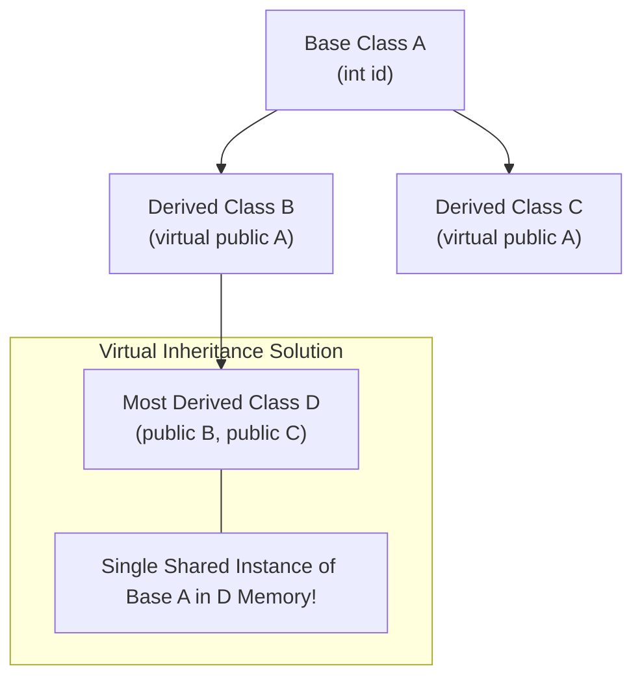

[Home](../README.md) > [02-cs-fundamentals](README.md) > 04_oops.md

# 04. Object-Oriented Programming (OOPs)

## Learn

### 1. The Four Pillars of OOP
1. **Encapsulation**: Bundling data (fields) and methods operating on that data inside a class, restricting direct outside access via access specifiers (`private`, `protected`, `public`).
2. **Abstraction**: Hiding internal implementation complexities and exposing only essential interfaces (Abstract classes, Interfaces).
3. **Inheritance**: Deriving new classes (child/derived) from existing classes (parent/base) to reuse code and establish "is-a" relationships.
4. **Polymorphism**: The ability of an entity (method, object) to take on multiple forms:
   - *Compile-Time (Static)*: Method Overloading, Operator Overloading.
   - *Run-Time (Dynamic)*: Method Overriding via Virtual Functions and VTables.

### 2. The Diamond Problem & Virtual Inheritance
- When class `D` inherits from both `B` and `C`, and both `B` and `C` inherit from base class `A`:

- `D` receives two separate duplicate copies of `A`'s member variables, causing compiler ambiguity (`D::A::val`).
- **Fix**: In C++, declare virtual inheritance in both intermediate classes: `class B : virtual public A` and `class C : virtual public A`. This guarantees only one shared instance of `A` exists inside `D`.

### 3. VTable & Dynamic Binding
- If a class contains at least one `virtual` function, the compiler inserts a hidden pointer (`vptr`) into every object instance.
- The `vptr` points to a static class **VTable** (Virtual Method Table), an array of function pointers.
- At runtime, calling `basePtr->draw()` resolves dynamically via the VTable, invoking the derived override.

### 4. Virtual Destructors Rule
- If you delete a derived class object through a base class pointer (`Base* p = new Derived(); delete p;`), the base destructor must be declared `virtual`!
- If the base destructor is NOT virtual, only the base destructor executes; the derived destructor never runs, causing memory and resource leaks.

---

## Practice
### OOP-001: C++ Diamond Problem & Virtual Inheritance

**Tag**: [VIDEO] | **Difficulty**: Medium | **Topic**: Inheritance

#### Question
In C++, how is the Diamond Problem (ambiguity from multiple inheritance of a common base class) resolved?

- **A**: By declaring all base class variables static
- **B**: By using virtual inheritance (`class B : virtual public A`) when deriving intermediate classes
- **C**: By using private inheritance
- **D**: By deleting the child class destructor

**Correct Answer**: **B**

#### Why
Virtual inheritance instructs the compiler to create only a single shared instance of the root base class in the grandchild class, resolving member ambiguity and preventing duplicate data storage.

- **5-Second Shortcut**: Diamond problem in C++ = solved with `virtual public Base`.
- **Trap**: Assuming Java allows multiple class inheritance. Java prevents this by supporting single class inheritance + interfaces.
- **Source**: KN Academy Video: https://youtu.be/o5TbT3kzEnA

---

### OOP-002: Shallow Copy vs Deep Copy Pointer Mechanics

**Tag**: [VIDEO] | **Difficulty**: Easy | **Topic**: Memory Management

#### Question
What is the danger of relying on the default compiler-generated copy constructor for a class containing dynamic heap pointers (`int* ptr`)?

- **A**: The program will fail to compile
- **B**: It performs a shallow copy, copying only the pointer address; both objects point to the same heap memory, causing a double-free crash when both destructors run
- **C**: It automatically frees the pointer
- **D**: It creates an infinite loop

**Correct Answer**: **B**

#### Why
A shallow copy copies pointer values directly. Both objects now own the identical memory address. When the first object is destroyed, its destructor frees the heap; when the second object is destroyed, it attempts to free already-freed memory (Double Free crash). A Deep Copy allocates new memory.

- **5-Second Shortcut**: Shallow copy = copies pointer address (double free risk); Deep copy = allocates fresh memory.
- **Trap**: Assuming default copy constructors duplicate the underlying allocated heap data. They do not.
- **Source**: KN Academy Video: https://youtu.be/o5TbT3kzEnA

---

### OOP-003: Virtual Functions & VTable Late Binding

**Tag**: [VIDEO] | **Difficulty**: Medium | **Topic**: Polymorphism

#### Question
How does the C++ runtime determine which overridden method to execute when calling `ptr->speak()` via a `Base* ptr = new Dog()`?

- **A**: By scanning the source code file at runtime
- **B**: By following the object's hidden `vptr` pointer to the `Dog` class VTable, which contains the address of `Dog::speak()`
- **C**: By checking the variable name
- **D**: By executing both methods in parallel

**Correct Answer**: **B**

#### Why
Objects of classes with virtual functions contain an internal pointer (`vptr`) pointing to the class's Virtual Method Table (VTable). The runtime dereferences `vptr` to find the exact function pointer for the derived class at runtime.

- **5-Second Shortcut**: `ptr->vptr` points to derived VTable $\to$ dynamic late binding.
- **Trap**: Assuming dynamic binding happens via compile-time name matching. It happens via VTable lookups.
- **Source**: KN Academy Video: https://youtu.be/o5TbT3kzEnA

---

### OOP-004: Abstract Class vs Interface

**Tag**: [VIDEO] | **Difficulty**: Easy | **Topic**: Abstraction

#### Question
In object-oriented design, what is the core architectural difference between an Abstract Class and an Interface?

- **A**: Abstract classes cannot have names
- **B**: An abstract class can contain concrete state (instance variables) and implemented methods; an interface defines strictly method contracts without state
- **C**: Interfaces allow code execution; abstract classes do not
- **D**: Interfaces are only available in C++

**Correct Answer**: **B**

#### Why
Abstract classes represent 'is-a' hierarchies and can hold instance state and concrete helper methods alongside abstract methods. Interfaces represent pure 'can-do' behavioral contracts without state.

- **5-Second Shortcut**: Abstract Class = state + behavior template; Interface = pure method contract.
- **Trap**: Assuming interfaces can have instance variables. Interface variables in Java are implicitly `public static final`.
- **Source**: KN Academy Video: https://youtu.be/o5TbT3kzEnA

---

### OOP-005: Dynamic Polymorphism & Object Slicing

**Tag**: [ADDED] | **Difficulty**: Medium | **Topic**: Polymorphism Traps

#### Question
Given `class Derived : public Base`. What happens when a derived object is passed by value to a function `void process(Base b)`?

- **A**: A compilation error occurs
- **B**: Object Slicing: the derived portion of the object is sliced off, leaving only the base class members copied into parameter `b`
- **C**: The function dynamically invokes derived methods
- **D**: Memory is corrupted

**Correct Answer**: **B**

#### Why
Object slicing occurs when a derived object is assigned by value to a base object. The base copy constructor copies only the base members; all derived members and the derived VTable pointer are stripped away. To preserve polymorphism, pass by reference or pointer (`Base&` or `Base*`).

- **5-Second Shortcut**: Pass by value slices derived members! Pass by reference (`Base&`) to preserve polymorphism.
- **Trap**: Expecting `b.speak()` inside `void process(Base b)` to execute the derived override.
- **Source**: Capgemini Candidate Exam Debriefs

---

### OOP-006: Virtual Destructor Mandate

**Tag**: [PATTERN] | **Difficulty**: Medium | **Topic**: Destructors

#### Question
Why must a base class destructor always be declared `virtual` if derived classes are deleted via base class pointers (`Base* p = new Derived(); delete p;`)?

- **A**: To make the class run faster
- **B**: If non-virtual, calling `delete p` invokes only the Base destructor, skipping the Derived destructor and causing resource/memory leaks
- **C**: C++ compilers refuse to compile without it
- **D**: To prevent stack overflow

**Correct Answer**: **B**

#### Why
Without a virtual destructor, `delete p` binds statically to `Base::~Base()`. The `Derived` destructor is never called, leaving any dynamic resources allocated by the derived class leaked in memory.

- **5-Second Shortcut**: Base destructor MUST be virtual whenever deleting via base pointer.
- **Trap**: Assuming destructors inherit virtuality automatically if constructors are defined. Destructors must be explicitly marked `virtual`.
- **Source**: Pattern practice: C++ memory management

---

### OOP-007: Pure Virtual Function & Instantiation

**Tag**: [ADDED] | **Difficulty**: Easy | **Topic**: C++ Syntax

#### Question
What syntax declares a pure virtual function in C++, and what is its effect on the class?

- **A**: `virtual void show() = null;`
- **B**: `virtual void show() = 0;` (makes the class an Abstract Class that cannot be directly instantiated)
- **C**: `pure void show();`
- **D**: `abstract void show();`

**Correct Answer**: **B**

#### Why
Appending `= 0` to a virtual method declaration defines it as a Pure Virtual Function. Any class containing at least one pure virtual function becomes an Abstract Class, preventing direct object creation.

- **5-Second Shortcut**: `= 0` = Pure Virtual Function $\to$ makes class Abstract.
- **Trap**: Confusing Java's `abstract` keyword with C++'s `= 0` syntax.
- **Source**: Added practice: C++ language fundamentals

---

### OOP-008: Compile-Time vs Run-Time Polymorphism

**Tag**: [ADDED] | **Difficulty**: Easy | **Topic**: Polymorphism Types

#### Question
Which pair correctly matches Compile-Time Polymorphism and Run-Time Polymorphism examples in C++/Java?

- **A**: Compile-Time: Method Overriding; Run-Time: Method Overloading
- **B**: Compile-Time: Method Overloading & Templates; Run-Time: Method Overriding via Virtual Functions
- **C**: Compile-Time: Interfaces; Run-Time: Abstract Classes
- **D**: Compile-Time: Inheritance; Run-Time: Encapsulation

**Correct Answer**: **B**

#### Why
Compile-time (static) polymorphism is resolved by the compiler before execution (function overloading, operator overloading, templates). Run-time (dynamic) polymorphism is resolved at execution via VTables (method overriding).

- **5-Second Shortcut**: Overloading = Compile-Time; Overriding = Run-Time.
- **Trap**: Swapping overloading and overriding.
- **Source**: Added practice: Polymorphism classification

---

### OOP-009: Private vs Protected Access Specifiers

**Tag**: [ADDED] | **Difficulty**: Easy | **Topic**: Access Specifiers

#### Question
What is the accessibility of a `protected` member variable compared to a `private` member variable?

- **A**: Protected members are accessible from anywhere in the program
- **B**: Private members are accessible only within the defining class; Protected members are accessible within the defining class AND derived child classes
- **C**: Protected members cannot be modified
- **D**: Private members can be accessed by child classes

**Correct Answer**: **B**

#### Why
`private` restricts visibility strictly to member methods of that specific class. `protected` extends visibility to subclasses (derived classes), while still hiding the member from outside client code.

- **5-Second Shortcut**: Private = class only; Protected = class + derived subclasses; Public = everywhere.
- **Trap**: Assuming private members are inherited and directly accessible in child classes.
- **Source**: Added practice: Access control rules

---

### OOP-010: Constructor Calling Order in Inheritance

**Tag**: [PATTERN] | **Difficulty**: Medium | **Topic**: Object Lifecycle

#### Question
When an object of `class Child : public Parent` is created, what is the execution order of constructors and destructors?

- **A**: Child Constructor $\to$ Parent Constructor $\to$ Parent Destructor $\to$ Child Destructor
- **B**: Parent Constructor $\to$ Child Constructor $\to$ Child Destructor $\to$ Parent Destructor
- **C**: Child Constructor $\to$ Child Destructor $\to$ Parent Constructor
- **D**: Random order

**Correct Answer**: **B**

#### Why
Constructors execute from the base upwards: `Parent` constructor runs first to initialize base state, then `Child` constructor runs. Destructors execute in exact reverse order: `Child` destructor runs first, then `Parent` destructor.

- **5-Second Shortcut**: Constructors: Base $\to$ Derived. Destructors: Derived $\to$ Base (Reverse).
- **Trap**: Thinking derived constructor finishes before base constructor starts.
- **Source**: Pattern practice: Construction & destruction sequence

---

### OOP-011: Static Keyword in Classes (Variables & Methods)

**Tag**: [ADDED] | **Difficulty**: Easy | **Topic**: Static Members

#### Question
What characterizes a `static` member variable in a class?

- **A**: It cannot be changed once initialized
- **B**: A single shared copy exists for the entire class across all instantiated objects, accessible without creating an object instance
- **C**: It is stored on the GPU
- **D**: It is private by default

**Correct Answer**: **B**

#### Why
Static fields belong to the class type itself rather than any individual object instance. All objects share the same memory location, and static methods cannot reference the `this` pointer.

- **5-Second Shortcut**: Static = one shared copy per class; no `this` pointer in static methods.
- **Trap**: Confusing `static` (class-level shared memory) with `const` or `final` (immutable value).
- **Source**: Added practice: Member storage duration

---

### OOP-012: Method Overriding Rules in Java

**Tag**: [PATTERN] | **Difficulty**: Medium | **Topic**: Overriding Constraints

#### Question
In Java, when overriding a method `protected void calculate()` in a subclass, which access modifier is permitted on the overriding method?

- **A**: Only `private`
- **B**: `protected` or `public` (equal or less restrictive access)
- **C**: Only `default` (package-private)
- **D**: Overriding methods cannot have access modifiers

**Correct Answer**: **B**

#### Why
When overriding a method, the subclass cannot assign weaker (more restrictive) access privileges. It can maintain the same level (`protected`) or expand access (`public`), but cannot reduce access to `private` or `default`.

- **5-Second Shortcut**: Overriding access privilege cannot be made more restrictive (Protected $\to$ Public is OK).
- **Trap**: Attempting to override a `public` method with a `protected` or `private` modifier.
- **Source**: Pattern practice: Java overriding rules

---

### OOP-013: Friend Functions in C++

**Tag**: [ADDED] | **Difficulty**: Easy | **Topic**: C++ Encapsulation

#### Question
What capability does declaring a `friend` function grant in C++?

- **A**: It makes the function run in a separate thread
- **B**: It grants a non-member external function access to private and protected members of the class
- **C**: It automatically shares the function across all other classes
- **D**: It deletes the class when finished

**Correct Answer**: **B**

#### Why
A `friend` declaration inside a class explicitly grants a non-member function or another class permission to access its `private` and `protected` data members, bypassing standard encapsulation.

- **5-Second Shortcut**: `friend` = non-member function granted private access.
- **Trap**: Thinking friendship is mutual or inherited. Friendship is neither inherited nor transitive.
- **Source**: Added practice: C++ language features

---

### OOP-014: Copy Assignment Operator vs Copy Constructor

**Tag**: [PATTERN] | **Difficulty**: Medium | **Topic**: C++ Operators

#### Question
Given `MyClass a; MyClass b;`: Which operation invokes the Copy Assignment Operator rather than the Copy Constructor?

- **A**: `MyClass c = a;`
- **B**: `MyClass c(a);`
- **C**: `b = a;`
- **D**: `void foo(MyClass c)`

**Correct Answer**: **C**

#### Why
`b = a;` assigns to an *already initialized, existing* object `b`, invoking the `operator=` copy assignment operator. `MyClass c = a;` and passing by value are *initializations*, which invoke the Copy Constructor.

- **5-Second Shortcut**: New object being created $\to$ Copy Constructor; Existing object updated $\to$ Assignment Operator.
- **Trap**: Assuming `MyClass c = a;` calls the assignment operator because of `=`. It calls the Copy Constructor.
- **Source**: Pattern practice: C++ object initialization

---

### OOP-015: Interface Default Methods in Java 8+

**Tag**: [ADDED] | **Difficulty**: Easy | **Topic**: Java Interfaces

#### Question
Why were `default` methods introduced in Java 8 interfaces?

- **A**: To eliminate the need for classes
- **B**: To allow adding new methods to existing interfaces with concrete implementations without breaking legacy classes implementing that interface
- **C**: To allow multiple class inheritance
- **D**: To encrypt interface bytecode

**Correct Answer**: **B**

#### Why
Before Java 8, adding a method to an interface broke every implementing class in the world. `default` methods allow library authors to add new capabilities with a default implementation, preserving backward compatibility.

- **5-Second Shortcut**: Default methods in interfaces allow backward-compatible API evolution.
- **Trap**: Assuming interfaces can now hold mutable instance state. Default methods still cannot have instance variables.
- **Source**: Added practice: Modern Java OOP

---

### OOP-016: Composition vs Inheritance (HAS-A vs IS-A)

**Tag**: [PATTERN] | **Difficulty**: Easy | **Topic**: Design Principles

#### Question
Why does the design principle 'Favor object composition over class inheritance' exist?

- **A**: Inheritance is deprecated in modern languages
- **B**: Inheritance creates tight compile-time coupling (white-box reuse) where base class changes break subclasses; composition creates loose runtime flexibility (black-box reuse)
- **C**: Composition uses zero memory
- **D**: Inheritance cannot use interfaces

**Correct Answer**: **B**

#### Why
Inheritance establishes rigid compile-time coupling. Composition ('has-a') embeds references to components, allowing dynamic swapping of behaviors at runtime with minimal coupling.

- **5-Second Shortcut**: Favor Composition (HAS-A, loose coupling) over Inheritance (IS-A, tight coupling).
- **Trap**: Using inheritance just to reuse a single helper method. Use composition instead.
- **Source**: Pattern practice: Software design principles

---

### OOP-017: Final / Sealed Classes & Methods

**Tag**: [ADDED] | **Difficulty**: Easy | **Topic**: Class Modifiers

#### Question
In Java, what is the effect of declaring a class as `final`?

- **A**: The class cannot be instantiated
- **B**: The class cannot be subclassed (inherited from)
- **C**: All methods in the class run at startup
- **D**: The class variables are erased

**Correct Answer**: **B**

#### Why
A `final` class cannot be extended by any other class (preventing inheritance). Similarly, a `final` method cannot be overridden by subclasses.

- **5-Second Shortcut**: Final class = cannot be inherited; Final method = cannot be overridden.
- **Trap**: Confusing `final` class (cannot extend) with `abstract` class (must be extended).
- **Source**: Added practice: Class constraints

---

### OOP-018: C++ Initializer List in Constructors

**Tag**: [PATTERN] | **Difficulty**: Medium | **Topic**: C++ Initialization

#### Question
Why is using an initializer list (`MyClass() : var(10) {}`) preferred over assignment inside the constructor body (`MyClass() { var = 10; }`)?

- **A**: It compiles to more assembly instructions
- **B**: Initializer lists construct member objects directly in-place, avoiding default construction followed by a redundant assignment operator call
- **C**: Constructor bodies cannot set numbers
- **D**: It runs in parallel

**Correct Answer**: **B**

#### Why
Inside the body, member objects are first default-constructed, then assigned over (`default ctor + operator=`). Initializer lists invoke the parameterized constructor directly, which is mandatory for `const` members and references.

- **5-Second Shortcut**: Initializer lists construct in-place; mandatory for `const` and reference members.
- **Trap**: Attempting to initialize a `const` member variable inside the constructor body (compiler error).
- **Source**: Pattern practice: C++ constructor efficiency

---

### OOP-019: SOLID: Single Responsibility Principle (SRP)

**Tag**: [ADDED] | **Difficulty**: Easy | **Topic**: SOLID Principles

#### Question
According to the Single Responsibility Principle (SRP), what should be the design criterion for a class?

- **A**: A class must have only one method
- **B**: A class should have one, and only one, reason to change (a single cohesive responsibility)
- **C**: A class must be written by one programmer
- **D**: A class can only be instantiated once

**Correct Answer**: **B**

#### Why
Robert C. Martin defines SRP: 'A class should have only one reason to change.' A class that handles user database persistence, PDF report generation, and email alerts violates SRP.

- **5-Second Shortcut**: SRP = One class, one responsibility, one reason to change.
- **Trap**: Thinking SRP means a class can only do one trivial function. It refers to cohesive business responsibility.
- **Source**: Added practice: SOLID design principles

---

### OOP-020: SOLID: Open/Closed Principle (OCP)

**Tag**: [ADDED] | **Difficulty**: Easy | **Topic**: SOLID Principles

#### Question
What is the core directive of the Open/Closed Principle (OCP)?

- **A**: Software entities should be open for extension, but closed for modification
- **B**: All source code must be open-source
- **C**: Files must be closed after writing
- **D**: Database connections must remain open

**Correct Answer**: **A**

#### Why
OCP states that systems should be designed so that new features can be added by writing new classes/modules (extension) rather than altering and recompiling existing, tested code (modification).

- **5-Second Shortcut**: Open for extension, closed for modification.
- **Trap**: Modifying an existing 50-case switch statement every time a new payment type is added (violates OCP).
- **Source**: Added practice: SOLID design principles

---

### OOP-021: SOLID: Liskov Substitution Principle (LSP)

**Tag**: [PATTERN] | **Difficulty**: Medium | **Topic**: SOLID Principles

#### Question
Why does a `Square` class inheriting from a `Rectangle` class violate the Liskov Substitution Principle (LSP)?

- **A**: Squares have 4 sides; rectangles do not
- **B**: Setting `width` on a square unexpectedly alters its `height`, violating the client's behavioral contract that rectangles have independent dimensions
- **C**: Square is not a polygon
- **D**: Compilers reject the syntax

**Correct Answer**: **B**

#### Why
LSP requires that subtypes must be substitutable for their base types without altering program correctness. A client expecting a Rectangle assumes setting width leaves height untouched; a Square breaks this invariant.

- **5-Second Shortcut**: Subtypes must preserve the behavioral contracts and invariants of base types.
- **Trap**: Assuming mathematical relationships always map cleanly to inheritance. Square/Rectangle violates LSP.
- **Source**: Pattern practice: LSP compliance

---

### OOP-022: SOLID: Interface Segregation Principle (ISP)

**Tag**: [ADDED] | **Difficulty**: Easy | **Topic**: SOLID Principles

#### Question
What does the Interface Segregation Principle (ISP) advocate?

- **A**: Combining all interfaces into a single master interface
- **B**: Clients should not be forced to depend upon interfaces that they do not use (prefer small, role-specific interfaces over 'fat' interfaces)
- **C**: Interfaces must have at least 50 methods
- **D**: Segregating interfaces by programming language

**Correct Answer**: **B**

#### Why
ISP advocates creating small, highly cohesive interfaces. Rather than one massive interface forcing classes to implement dummy methods they don't need, decompose into focused role interfaces.

- **5-Second Shortcut**: Many client-specific interfaces are better than one general-purpose fat interface.
- **Trap**: Creating a 'God interface' with 40 methods.
- **Source**: Added practice: SOLID design principles

---

### OOP-023: SOLID: Dependency Inversion Principle (DIP)

**Tag**: [PATTERN] | **Difficulty**: Medium | **Topic**: SOLID Principles

#### Question
What is the architectural rule of the Dependency Inversion Principle (DIP)?

- **A**: High-level modules should not depend on low-level modules; both should depend on abstractions (interfaces)
- **B**: Dependencies must be inverted upside down in memory
- **C**: Classes should instantiate all helper objects directly with `new`
- **D**: Variables must be static

**Correct Answer**: **A**

#### Why
DIP decouples high-level policy logic from low-level implementation details (like databases or third-party APIs) by introducing an abstraction layer, enabling Dependency Injection and testability.

- **5-Second Shortcut**: Depend on abstractions (interfaces), not concrete implementation classes.
- **Trap**: Directly hardcoding `new MySQLDatabase()` inside a high-level business service class.
- **Source**: Pattern practice: Architecture design

---

### OOP-024: Singleton Design Pattern Thread Safety (Double-Checked Locking)

**Tag**: [PATTERN] | **Difficulty**: Hard | **Topic**: Design Patterns

#### Question
In a multithreaded Singleton implementation, why is the instance variable declared `volatile` in double-checked locking?

- **A**: To compress the instance in RAM
- **B**: To prevent CPU instruction reordering where a thread observes a partially initialized object reference before the constructor completes
- **C**: To allow multiple singleton instances
- **D**: To make the variable read-only

**Correct Answer**: **B**

#### Why
`instance = new Singleton()` involves 3 steps: allocate memory, run constructor, assign pointer. Without `volatile`, instruction reordering may assign the pointer *before* the constructor finishes, exposing a half-initialized object to another thread.

- **5-Second Shortcut**: `volatile` prevents instruction reordering in double-checked locking.
- **Trap**: Assuming simple synchronized checks are enough. Without volatile, instruction reordering causes race conditions.
- **Source**: Pattern practice: Design patterns & concurrency

---

### OOP-025: Factory Method vs Abstract Factory Pattern

**Tag**: [ADDED] | **Difficulty**: Medium | **Topic**: Creational Patterns

#### Question
What distinguishes the Abstract Factory pattern from the Factory Method pattern?

- **A**: Factory method uses interfaces; abstract factory uses classes
- **B**: Factory Method creates a single product via inheritance; Abstract Factory creates families of related or dependent objects through composition without specifying concrete classes
- **C**: Abstract factory is deprecated
- **D**: Factory method only works in C++

**Correct Answer**: **B**

#### Why
Factory Method relies on a child class overriding a method to instantiate one specific product. Abstract Factory provides an interface for creating entire suites of related objects (e.g. Windows Button + Windows Scrollbar vs Mac Button + Mac Scrollbar).

- **5-Second Shortcut**: Factory Method = 1 product; Abstract Factory = family of related products.
- **Trap**: Treating Factory Method and Abstract Factory as interchangeable.
- **Source**: Added practice: Creational design patterns

---

### OOP-026: RAII (Resource Acquisition Is Initialization) Idiom

**Tag**: [PATTERN] | **Difficulty**: Medium | **Topic**: C++ Idioms

#### Question
What core guarantee does the RAII idiom provide in C++?

- **A**: It speeds up program compilation
- **B**: Resources (heap memory, file handles, mutex locks) are acquired in a constructor and automatically released in the destructor when the object leaves scope, guaranteeing leak-free execution even during exceptions
- **C**: It removes the need for classes
- **D**: It replaces pointers with integers

**Correct Answer**: **B**

#### Why
RAII ties resource lifespan to automatic stack object scope. When an exception is thrown, stack unwinding automatically triggers destructors, releasing all held mutexes, sockets, and memory safely.

- **5-Second Shortcut**: RAII = bind resource management to object lifetime (destructor releases resource).
- **Trap**: Manually writing `delete` or `file.close()` in 15 different error branches.
- **Source**: Pattern practice: C++ RAII architecture

---

### OOP-027: Smart Pointers: unique_ptr vs shared_ptr

**Tag**: [ADDED] | **Difficulty**: Easy | **Topic**: C++ Memory

#### Question
In modern C++, what ownership semantics distinguish `std::unique_ptr` from `std::shared_ptr`?

- **A**: `unique_ptr` has reference counting; `shared_ptr` does not
- **B**: `unique_ptr` enforces exclusive, non-copyable ownership (move only); `shared_ptr` uses reference counting to allow multiple shared owners of the heap resource
- **C**: `shared_ptr` is 10x faster than raw pointers
- **D**: `unique_ptr` can only hold integers

**Correct Answer**: **B**

#### Why
`unique_ptr` has zero runtime overhead over a raw pointer and cannot be copied, only moved (`std::move`). `shared_ptr` maintains a thread-safe atomic reference count, freeing the resource when the last owner is destroyed.

- **5-Second Shortcut**: `unique_ptr` = exclusive single owner (zero overhead); `shared_ptr` = reference-counted shared ownership.
- **Trap**: Copying a `unique_ptr` (compiler error). You must move ownership.
- **Source**: Added practice: Modern C++ smart pointers

---

### OOP-028: std::weak_ptr & Circular Reference Resolution

**Tag**: [PATTERN] | **Difficulty**: Hard | **Topic**: C++ Smart Pointers

#### Question
How does `std::weak_ptr` resolve memory leaks caused by circular references between `std::shared_ptr` objects?

- **A**: It converts objects into binary strings
- **B**: It observes a `shared_ptr` without incrementing the reference count, preventing cyclical ownership loops that trap reference counts above zero
- **C**: It deletes objects immediately upon creation
- **D**: It runs the garbage collector

**Correct Answer**: **B**

#### Why
If Object A has a `shared_ptr` to B, and B has a `shared_ptr` to A, their reference counts never drop to 0, causing a permanent leak. Changing one pointer to `weak_ptr` breaks the cycle by holding a non-owning reference.

- **5-Second Shortcut**: `weak_ptr` breaks circular reference memory leaks without incrementing ref count.
- **Trap**: Using `shared_ptr` for back-pointers in parent-child tree nodes, causing cyclic leaks.
- **Source**: Pattern practice: Smart pointer cycles

---

### OOP-029: Covariant Return Types in C++

**Tag**: [ADDED] | **Difficulty**: Hard | **Topic**: Polymorphism Nuances

#### Question
In C++, what is a 'Covariant Return Type' when overriding a virtual method in a derived class?

- **A**: A method returning two values simultaneously
- **B**: An overridden method returning a pointer or reference to a more derived class type than the base method return type
- **C**: A method returning a void pointer
- **D**: A method returning a template

**Correct Answer**: **B**

#### Why
If `Base::clone()` returns `Base*`, `Derived::clone()` can override it and legally return `Derived*` directly. This allows callers to receive the specific derived type without explicit casting.

- **5-Second Shortcut**: Covariant return = overriding method returns derived pointer/reference.
- **Trap**: Assuming overridden methods must always return the exact identical type.
- **Source**: Added practice: C++ language specifications

---

### OOP-030: Comparable vs Comparator in Java

**Tag**: [ADDED] | **Difficulty**: Easy | **Topic**: Java Object Ordering

#### Question
What is the functional difference between `Comparable` and `Comparator` in Java?

- **A**: Comparable sorts numbers; Comparator sorts strings
- **B**: `Comparable` defines natural ordering within the class itself via `compareTo()`; `Comparator` defines external customized sorting strategies via `compare()`
- **C**: Comparator is an abstract class
- **D**: Comparable can only sort in descending order

**Correct Answer**: **B**

#### Why
`Comparable<T>` is implemented by the domain class itself (`this.compareTo(other)`) for default sorting. `Comparator<T>` is implemented in separate classes to provide multiple alternative sort criteria.

- **5-Second Shortcut**: Comparable = `compareTo()` (natural order inside class); Comparator = `compare()` (custom strategy outside class).
- **Trap**: Modifying class source code just to add an alternate sort order. Use a Comparator.
- **Source**: Added practice: Java object design

---

### OOP-031: Pass-by-Value vs Pass-by-Reference in Java

**Tag**: [ADDED] | **Difficulty**: Medium | **Topic**: Java Memory Model

#### Question
Is Java 'Pass-by-Reference' or 'Pass-by-Value' when passing an object to a method?

- **A**: Strictly pass-by-reference
- **B**: Strictly pass-by-value: object references are passed by value (a copy of the reference address is passed)
- **C**: Pass-by-value for primitives; Pass-by-reference for objects
- **D**: Depends on compiler settings

**Correct Answer**: **B**

#### Why
Java is strictly pass-by-value at all times. For objects, the value passed is the reference address. Reassigning the parameter variable inside the method (`obj = new Object()`) does NOT affect the caller's variable.

- **5-Second Shortcut**: Java is strictly pass-by-value (object references are passed by value).
- **Trap**: Assuming Java passes objects by reference. Reassigning the parameter reference does not affect the caller.
- **Source**: Added practice: Java language mechanics

---

### OOP-032: Observer Pattern Architecture

**Tag**: [ADDED] | **Difficulty**: Easy | **Topic**: Behavioral Patterns

#### Question
What core problem does the Observer design pattern solve?

- **A**: Encrypting network communications
- **B**: Establishing a one-to-many dependency where when one subject changes state, all registered observer dependents are notified and updated automatically
- **C**: Sorting arrays in O(N log N)
- **D**: Connecting to relational databases

**Correct Answer**: **B**

#### Why
The Observer pattern decouples an event publisher (subject) from event subscribers (observers). When the subject's state updates, it iterates through its registered listener list and invokes their notify callbacks.

- **5-Second Shortcut**: Observer = One-to-many publish/subscribe event notification.
- **Trap**: Polling a variable every 10ms instead of using event-driven Observer pattern.
- **Source**: Added practice: Behavioral design patterns

---

### OOP-033: Decorator vs Adapter Pattern

**Tag**: [PATTERN] | **Difficulty**: Medium | **Topic**: Structural Patterns

#### Question
What is the intent difference between the Decorator and Adapter design patterns?

- **A**: Decorator changes interface; Adapter adds responsibilities
- **B**: Adapter converts an incompatible interface into an expected interface without adding behavior; Decorator enhances/adds dynamic responsibilities while preserving the identical interface
- **C**: Decorator only works in GUI applications
- **D**: Adapter cannot use inheritance

**Correct Answer**: **B**

#### Why
Adapter makes two incompatible interfaces work together. Decorator wraps an object to dynamically extend its functionality (e.g. `BufferedInputStream` wrapping `FileInputStream`) while adhering to the exact same interface.

- **5-Second Shortcut**: Adapter = changes the interface; Decorator = adds behavior to the same interface.
- **Trap**: Confusing Adapter (compatibility) with Decorator (extension).
- **Source**: Pattern practice: Structural design patterns

---

### OOP-034: Static Binding vs Dynamic Binding Performance

**Tag**: [ADDED] | **Difficulty**: Easy | **Topic**: Language Performance

#### Question
Why does calling a non-virtual method exhibit higher runtime performance than calling a virtual method in C++?

- **A**: Non-virtual methods run on the GPU
- **B**: Non-virtual calls use direct static memory addresses known at compile time and can be inlined by the compiler, avoiding VTable dereference overhead
- **C**: Virtual methods require garbage collection
- **D**: Non-virtual methods can only have 1 line of code

**Correct Answer**: **B**

#### Why
Non-virtual functions are statically bound by the compiler, allowing aggressive compiler optimizations and inlining. Virtual functions require fetching `vptr`, indexing into the VTable, and performing an indirect function pointer call.

- **5-Second Shortcut**: Static binding = direct call / inlining; Dynamic binding = VTable pointer lookup.
- **Trap**: Declaring all methods virtual by default in high-frequency low-latency code.
- **Source**: Added practice: Execution efficiency

---

### OOP-035: Strategy Design Pattern

**Tag**: [PATTERN] | **Difficulty**: Easy | **Topic**: Behavioral Patterns

#### Question
What is the primary benefit of the Strategy design pattern?

- **A**: It eliminates the need for constructors
- **B**: It defines a family of interchangeable algorithms, encapsulates each one inside a separate class, and makes them swappable at runtime without altering client code
- **C**: It speeds up database writes
- **D**: It replaces loops with recursion

**Correct Answer**: **B**

#### Why
The Strategy pattern decouples algorithms (e.g. `CreditCardPayment`, `PayPalPayment`, `CryptoPayment`) into separate strategy classes implementing a common interface, replacing messy nested if-else blocks.

- **5-Second Shortcut**: Strategy = encapsulate algorithms into interchangeable classes swappable at runtime.
- **Trap**: Using a 100-line if-else block to choose business algorithms instead of Strategy pattern.
- **Source**: Pattern practice: Behavioral patterns

---

## Sources for This File
- KN Academy Video: [Capgemini Complete Recruitment Pattern](https://youtu.be/o5TbT3kzEnA)
- KN Academy Playlist: [Capgemini 2026/2027 Masterclass](https://www.youtube.com/watch?v=mLaYLknw4KU&list=PLGFjgYQtw1UjDBEkL2Edqej2kXbxGA1NO)
- Gemini candidate chat archives in `Capgemini Candidate Exam Debriefs`

---

Previous: [03_dbms.md](03_dbms.md) | Next: [05_os.md](05_os.md)
