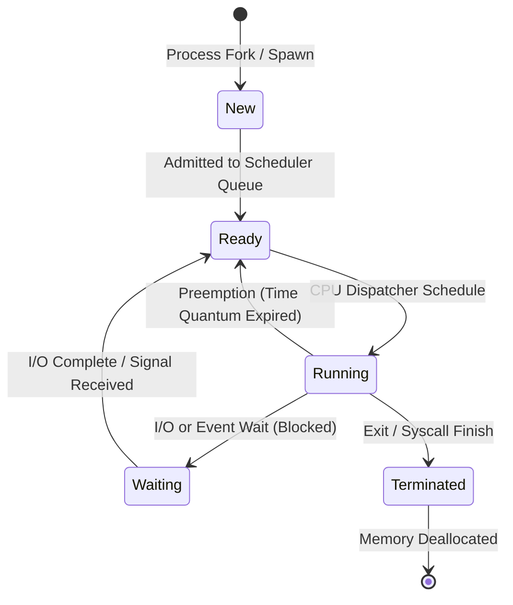

[Home](../README.md) > [02-cs-fundamentals](README.md) > 05_os.md

# 05. Operating Systems (OS)

## Learn

### 1. The Four Coffman Deadlock Conditions
A deadlock can occur if and only if all four conditions hold simultaneously:
1. **Mutual Exclusion**: At least one resource must be non-shareable.
2. **Hold and Wait**: A process holds at least one resource and is waiting to acquire additional resources held by other processes.
3. **No Preemption**: Resources cannot be forcibly confiscated from a process; they must be released voluntarily.
4. **Circular Wait**: A closed chain of processes exists: $P_0 \to P_1 \to \dots \to P_n \to P_0$, where each waits for a resource held by the next.

### 2. Banker's Algorithm Mechanics (Known Correction 1)
- **Deadlock Avoidance**: The OS simulates resource allocation by calculating whether granting a request leaves the system in a **Safe State** (able to allocate to all processes to completion).
- **Matrix Formulation**:
  - `Available[m]`: Available instances of each resource.
  - `Max[n][m]`: Maximum demand of each process.
  - `Allocation[n][m]`: Currently allocated resources.
  - `Need[n][m] = Max[n][m] - Allocation[n][m]`.
- *Note*: Banker's Algorithm uses **matrices and vectors**, NOT a resource-allocation graph!

### 3. Process vs. Thread Memory Layout
- **Process**: Independent execution unit with its own private virtual address space, containing text (code), data (globals), heap (dynamic memory), and open file descriptors. Heavyweight context switch.
- **Thread (Lightweight Process)**: Runs inside a process. Threads **share** code, data, heap, and open files. Each thread has its **own private** Stack, Registers, and Program Counter (PC).

### 4. Paging & Belady's Anomaly
- **Paging**: Physical memory split into fixed-size **Frames**; logical memory split into same-size **Pages**. Address = Page Number ($p$) + Offset ($d$).
- **Belady's Anomaly**: For the **FIFO** page replacement algorithm, increasing the number of physical page frames can paradoxically *increase* the total number of page faults! (LRU and Optimal algorithms never suffer Belady's anomaly because they belong to the class of Stack Algorithms).

### 5. Thrashing
- When the sum of all processes' working sets exceeds total physical RAM, the OS spends virtually 100% of its time swapping pages in and out of disk rather than executing CPU instructions. CPU utilization plummets to near zero.

---

## Practice
### OS-001: Semaphore: Binary vs Counting

**Tag**: [VIDEO] | **Difficulty**: Easy | **Topic**: Synchronization

#### Question
What is the functional difference between a Binary Semaphore (Mutex) and a Counting Semaphore?

- **A**: Binary semaphores run in user space; counting semaphores run in the kernel
- **B**: A Binary Semaphore takes only values 0 and 1 (enforcing mutual exclusion for a single resource); a Counting Semaphore takes non-negative integer values to control access to a finite pool of identical resources
- **C**: Counting semaphores never block processes
- **D**: Binary semaphores are deprecated

**Correct Answer**: **B**

#### Why
A binary semaphore acts as a mutex lock (0=locked, 1=free). A counting semaphore initializes to $N$, allowing up to $N$ concurrent processes to access a pool of $N$ identical resources before subsequent callers block.

- **5-Second Shortcut**: Binary = 0 or 1 (single lock); Counting = 0 to N (resource pool).
- **Trap**: Thinking semaphores can hold negative numbers. Standard semaphore values are non-negative ($S \ge 0$).
- **Source**: KN Academy Video: https://youtu.be/o5TbT3kzEnA

---

### OS-002: Deadlock Coffman Conditions

**Tag**: [VIDEO] | **Difficulty**: Easy | **Topic**: Deadlocks

#### Question
Which of the following is NOT one of the four necessary Coffman conditions required for a system deadlock to occur?

- **A**: Mutual Exclusion
- **B**: Hold and Wait
- **C**: Preemptive Resource Scheduling
- **D**: Circular Wait

**Correct Answer**: **C**

#### Why
The four Coffman conditions are: Mutual Exclusion, Hold and Wait, No Preemption, and Circular Wait. Preemption *prevents* deadlocks by taking resources away from waiting processes.

- **5-Second Shortcut**: The condition is NO Preemption; Preemption prevents deadlocks.
- **Trap**: Confusing 'No Preemption' with 'Preemption'. Preemption breaks deadlocks.
- **Source**: KN Academy Video: https://youtu.be/o5TbT3kzEnA

---

### OS-003: Banker's Algorithm Safe State Determination

**Tag**: [VIDEO] | **Difficulty**: Medium | **Topic**: Deadlock Avoidance

#### Question
In Banker's Algorithm, what formula computes the additional resources a process may request before completion?

- **A**: Need = Max + Allocation
- **B**: Need = Max - Allocation
- **C**: Need = Available - Max
- **D**: Need = Allocation - Available

**Correct Answer**: **B**

#### Why
The Need matrix defines the remaining resources required by each process: $\text{Need}[i][j] = \text{Max}[i][j] - \text{Allocation}[i][j]$. If $\text{Need} \le \text{Available}$, the process can finish safely.

- **5-Second Shortcut**: Need = Max - Allocation.
- **Trap**: Adding Max and Allocation together.
- **Source**: KN Academy Video: https://youtu.be/o5TbT3kzEnA

---

### OS-004: Page Replacement Policies: FIFO, LRU & Optimal

**Tag**: [VIDEO] | **Difficulty**: Medium | **Topic**: Virtual Memory

#### Question
Which page replacement algorithm is theoretically guaranteed to produce the absolute minimum number of page faults for any given reference string?

- **A**: First-In First-Out (FIFO)
- **B**: Least Recently Used (LRU)
- **C**: Optimal Page Replacement (OPT / Belady's Min)
- **D**: Least Frequently Used (LFU)

**Correct Answer**: **C**

#### Why
The Optimal algorithm replaces the page that will not be used for the longest period in the future. Because it requires impossible perfect future knowledge, it is used as an idealized theoretical benchmark against which real algorithms (like LRU) are compared.

- **5-Second Shortcut**: Optimal (OPT) = replaces page not needed for the longest future time (theoretical best).
- **Trap**: Thinking LRU is optimal. LRU approximates OPT by using past behavior.
- **Source**: KN Academy Video: https://youtu.be/o5TbT3kzEnA

---

### OS-005: Belady's Anomaly in Paging

**Tag**: [VIDEO] | **Difficulty**: Easy | **Topic**: Page Replacement

#### Question
Belady's Anomaly (where increasing the physical frame allocation increases the total page fault count) can occur in which algorithm?

- **A**: Least Recently Used (LRU)
- **B**: Optimal (OPT)
- **C**: First-In, First-Out (FIFO)
- **D**: Clock algorithm

**Correct Answer**: **C**

#### Why
FIFO is not a stack algorithm, meaning the set of pages in a frame size $k$ is not necessarily a subset of pages in frame size $k+1$. This structural flaw allows Belady's Anomaly under certain access strings.

- **5-Second Shortcut**: FIFO suffers Belady's anomaly; LRU and OPT never do.
- **Trap**: Believing more RAM frames always reduces page faults in every algorithm.
- **Source**: KN Academy Video: https://youtu.be/o5TbT3kzEnA

---

### OS-006: Process vs Thread Memory Layout

**Tag**: [ADDED] | **Difficulty**: Easy | **Topic**: Processes and Threads

#### Question
Which memory segments are shared among multiple threads belonging to the same parent process?

- **A**: Each thread has its own private Heap and Code
- **B**: Threads share Code, Global Data, and Heap; each thread has its own private Stack, Registers, and Program Counter
- **C**: Threads share Stacks but have separate Heaps
- **D**: Threads share nothing

**Correct Answer**: **B**

#### Why
Threads share the process address space: text (code), initialized data, heap, and open file descriptors. However, to execute independently, each thread must have its own private Stack, CPU Registers, and Program Counter (PC).

- **5-Second Shortcut**: Threads share Code + Data + Heap; Threads have private Stack + Registers + PC.
- **Trap**: Thinking threads have private heaps. All threads allocate from the single shared process heap.
- **Source**: Capgemini Candidate Exam Debriefs

---

### OS-007: Preemptive CPU Scheduling: SRTF Overhead

**Tag**: [ADDED] | **Difficulty**: Medium | **Topic**: CPU Scheduling

#### Question
What is the primary operational drawback of Shortest Remaining Time First (SRTF) preemptive scheduling despite its minimal average waiting time?

- **A**: It cannot run on multi-core CPUs
- **B**: It requires frequent context-switching overhead and can cause starvation of long-burst processes
- **C**: It operates in strictly O(N^3) time
- **D**: It causes thrashing

**Correct Answer**: **B**

#### Why
SRTF continuously preempts whenever a shorter job arrives, introducing high context-switching CPU overhead. Furthermore, a steady stream of short processes will indefinitely starve long processes.

- **5-Second Shortcut**: SRTF = optimal wait time, but high context switch overhead and risk of long-job starvation.
- **Trap**: Assuming SRTF is always best in production. High context-switch overhead makes it impractical without aging.
- **Source**: Capgemini Candidate Exam Debriefs

---

### OS-008: Virtual Memory Operating Systems - Thrashing

**Tag**: [ADDED] | **Difficulty**: Easy | **Topic**: Memory Management

#### Question
What is 'Thrashing' in virtual memory systems, and what is its immediate effect on CPU utilization?

- **A**: CPU utilization reaches 100% processing graphics
- **B**: The system spends almost all its time swapping pages between RAM and disk swap space, causing CPU utilization to drop to near zero
- **C**: The hard drive completely erases all data
- **D**: Processes run twice as fast

**Correct Answer**: **B**

#### Why
Thrashing occurs when the total working set of active processes exceeds physical RAM. The OS continuously generates page faults, spending all disk I/O swapping pages rather than executing user code, driving CPU utilization to zero.

- **5-Second Shortcut**: Thrashing = continuous page swapping $\to$ CPU utilization drops to zero.
- **Trap**: Thinking thrashing means the CPU is maxed out at 100%. CPU utilization drops because it waits for disk I/O.
- **Source**: Capgemini Candidate Exam Debriefs

---

### OS-009: OS File System Architecture & Program Loader

**Tag**: [ADDED] | **Difficulty**: Easy | **Topic**: System Architecture

#### Question
What is the role of the OS 'Loader' when executing an executable binary file stored on disk?

- **A**: Compiling source code into machine code
- **B**: Reading the executable file into main memory (RAM), setting up its stack and heap segments, and jumping the CPU to the program entry point (e.g. `main`)
- **C**: Formatting the hard drive
- **D**: Compressing disk files

**Correct Answer**: **B**

#### Why
The loader is the OS subsystem that brings executable code into physical memory, resolves dynamic libraries, initializes registers and stack pointers, and hands CPU execution to the entry point.

- **5-Second Shortcut**: Loader = loads executable into RAM, initializes memory segments, starts execution.
- **Trap**: Confusing the Loader with the Compiler or Linker. The Loader runs at execution time.
- **Source**: Capgemini Candidate Exam Debriefs

---

### OS-010: OS Deadlock Prevention & Resource Allocation Formula

**Tag**: [ADDED] | **Difficulty**: Hard | **Topic**: Deadlock Calculations

#### Question
A system has $N$ concurrent processes. Each process requires at most $K$ instances of a resource. What is the minimum number of total resource instances $R$ required to mathematically guarantee deadlock will NEVER occur?

- **A**: $R = N \times K$
- **B**: $R = N(K - 1) + 1$
- **C**: $R = N + K$
- **D**: $R = K^N$

**Correct Answer**: **B**

#### Why
Worst-case scenario: every process holds $K-1$ resources and waits for its last resource ($N \times (K-1)$ total resources held, all waiting). Adding just ONE more resource guarantees at least one process can finish, release its resources, and allow all others to complete.

- **5-Second Shortcut**: Deadlock-free formula: $R \ge N(K - 1) + 1$.
- **Trap**: Thinking you need $N \times K$ resources. You only need $N(K-1) + 1$.
- **Source**: Capgemini Candidate Exam Debriefs

---

### OS-011: Round Robin Scheduling & Time Quantum Selection

**Tag**: [PATTERN] | **Difficulty**: Medium | **Topic**: CPU Scheduling

#### Question
What occurs if the Time Quantum ($q$) in Round Robin scheduling is set excessively large ($q \to \infty$)?

- **A**: The system deadlocks immediately
- **B**: Round Robin degenerates into First-Come, First-Served (FCFS) scheduling
- **C**: Context switching increases exponentially
- **D**: Shortest job first is executed

**Correct Answer**: **B**

#### Why
If the time quantum exceeds the CPU burst of every process, no process is ever preempted before completion. The algorithm processes jobs in arrival order, behaving identically to FCFS.

- **5-Second Shortcut**: Large quantum $\to$ FCFS; Tiny quantum $\to$ high context-switch overhead.
- **Trap**: Thinking large quantum makes Round Robin run faster. It turns into FCFS with poor interactive response.
- **Source**: Pattern practice: Scheduling boundary conditions

---

### OS-012: Translation Lookaside Buffer (TLB) Hit Ratio

**Tag**: [PATTERN] | **Difficulty**: Medium | **Topic**: Memory Management

#### Question
In a paged memory system, TLB access time is 10ns, and main memory access time is 100ns. With an 80% TLB hit ratio, what is the Effective Memory Access Time (EMAT)?

- **A**: 110ns
- **B**: 130ns
- **C**: 190ns
- **D**: 90ns

**Correct Answer**: **B**

#### Why
On TLB hit (80%): $10\text{ns (TLB)} + 100\text{ns (RAM)} = 110\text{ns}$. On TLB miss (20%): $10\text{ns (TLB)} + 100\text{ns (Page Table in RAM)} + 100\text{ns (Data in RAM)} = 210\text{ns}$. $\text{EMAT} = 0.8(110) + 0.2(210) = 88 + 42 = 130\text{ns}$.

- **5-Second Shortcut**: EMAT = Hit%(TLB+RAM) + Miss%(TLB+2*RAM) = 0.8(110) + 0.2(210) = 130ns.
- **Trap**: Forgetting that a TLB miss requires TWO memory accesses (one for page table, one for data).
- **Source**: Pattern practice: Memory latency calculations

---

### OS-013: Inverted Page Table Architecture

**Tag**: [PATTERN] | **Difficulty**: Hard | **Topic**: Virtual Memory

#### Question
What problem does an Inverted Page Table solve in 64-bit operating systems?

- **A**: It speeds up disk drive read speeds
- **B**: Instead of one page table per process (which would consume petabytes in 64-bit address spaces), an inverted page table has one entry per *physical frame* in RAM, drastically reducing page table memory footprint
- **C**: It eliminates the need for RAM
- **D**: It replaces the CPU cache

**Correct Answer**: **B**

#### Why
Traditional page tables scale with virtual address space (enormous in 64-bit). Inverted page tables index by physical frame count ($O(\text{RAM size})$), consuming minimal memory regardless of process count.

- **5-Second Shortcut**: Inverted Page Table = 1 entry per physical RAM frame (fixed size).
- **Trap**: Assuming inverted page tables index by virtual page. They index by physical frames.
- **Source**: Pattern practice: Modern memory architecture

---

### OS-014: Producer-Consumer Problem: Semaphores

**Tag**: [PATTERN] | **Difficulty**: Medium | **Topic**: Concurrency

#### Question
In the bounded-buffer Producer-Consumer problem with buffer size $N$, which initial values must be assigned to semaphores `mutex`, `empty`, and `full`?

- **A**: `mutex=0, empty=0, full=N`
- **B**: `mutex=1, empty=N, full=0`
- **C**: `mutex=1, empty=0, full=N`
- **D**: `mutex=N, empty=1, full=1`

**Correct Answer**: **B**

#### Why
`mutex` must be 1 for mutual exclusion. `empty` tracks available empty slots (starts at $N$). `full` tracks available filled slots for consumers (starts at 0).

- **5-Second Shortcut**: Producer-Consumer: mutex=1, empty=N (slots free), full=0 (slots filled).
- **Trap**: Setting `empty=0` and `full=N` initially. The buffer starts completely empty, not full.
- **Source**: Pattern practice: Classical synchronization problems

---

### OS-015: Fork() System Call Return Value

**Tag**: [ADDED] | **Difficulty**: Easy | **Topic**: Process Control

#### Question
What does the `fork()` system call return to the parent process and to the child process upon successful creation?

- **A**: Returns 0 to both
- **B**: Returns 0 to the child process, and returns the Child's PID to the parent process
- **C**: Returns -1 to the child
- **D**: Returns 1 to both

**Correct Answer**: **B**

#### Why
`fork()` creates a duplicate child process. In the child process, `fork()` returns 0. In the parent process, `fork()` returns the non-zero Process ID (PID) of the newly created child.

- **5-Second Shortcut**: `fork()` returns: 0 to Child; Child's PID to Parent.
- **Trap**: Thinking `fork()` returns the parent's PID to the child. Child gets 0.
- **Source**: Added practice: Unix process lifecycle

---

### OS-016: Zombie Process vs Orphan Process

**Tag**: [ADDED] | **Difficulty**: Medium | **Topic**: Process States

#### Question
What is a 'Zombie Process' in Unix operating systems?

- **A**: A process that has no parent
- **B**: A process that has finished execution (called `exit()`), but still has an entry in the process table because its parent has not yet read its exit status with `wait()`
- **C**: A process using 100% CPU
- **D**: A process that cannot be killed with SIGKILL

**Correct Answer**: **B**

#### Why
A zombie has terminated its execution and released its memory, but retains an entry in the OS process table so the parent can inspect its exit status code via `wait()`. An orphan process is one whose parent died before it.

- **5-Second Shortcut**: Zombie = finished execution, waiting for parent to call `wait()`; Orphan = parent died first.
- **Trap**: Confusing Zombie (terminated, un-waited) with Orphan (running, parent dead).
- **Source**: Added practice: Unix process states

---

### OS-017: Internal Fragmentation vs External Fragmentation

**Tag**: [ADDED] | **Difficulty**: Easy | **Topic**: Memory Management

#### Question
What is the difference between Internal and External Fragmentation?

- **A**: Internal is on disk; external is in RAM
- **B**: Internal fragmentation occurs when allocated memory blocks are larger than requested (wasted space *inside* allocated partition); External fragmentation occurs when total free memory exists but is broken into non-contiguous scattered pieces
- **C**: Paging causes external fragmentation
- **D**: Segmentation causes internal fragmentation

**Correct Answer**: **B**

#### Why
Paging causes internal fragmentation (the last page assigned to a process is rarely 100% filled). Variable-partition allocation causes external fragmentation (scattered holes of free RAM between processes).

- **5-Second Shortcut**: Internal = wasted space INSIDE block (paging); External = scattered free holes OUTSIDE blocks.
- **Trap**: Believing paging causes external fragmentation. Paging eliminates external fragmentation.
- **Source**: Added practice: Memory fragmentation

---

### OS-018: Aging Technique for Starvation Prevention

**Tag**: [ADDED] | **Difficulty**: Easy | **Topic**: CPU Scheduling

#### Question
How does the 'Aging' technique prevent starvation in priority-based CPU scheduling?

- **A**: By terminating older processes
- **B**: By gradually increasing the priority of processes that wait in the ready queue for long periods of time
- **C**: By doubling time quantum every minute
- **D**: By rebooting the server

**Correct Answer**: **B**

#### Why
Aging prevents low-priority processes from waiting indefinitely by steadily boosting their priority score as waiting time elapses, guaranteeing they eventually reach the highest priority and execute.

- **5-Second Shortcut**: Aging = gradually increase priority of waiting jobs to prevent starvation.
- **Trap**: Assuming priority scheduling can never starve. Aging is necessary to prevent starvation.
- **Source**: Added practice: Scheduling starvation remedies

---

### OS-019: Dirty Bit (Modified Bit) in Page Tables

**Tag**: [PATTERN] | **Difficulty**: Medium | **Topic**: Virtual Memory

#### Question
What is the purpose of the 'Dirty Bit' (Modified Bit) in a page table entry?

- **A**: To detect viruses
- **B**: To record whether the page has been modified in RAM since it was loaded; if clean (bit=0), it can be discarded without writing to disk upon eviction
- **C**: To indicate read-only permissions
- **D**: To count page references

**Correct Answer**: **B**

#### Why
If a page in RAM has not been modified (dirty bit = 0), its content is identical to the copy on disk. During page replacement, clean pages are discarded immediately, avoiding an expensive disk write.

- **5-Second Shortcut**: Dirty bit = 1: modified (must write to disk on eviction); Dirty bit = 0: clean (discard).
- **Trap**: Writing every evicted page back to disk. Clean pages are simply discarded.
- **Source**: Pattern practice: Paging hardware flags

---

### OS-020: Thrashing Resolution (Working Set Model)

**Tag**: [PATTERN] | **Difficulty**: Hard | **Topic**: Memory Optimization

#### Question
How does Peter Denning's Working Set Model resolve thrashing in an operating system?

- **A**: By increasing virtual memory to infinity
- **B**: By tracking the set of pages each process actively references in window $\Delta$; if $\sum |WS_i| > \text{Total RAM}$, the OS suspends one entire process and swaps it out to disk
- **C**: By running FIFO instead of LRU
- **D**: By shutting down user sessions

**Correct Answer**: **B**

#### Why
The Working Set represents a process's active working memory. When total working set demand exceeds physical RAM, the OS suspends an entire process (swapping all its pages out), freeing enough frames for remaining processes to run without thrashing.

- **5-Second Shortcut**: Working set > RAM $\implies$ Suspend one process to free RAM for others.
- **Trap**: Assuming the OS should allocate fewer frames to every process. That accelerates thrashing.
- **Source**: Pattern practice: Thrashing mitigation protocols

---

### OS-021: Critical Section Problem Requirements

**Tag**: [ADDED] | **Difficulty**: Easy | **Topic**: Process Synchronization

#### Question
What are the three mandatory requirements that any valid solution to the Critical Section problem must satisfy?

- **A**: Speed, Memory, Simplicity
- **B**: Mutual Exclusion, Progress, and Bounded Waiting
- **C**: Deadlock, Starvation, Preemption
- **D**: Atomicity, Consistency, Durability

**Correct Answer**: **B**

#### Why
A valid synchronization solution must ensure: 1. Mutual Exclusion (only one process inside critical section). 2. Progress (selection of next entrant cannot be postponed indefinitely). 3. Bounded Waiting (a bound must exist on the number of times others enter before a waiting process).

- **5-Second Shortcut**: Critical Section: Mutual Exclusion, Progress, Bounded Waiting.
- **Trap**: Thinking Mutual Exclusion alone is sufficient. Without Progress and Bounded Waiting, deadlocks occur.
- **Source**: Added practice: Synchronization theory

---

### OS-022: Spinlock vs Mutex (When to use a Spinlock)

**Tag**: [PATTERN] | **Difficulty**: Medium | **Topic**: Locking Mechanics

#### Question
In which scenario is a Spinlock (busy-waiting lock) preferred over a traditional blocking Mutex?

- **A**: On a single-core CPU where locks are held for 10 minutes
- **B**: On a multi-core system where the critical section is extremely short, making the cost of spinning less than the latency of a thread context switch
- **C**: When saving battery power
- **D**: When waiting for network packet arrival

**Correct Answer**: **B**

#### Why
A blocking mutex puts the thread to sleep, incurring expensive OS context-switching latency (~microsecond scale). On multi-core systems, if the lock is held for only a few nanoseconds, spinning on a CPU core avoids context-switch overhead.

- **5-Second Shortcut**: Spinlock = fast for very short locks on multi-core; avoids context-switch cost.
- **Trap**: Using spinlocks on single-core CPUs. A spinning thread starves the lock-holder on single core.
- **Source**: Pattern practice: Low-level locking performance

---

### OS-023: Demand Paging vs Pure Demand Paging

**Tag**: [ADDED] | **Difficulty**: Easy | **Topic**: Virtual Memory

#### Question
What characterizes 'Pure Demand Paging' when a new process starts execution?

- **A**: All pages are loaded into RAM before execution begins
- **B**: Execution starts with zero pages in physical memory; the very first instruction immediately triggers a page fault to fetch the initial page
- **C**: Pages are compressed with ZIP
- **D**: The page table is disabled

**Correct Answer**: **B**

#### Why
Pure demand paging never pre-loads any pages. The process starts execution with no pages in RAM; page faults occur on the first instruction, first variable access, bringing pages into memory strictly on-demand.

- **5-Second Shortcut**: Pure Demand Paging: starts with 0 pages in RAM; faults on instruction 1.
- **Trap**: Confusing with pre-paging. Pre-paging loads working sets in advance.
- **Source**: Added practice: Virtual memory loading

---

### OS-024: RAID 0, 1, 5, 10 Configurations

**Tag**: [ADDED] | **Difficulty**: Medium | **Topic**: Storage Systems

#### Question
Which RAID level provides block-level striping with distributed parity, tolerating the failure of any single hard disk with minimal storage overhead?

- **A**: RAID 0
- **B**: RAID 1
- **C**: RAID 5
- **D**: RAID 6

**Correct Answer**: **C**

#### Why
RAID 0 is striping only (zero fault tolerance). RAID 1 is mirroring (100% capacity overhead). RAID 5 stripes data and distributes parity across $N$ disks, tolerating 1 drive failure with only $1/N$ storage overhead.

- **5-Second Shortcut**: RAID 0 = Striping (fast, no parity); RAID 1 = Mirroring; RAID 5 = Striping + Distributed Parity.
- **Trap**: Thinking RAID 0 provides redundancy. RAID 0 has zero redundancy (lose 1 disk, lose all data).
- **Source**: Added practice: Storage array architectures

---

### OS-025: DMA (Direct Memory Access) Controller Role

**Tag**: [ADDED] | **Difficulty**: Easy | **Topic**: I/O Hardware

#### Question
What is the primary function of a Direct Memory Access (DMA) controller in modern computer architecture?

- **A**: To replace the GPU
- **B**: To transfer data blocks directly between high-speed I/O devices and main memory without continuous CPU intervention, interrupting the CPU only when the entire block transfer completes
- **C**: To compile Java programs
- **D**: To power the motherboard

**Correct Answer**: **B**

#### Why
Without DMA, the CPU must read and write every single byte via Programmed I/O. DMA transfers entire data blocks directly between device and RAM at memory bus speeds, freeing the CPU to execute instructions.

- **5-Second Shortcut**: DMA = high-speed device-to-RAM transfer without CPU intervention.
- **Trap**: Assuming the CPU manages every byte moved from hard drive to RAM.
- **Source**: Added practice: Computer organization & I/O

---

### OS-026: Deadlock Detection vs Prevention vs Avoidance

**Tag**: [PATTERN] | **Difficulty**: Medium | **Topic**: Deadlock Taxonomy

#### Question
What distinguishes Deadlock Avoidance from Deadlock Prevention?

- **A**: Prevention detects deadlocks after they occur; avoidance prevents them
- **B**: Prevention eliminates at least one Coffman condition structurally in advance; Avoidance dynamically monitors resource allocation states (Banker's) to steer away from unsafe states
- **C**: Avoidance requires rebooting the server
- **D**: They are identical

**Correct Answer**: **B**

#### Why
Prevention imposes structural static rules (e.g. strict resource ordering to break circular wait). Avoidance dynamically evaluates runtime resource requests against current availability to ensure the system never enters an unsafe state.

- **5-Second Shortcut**: Prevention = static rules breaking Coffman conditions; Avoidance = dynamic check (Banker's).
- **Trap**: Classifying Banker's algorithm as Deadlock Prevention. Banker's is Deadlock Avoidance.
- **Source**: Pattern practice: Deadlock taxonomy

---

### OS-027: Multilevel Feedback Queue (MLFQ) Scheduling

**Tag**: [PATTERN] | **Difficulty**: Hard | **Topic**: CPU Scheduling

#### Question
How does a Multilevel Feedback Queue (MLFQ) distinguish I/O-bound interactive processes from CPU-bound batch processes without prior knowledge of burst times?

- **A**: By asking the user during process launch
- **B**: Processes that consume their full time quantum without blocking are demoted to lower-priority queues with larger quanta; processes that yield the CPU for I/O remain in high-priority queues
- **C**: By reading process file sizes
- **D**: By running all processes in parallel

**Correct Answer**: **B**

#### Why
MLFQ prioritizes short interactive jobs: new jobs start at top priority. If a job uses its full quantum, it is penalized as CPU-bound and demoted. If it yields early for I/O, it stays at high priority for responsive UI interaction.

- **5-Second Shortcut**: MLFQ: uses full quantum $\to$ demoted (CPU-bound); yields early for I/O $\to$ high priority.
- **Trap**: Assuming operating systems must be told process burst times in advance. MLFQ learns dynamically.
- **Source**: Pattern practice: Advanced scheduling design

---

### OS-028: Peterson's Algorithm for Mutual Exclusion

**Tag**: [PATTERN] | **Difficulty**: Hard | **Topic**: Classic Synchronization

#### Question
In Peterson's two-process mutual exclusion algorithm, why does process $P_0$ set `turn = 1` immediately after declaring `flag[0] = true`?

- **A**: To crash Process 1
- **B**: To demonstrate 'politeness' by granting Process 1 the priority to enter the critical section if both processes request entry simultaneously, preventing mutual exclusion conflicts
- **C**: To release the CPU
- **D**: To allocate heap memory

**Correct Answer**: **B**

#### Why
Process 0 sets its own interest (`flag[0] = true`), but generously yields `turn = 1`. Process 0 only enters if Process 1 is uninterested (`flag[1] == false`) or if Process 1 yielded the turn back (`turn == 0`).

- **5-Second Shortcut**: Peterson's: declare intent (`flag[i]=true`), yield turn (`turn=j`).
- **Trap**: Setting `turn = 0` inside Process 0. It must yield `turn = 1` to the other process.
- **Source**: Pattern practice: Low-level synchronization algorithms

---

### OS-029: Copy-On-Write (COW) in Fork()

**Tag**: [ADDED] | **Difficulty**: Medium | **Topic**: Memory Optimization

#### Question
Why is Copy-On-Write (COW) utilized during the `fork()` system call in modern operating systems?

- **A**: To duplicate hard drives
- **B**: Parent and child initially share the exact same physical pages read-only; physical copying occurs only for pages that are subsequently modified, dramatically speeding up process creation
- **C**: To prevent printing on paper
- **D**: To bypass the page table

**Correct Answer**: **B**

#### Why
Creating a full physical copy of 4GB of parent RAM on every `fork()` is slow and wasteful, especially when followed by `exec()`. COW shares pages read-only and duplicates a page only when parent or child writes to it.

- **5-Second Shortcut**: COW = share pages read-only; copy only when a page is written to.
- **Trap**: Assuming `fork()` immediately allocates a complete duplicate physical copy of all RAM.
- **Source**: Added practice: Unix memory optimizations

---

### OS-030: Page Fault Handling Sequence

**Tag**: [PATTERN] | **Difficulty**: Hard | **Topic**: Virtual Memory

#### Question
What is the exact sequence of events executed by the hardware and OS when a Page Fault trap occurs?

- **A**: Terminate process $\to$ send email $\to$ restart CPU
- **B**: Hardware traps to OS $\to$ Save registers $\to$ Locate missing page on backing store $\to$ Read page into available RAM frame $\to$ Update page table $\to$ Restart faulting instruction
- **C**: Execute instruction twice $\to$ throw exception
- **D**: Clear TLB $\to$ power down disk

**Correct Answer**: **B**

#### Why
When a page table lookup fails (invalid bit), MMU traps to OS: 1. Save process state. 2. Fetch page from disk into RAM. 3. Update page table valid bit. 4. Restore CPU registers and re-execute the *exact instruction* that caused the fault.

- **5-Second Shortcut**: Page Fault: Trap $\to$ Fetch from disk $\to$ Update Page Table $\to$ Restart instruction.
- **Trap**: Assuming the program advances to the next instruction. The faulting instruction must be restarted.
- **Source**: Pattern practice: Hardware/OS interrupt sequence

---

### OS-031: Monolithic vs Microkernel Architecture

**Tag**: [ADDED] | **Difficulty**: Easy | **Topic**: Kernel Design

#### Question
What is the core architectural difference between a Monolithic Kernel (Linux) and a Microkernel (Mach, QNX)?

- **A**: Monolithic kernels run on phones; microkernels run on supercomputers
- **B**: Monolithic kernels run all OS services (file system, networking, device drivers) inside kernel space; Microkernels run only bare essentials (IPC, scheduling) in kernel space, moving drivers to user space
- **C**: Microkernels have no kernel mode
- **D**: Monolithic kernels cannot use C++

**Correct Answer**: **B**

#### Why
Monolithic kernels provide high performance via direct function calls in kernel space. Microkernels maximize stability and security by running file systems and drivers as user-space daemons communicating via IPC.

- **5-Second Shortcut**: Monolithic = all services in kernel space; Microkernel = minimal kernel (drivers in user space).
- **Trap**: Assuming monolithic means old and microkernel means modern. Linux is monolithic and dominates cloud computing.
- **Source**: Added practice: Operating system architecture

---

### OS-032: Memory-Mapped Files (mmap)

**Tag**: [ADDED] | **Difficulty**: Medium | **Topic**: File Systems

#### Question
What performance advantage does memory-mapping a file (`mmap`) offer over standard `read()` / `write()` system calls?

- **A**: It eliminates disk storage completely
- **B**: It maps file bytes directly into the process's virtual address space, allowing memory pointer access and avoiding copying data into user-space buffers
- **C**: It doubles CPU frequency
- **D**: It encrypts file contents

**Correct Answer**: **B**

#### Why
Standard `read()` copies data from disk to kernel page cache, then copies from kernel space to user space. `mmap` assigns virtual pages directly to the kernel page cache, eliminating user-kernel buffer copy overhead (zero-copy I/O).

- **5-Second Shortcut**: `mmap` maps files directly to virtual memory $\to$ eliminates user-kernel buffer copying.
- **Trap**: Assuming `mmap` loads the entire file into RAM at once. It uses demand paging.
- **Source**: Added practice: I/O performance

---

### OS-033: Real-Time Operating Systems (Hard vs Soft RTOS)

**Tag**: [ADDED] | **Difficulty**: Easy | **Topic**: RTOS

#### Question
What distinguishes a 'Hard Real-Time System' from a 'Soft Real-Time System'?

- **A**: Hard RTOS uses metal casing; soft RTOS uses plastic
- **B**: In Hard RTOS, missing a single deadline results in total system catastrophe (airbags, pacemakers); in Soft RTOS, missing a deadline degrades quality without catastrophic failure (video streaming)
- **C**: Hard RTOS runs on Windows
- **D**: Soft RTOS cannot use clocks

**Correct Answer**: **B**

#### Why
Hard RTOS guarantees deterministic upper bounds on latency where a late answer is a fatal error. Soft RTOS gives high priority to real-time tasks, but late packets merely cause audio/video stutter without danger.

- **5-Second Shortcut**: Hard RTOS = zero deadline tolerance (failure is fatal); Soft RTOS = degrades quality.
- **Trap**: Calling video streaming a Hard RTOS. Video is Soft RTOS; pacemakers are Hard RTOS.
- **Source**: Added practice: Real-time systems

---

### OS-034: Context Switch Latency & Costs

**Tag**: [PATTERN] | **Difficulty**: Medium | **Topic**: Kernel Overhead

#### Question
What direct hardware overhead is incurred during a CPU context switch between two processes?

- **A**: Power cable heating
- **B**: Saving and restoring CPU registers, flushing or invalidating the Translation Lookaside Buffer (TLB), and subsequent CPU cache misses as the new process warms the cache
- **C**: Hard drive head movement
- **D**: Re-installing the operating system

**Correct Answer**: **B**

#### Why
A process context switch requires saving state to the PCB, loading the new process page table, and invalidating the TLB. The newly scheduled process suffers thousands of cache misses until its working set warms up L1/L2 caches.

- **5-Second Shortcut**: Context switch cost: Save/restore registers + TLB flush + cold CPU cache misses.
- **Trap**: Thinking context switches only take a single CPU cycle. They cost thousands of CPU cycles in lost cache locality.
- **Source**: Pattern practice: Hardware performance cost of concurrency

---

### OS-035: Spooling vs Buffering in I/O Systems

**Tag**: [ADDED] | **Difficulty**: Easy | **Topic**: I/O Management

#### Question
What does 'SPOOLING' (Simultaneous Peripheral Operations On-Line) accomplish in printer and batch job management?

- **A**: It spins the hard drive faster
- **B**: It buffers jobs onto disk storage, allowing the CPU to submit print jobs at memory speed while the slow physical printer processes them sequentially at its own mechanical pace
- **C**: It cleans printer paper
- **D**: It compresses text files

**Correct Answer**: **B**

#### Why
Printers operate at mechanical speeds (pages per minute). Spooling intercepts output from fast CPU processes, queues print jobs on disk, and feeds the printer steadily without holding the producing process blocked.

- **5-Second Shortcut**: SPOOLING = queue slow I/O jobs on disk so CPU doesn't wait on hardware.
- **Trap**: Confusing Spooling (disk-based queuing for slow peripherals) with simple in-RAM buffering.
- **Source**: Added practice: I/O management

---

## Sources for This File
- KN Academy Video: [Capgemini Complete Recruitment Pattern](https://youtu.be/o5TbT3kzEnA)
- KN Academy Playlist: [Capgemini 2026/2027 Masterclass](https://www.youtube.com/watch?v=mLaYLknw4KU&list=PLGFjgYQtw1UjDBEkL2Edqej2kXbxGA1NO)
- Gemini candidate chat archives in `Capgemini Candidate Exam Debriefs`

---

Previous: [04_oops.md](04_oops.md) | Next: [06_dsa_theory.md](06_dsa_theory.md)
