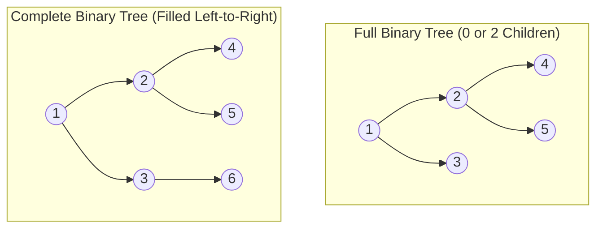

[Home](../README.md) > [02-cs-fundamentals](README.md) > 06_dsa_theory.md

# 06. Data Structures & Algorithms (DSA) Theory

## Learn

### 1. Asymptotic Notations
- **$O(g(n))$ (Big-O)**: Asymptotic **upper bound** ($f(n) \le c \cdot g(n)$). Worst-case running time guarantee.
- **$\Omega(g(n))$ (Big-Omega)**: Asymptotic **lower bound** ($f(n) \ge c \cdot g(n)$). Best-case baseline.
- **$\Theta(g(n))$ (Big-Theta)**: Asymptotic **tight bound** ($c_1 g(n) \le f(n) \le c_2 g(n)$).
- **Master Theorem**: For recurrences $T(n) = a T(n/b) + \Theta(n^k)$:
  - Case 1: If $\log_b a > k \implies T(n) = \Theta(n^{\log_b a})$.
  - Case 2: If $\log_b a = k \implies T(n) = \Theta(n^k \log n)$.
  - Case 3: If $\log_b a < k \implies T(n) = \Theta(n^k)$.

### 2. Binary Tree Terminology
- **Full Binary Tree**: Every node has either strictly **0 or 2 children** (no node has 1 child).
- **Complete Binary Tree**: All levels are completely filled, except possibly the bottom level, which is filled **from left to right**. Used in binary heaps!
- **Perfect Binary Tree**: All interior nodes have 2 children and all leaf nodes are at the same depth. Total nodes = $2^{h+1} - 1$.
- **BST Inorder Traversal**: An Inorder traversal (`Left -> Root -> Right`) on a Binary Search Tree ALWAYS produces elements in **sorted ascending order**.

### 3. Comparison-Based Sorting Lower Bound
- Any comparison-based sorting algorithm requires at least $\Omega(N \log N)$ comparisons in the worst case.
- **Proof**: A decision tree for sorting $N$ elements must distinguish between all $N!$ possible permutations. The height of a binary tree with $N!$ leaves is at least $\log_2(N!) = \Omega(N \log N)$ by Stirling's approximation.
- Non-comparison sorts (Counting Sort, Radix Sort) achieve $O(N)$ by exploiting integer key digit distributions.

### 4. Hash Table Collision Resolution
- **Separate Chaining**: Colliding keys are appended to linked lists (or red-black trees in Java 8 HashMap) at the hash bucket.
- **Open Addressing**: All elements stored directly in the hash array.
  - *Linear Probing*: Probe sequence $(h(k) + i) \pmod m$. Suffers from **Primary Clustering** (long contiguous blocks of occupied slots build up, slowing search).
  - *Quadratic Probing*: Probe sequence $(h(k) + c_1 i + c_2 i^2) \pmod m$. Reduces primary clustering.
  - *Double Hashing*: Probe sequence $(h_1(k) + i \cdot h_2(k)) \pmod m$. Best open addressing distribution.

---

## Practice
### DSA-001: Full vs Complete Binary Tree Properties

**Tag**: [ADDED] | **Difficulty**: Easy | **Topic**: Tree Theory

#### Question
Which statement correctly distinguishes a Full Binary Tree from a Complete Binary Tree?

- **A**: Full trees have all leaves at identical depth
- **B**: In a Full Binary Tree, every node has strictly 0 or 2 children; in a Complete Binary Tree, all levels are completely filled except possibly the last, which fills left-to-right
- **C**: Complete trees cannot be implemented with arrays
- **D**: Full trees have no leaves

**Correct Answer**: **B**

#### Why
Full = 0 or 2 children per node (strictly no single-child nodes). Complete = all levels fully packed, with bottom level packed strictly left-to-right (the structural requirement for array-backed binary heaps).

- **5-Second Shortcut**: Full = 0 or 2 children; Complete = left-packed levels (heaps).
- **Trap**: Confusing Full with Perfect binary tree. Perfect requires all leaves at the exact same depth.
- **Source**: Capgemini Candidate Exam Debriefs

---

### DSA-002: Selection Sort Two-Pass Invariant

**Tag**: [ADDED] | **Difficulty**: Easy | **Topic**: Sorting Theory

#### Question
What is the operational invariant and worst-case comparison complexity of Selection Sort on an array of $N$ elements?

- **A**: Maintains a sorted subarray; performs exactly O(N log N) comparisons
- **B**: In each outer pass $i$, it scans the unsorted suffix to locate the minimum element and swaps it into index $i$; comparison complexity is strictly $\Theta(N^2)$ in all cases
- **C**: It is an adaptive O(N) sort
- **D**: It requires O(N) auxiliary space

**Correct Answer**: **B**

#### Why
Selection sort performs $N-1$ passes. In pass $i$, it compares against all remaining elements ($N - i - 1$ comparisons). Total comparisons = $(N-1) + (N-2) + \dots + 1 = N(N-1)/2 = \Theta(N^2)$, regardless of whether the array is already sorted.

- **5-Second Shortcut**: Selection Sort = $\Theta(N^2)$ comparisons in ALL cases (best, average, worst).
- **Trap**: Assuming Selection Sort runs in $O(N)$ on an already-sorted array. Unlike Insertion Sort, Selection Sort always scans the full suffix.
- **Source**: Capgemini Candidate Exam Debriefs

---

### DSA-003: Binary Search Tree Inorder Traversal Property

**Tag**: [CHAT] | **Difficulty**: Easy | **Topic**: Tree Traversal

#### Question
Which traversal algorithm performed on a Binary Search Tree (BST) is guaranteed to visit all nodes in strictly non-decreasing sorted order?

- **A**: Preorder Traversal (Root $\to$ Left $\to$ Right)
- **B**: Inorder Traversal (Left $\to$ Root $\to$ Right)
- **C**: Postorder Traversal (Left $\to$ Right $\to$ Root)
- **D**: Level-Order Traversal (BFS)

**Correct Answer**: **B**

#### Why
By definition of a BST, all left subtree keys are smaller than root, and all right subtree keys are larger. Traversing Left subtree $\to$ Root $\to$ Right subtree visits elements in strictly ascending sorted order.

- **5-Second Shortcut**: BST Inorder Traversal = Sorted Ascending Sequence.
- **Trap**: Thinking Preorder visits nodes in sorted order. Only Inorder gives sorted output.
- **Source**: Capgemini Candidate Exam Debriefs

---

### DSA-004: Circular Queue Full Condition

**Tag**: [CHAT] | **Difficulty**: Medium | **Topic**: Queue Data Structures

#### Question
In a circular queue implemented using a fixed-size array of length `SIZE` with pointers `front` and `rear`, what is the standard condition indicating the queue is completely full?

- **A**: `rear == front`
- **B**: `(rear + 1) % SIZE == front`
- **C**: `rear == SIZE - 1`
- **D**: `front == (rear - 1) % SIZE`

**Correct Answer**: **B**

#### Why
To distinguish between a completely empty queue and a full queue without a counter variable, one slot is kept empty. The queue is declared full when advancing `rear` by one position wraps around to meet `front`: `(rear + 1) % SIZE == front`.

- **5-Second Shortcut**: Circular queue full: `(rear + 1) % SIZE == front`.
- **Trap**: Thinking `rear == front` means full. In standard implementations, `rear == front` indicates an empty queue.
- **Source**: Capgemini Candidate Exam Debriefs

---

### DSA-005: Sorting Algorithm Lower Bound

**Tag**: [CHAT] | **Difficulty**: Easy | **Topic**: Algorithm Analysis

#### Question
What is the mathematical worst-case lower bound on comparison operations for any comparison-based sorting algorithm operating on $N$ arbitrary elements?

- **A**: $\Omega(N)$
- **B**: $\Omega(N \log N)$
- **C**: $\Omega(N^2)$
- **D**: $\Omega(\log N)$

**Correct Answer**: **B**

#### Why
A comparison sort can be modeled as a decision tree with $N!$ leaves (representing all possible permutations). The minimum height of a binary tree with $N!$ leaves is $\lceil \log_2(N!) \rceil = \Omega(N \log N)$ by Stirling's formula.

- **5-Second Shortcut**: Comparison sorting lower bound is $\Omega(N \log N)$.
- **Trap**: Assuming non-comparison sorts (Counting Sort) violate this theorem. The theorem applies strictly to comparison-based models.
- **Source**: Capgemini Candidate Exam Debriefs

---

### DSA-006: Hash Map Collisions in Open Addressing (Linear Probing)

**Tag**: [CHAT] | **Difficulty**: Medium | **Topic**: Hashing Techniques

#### Question
In open addressing with Linear Probing ($h(k, i) = (h'(k) + i) \pmod m$), what phenomenon degrades search performance as the load factor increases?

- **A**: Secondary Memory Leakage
- **B**: Primary Clustering (contiguous occupied blocks form, increasing the average probe length for subsequent keys)
- **C**: Stack Overflow
- **D**: B-Tree Rebalancing

**Correct Answer**: **B**

#### Why
Primary clustering occurs because once a collision occurs, adjacent occupied slots form contiguous runs. Any new key hashing to any slot in the run extends the cluster further, causing average search time to degrade sharply toward $O(N)$.

- **5-Second Shortcut**: Linear Probing suffers from Primary Clustering.
- **Trap**: Assuming linear probing distributes keys uniformly across slots.
- **Source**: Capgemini Candidate Exam Debriefs

---

### DSA-007: Array Indexing vs Linked List Traversal Time

**Tag**: [ADDED] | **Difficulty**: Easy | **Topic**: Data Structures

#### Question
What are the asymptotic time complexities of accessing the $k$-th element in a contiguous array versus a singly linked list of size $N$?

- **A**: Array: $O(1)$; Linked List: $O(1)$
- **B**: Array: $O(1)$; Linked List: $O(k)$ or $O(N)$
- **C**: Array: $O(N)$; Linked List: $O(1)$
- **D**: Array: $O(\log N)$; Linked List: $O(N)$

**Correct Answer**: **B**

#### Why
Arrays store elements in contiguous memory, allowing direct pointer arithmetic calculation (`base + k * sizeof(type)`) in $O(1)$ time. Linked lists require sequential node pointer dereferencing from the head, taking $O(k)$ time.

- **5-Second Shortcut**: Array access = $O(1)$; Linked list access = $O(N)$.
- **Trap**: Assuming linked lists allow random access. Linked lists require sequential traversal.
- **Source**: Added practice: Data structure access mechanics

---

### DSA-008: Binary Heap Property & Array Representation

**Tag**: [PATTERN] | **Difficulty**: Medium | **Topic**: Heap Data Structure

#### Question
In a 0-indexed array implementation of a Max-Heap, for a parent node at index $i$, where are its left and right child nodes located?

- **A**: Left: $2i$; Right: $2i + 1$
- **B**: Left: $2i + 1$; Right: $2i + 2$
- **C**: Left: $i/2$; Right: $i/2 + 1$
- **D**: Left: $i + 1$; Right: $i + 2$

**Correct Answer**: **B**

#### Why
For a 0-indexed complete binary tree array: Left child is at index $2i + 1$; Right child is at index $2i + 2$. Parent of node $k$ is at index $\lfloor (k - 1) / 2 \rfloor$. (For 1-indexed heaps, left is $2i$, right is $2i + 1$).

- **5-Second Shortcut**: 0-indexed heap: Left = $2i + 1$; Right = $2i + 2$; Parent = $(i - 1)/2$.
- **Trap**: Using the 1-indexed formula ($2i, 2i+1$) for a 0-indexed array.
- **Source**: Pattern practice: Heap layout rules

---

### DSA-009: QuickSort Worst-Case Complexity & Pivot Selection

**Tag**: [PATTERN] | **Difficulty**: Medium | **Topic**: Divide and Conquer

#### Question
What causes QuickSort to degrade to its worst-case time complexity of $O(N^2)$, and how is it mitigated?

- **A**: Choosing the median pivot on unsorted data
- **B**: Always picking the first or last element as pivot on an already sorted or reverse-sorted array; mitigated via randomized pivot selection or Median-of-Three
- **C**: Running QuickSort on arrays smaller than 10 elements
- **D**: Using two recursive calls

**Correct Answer**: **B**

#### Why
When the pivot is the extreme minimum or maximum element, the partition splits into sizes $0$ and $N-1$, yielding recurrence $T(N) = T(N-1) + O(N) = O(N^2)$. Randomized pivoting or picking the median of three elements avoids this worst case.

- **5-Second Shortcut**: QuickSort worst case $O(N^2)$ occurs when pivot is the extreme min/max on sorted arrays.
- **Trap**: Assuming QuickSort is always $O(N \log N)$. Without good pivoting, it is $O(N^2)$.
- **Source**: Pattern practice: Sorting edge cases

---

### DSA-010: MergeSort Stability & Auxiliary Memory

**Tag**: [ADDED] | **Difficulty**: Easy | **Topic**: Sorting Properties

#### Question
What are the stability property and auxiliary space complexity of standard standard MergeSort on an array of size $N$?

- **A**: Unstable; $O(1)$ space
- **B**: Stable; $O(N)$ auxiliary space
- **C**: Stable; $O(\log N)$ space
- **D**: Unstable; $O(N)$ space

**Correct Answer**: **B**

#### Why
MergeSort is Stable because when merging two subarrays, equal elements from the left subarray are chosen before equal elements from the right subarray (`<=`). Merging arrays out-of-place requires an auxiliary buffer of size $O(N)$.

- **5-Second Shortcut**: MergeSort = Stable, $O(N \log N)$ time, $O(N)$ auxiliary space.
- **Trap**: Thinking standard array MergeSort is an in-place $O(1)$ space algorithm.
- **Source**: Added practice: Sorting algorithm metrics

---

### DSA-011: Adjacency Matrix vs Adjacency List for Graphs

**Tag**: [PATTERN] | **Difficulty**: Medium | **Topic**: Graph Representations

#### Question
For a sparse graph with $V$ vertices and $E$ edges where $E \ll V^2$, which graph representation optimizes both space and neighbor traversal time?

- **A**: Adjacency Matrix ($O(V^2)$ space)
- **B**: Adjacency List ($O(V + E)$ space)
- **C**: Incidence Matrix
- **D**: Complete Binary Tree

**Correct Answer**: **B**

#### Why
An adjacency matrix allocates a $V \times V$ grid requiring $O(V^2)$ memory regardless of edge count. For sparse graphs, an adjacency list stores only actual edges, consuming $O(V + E)$ memory and allowing neighbor iteration in $O(\text{degree})$ time.

- **5-Second Shortcut**: Sparse graph ($E \ll V^2$) = use Adjacency List ($O(V + E)$).
- **Trap**: Using an Adjacency Matrix on a graph with 100,000 vertices and 200,000 edges ($10^{10}$ cells = 40GB RAM wasted).
- **Source**: Pattern practice: Graph representation trade-offs

---

### DSA-012: Dijkstra's Algorithm Negative Weights Trap

**Tag**: [PATTERN] | **Difficulty**: Hard | **Topic**: Graph Algorithms

#### Question
Why does Dijkstra's shortest path algorithm fail on graphs containing negative edge weights?

- **A**: Dijkstra only works on trees
- **B**: Dijkstra assumes that adding an edge to a path can never decrease its total length (greedy invariant); once a node is marked visited, its distance is never reconsidered
- **C**: It causes a compiler error
- **D**: Heap data structures cannot store negative numbers

**Correct Answer**: **B**

#### Why
Dijkstra uses a greedy strategy: once a node is finalized, its shortest path is assumed permanently fixed. A negative edge encountered later could create a shorter path through an already-visited vertex. Use Bellman-Ford for negative weights.

- **5-Second Shortcut**: Dijkstra fails with negative edges. Use Bellman-Ford ($O(V \cdot E)$).
- **Trap**: Assuming Dijkstra works with negative edges as long as there is no negative cycle. Negative edges break Dijkstra even without cycles.
- **Source**: Pattern practice: Shortest path algorithms

---

### DSA-013: AVL Tree Balance Factor Rule

**Tag**: [ADDED] | **Difficulty**: Easy | **Topic**: Self-Balancing Trees

#### Question
What is the allowable Balance Factor ($BF = \text{Height}(Left) - \text{Height}(Right)$) for every node in an AVL Tree?

- **A**: Strictly 0
- **B**: $-1, 0,$ or $+1$
- **C**: $-2$ to $+2$
- **D**: Any positive integer

**Correct Answer**: **B**

#### Why
An AVL tree is a strictly self-balancing BST where the height difference between left and right subtrees of any node cannot exceed 1. If $|BF| \ge 2$, rotations (LL, RR, LR, RL) rebalance the node.

- **5-Second Shortcut**: AVL balance factor must be in $\{-1, 0, +1\}$.
- **Trap**: Thinking AVL trees must have balance factor 0 at all nodes (that would be a perfect tree).
- **Source**: Added practice: Self-balancing trees

---

### DSA-014: Red-Black Tree Properties

**Tag**: [PATTERN] | **Difficulty**: Hard | **Topic**: Balanced Search Trees

#### Question
In a Red-Black Tree, which property ensures that the tree remains balanced with height $\le 2 \log_2(N + 1)$?

- **A**: All nodes must be colored black
- **B**: Every path from a node to any of its descendant NIL leaves contains the exact same number of black nodes (Black-Height invariant)
- **C**: Red nodes can have red children
- **D**: Leaf nodes are red

**Correct Answer**: **B**

#### Why
Key Red-Black invariants: Root is black; No two consecutive red nodes on any path; Every path from root to NIL leaves contains equal count of black nodes. Since the longest path (alternating red-black) is at most twice the shortest (all black), height is $O(\log N)$.

- **5-Second Shortcut**: Red-Black tree: equal black nodes on all root-to-leaf paths.
- **Trap**: Thinking Red-Black trees are strictly height-balanced like AVL. AVL is more strictly balanced; RB trees require fewer rotations on insert/delete.
- **Source**: Pattern practice: Balanced tree invariants

---

### DSA-015: BFS vs DFS Space Complexity on Trees

**Tag**: [PATTERN] | **Difficulty**: Medium | **Topic**: Graph Traversal

#### Question
On a balanced binary tree of $N$ nodes (height $h = \log_2 N$), what are the worst-case space complexities of Breadth-First Search (BFS) and Depth-First Search (DFS)?

- **A**: BFS: $O(\log N)$; DFS: $O(N)$
- **B**: BFS: $O(N)$ (bottom level queue); DFS: $O(\log N)$ (call stack depth)
- **C**: Both are strictly $O(1)$
- **D**: Both are strictly $O(N)$

**Correct Answer**: **B**

#### Why
BFS uses a queue holding all nodes at the widest level ($N/2$ nodes at the leaf level $\to O(N)$). DFS uses a recursion call stack proportional to tree height ($h = O(\log N)$).

- **5-Second Shortcut**: Balanced tree: BFS space = $O(N)$ (leaf level); DFS space = $O(\log N)$ (height).
- **Trap**: Assuming BFS uses less memory than DFS. For wide trees, BFS queues consume vastly more memory.
- **Source**: Pattern practice: Traversal memory profiles

---

### DSA-016: Disjoint Set Union (DSU) with Path Compression

**Tag**: [PATTERN] | **Difficulty**: Hard | **Topic**: Advanced Data Structures

#### Question
What is the amortized time complexity per operation for Disjoint Set Union (DSU) implemented with both Union-by-Rank and Path Compression?

- **A**: $O(\log N)$
- **B**: $O(\alpha(N))$ (nearly $O(1)$, where $\alpha$ is the Inverse Ackermann function)
- **C**: $O(N)$
- **D**: $O(1)$ strict worst-case

**Correct Answer**: **B**

#### Why
Combining Union-by-Rank (keeps tree shallow) with Path Compression (flattens tree during find) achieves an amortized per-operation complexity of $O(\alpha(N))$, where $\alpha(N) < 5$ for all universe sizes.

- **5-Second Shortcut**: DSU with path compression + union by rank = $O(\alpha(N)) \approx O(1)$ amortized.
- **Trap**: Stating DSU is $O(1)$ strict worst case. It is nearly $O(1)$ amortized, not worst-case.
- **Source**: Pattern practice: Advanced algorithmic bounds

---

### DSA-017: Master Theorem: $T(N) = 2T(N/2) + O(N)$

**Tag**: [ADDED] | **Difficulty**: Easy | **Topic**: Recurrence Relations

#### Question
Applying the Master Theorem to $T(N) = 2T(N/2) + O(N)$ (the MergeSort recurrence) yields what time complexity?

- **A**: $O(N)$
- **B**: $O(N \log N)$
- **C**: $O(N^2)$
- **D**: $O(\log N)$

**Correct Answer**: **B**

#### Why
Here $a = 2, b = 2, k = 1$. $\log_b a = \log_2 2 = 1$. Since $\log_b a == k$ ($1 == 1$), Master Theorem Case 2 applies: $T(N) = \Theta(N^k \log N) = \Theta(N \log N)$.

- **5-Second Shortcut**: $2T(N/2) + O(N) = O(N \log N)$ (MergeSort recurrence).
- **Trap**: Picking $O(N)$ because the work per level is $O(N)$. There are $\log N$ levels.
- **Source**: Added practice: Master theorem application

---

### DSA-018: Master Theorem: $T(N) = 4T(N/2) + O(N)$

**Tag**: [PATTERN] | **Difficulty**: Medium | **Topic**: Recurrence Relations

#### Question
Applying the Master Theorem to $T(N) = 4T(N/2) + O(N)$ yields what time complexity?

- **A**: $O(N \log N)$
- **B**: $O(N^2)$
- **C**: $O(N^4)$
- **D**: $O(N)$

**Correct Answer**: **B**

#### Why
$a = 4, b = 2, k = 1$. $\log_b a = \log_2 4 = 2$. Since $\log_b a > k$ ($2 > 1$), Case 1 applies: $T(N) = \Theta(N^{\log_b a}) = \Theta(N^2)$.

- **5-Second Shortcut**: $\log_2 4 = 2 > 1 \implies O(N^{\log_2 4}) = O(N^2)$.
- **Trap**: Thinking the $O(N)$ work dominates. Subproblem branching ($4 > 2$) dominates.
- **Source**: Pattern practice: Recurrence relations

---

### DSA-019: Trie (Prefix Tree) Search Complexity

**Tag**: [ADDED] | **Difficulty**: Easy | **Topic**: String Data Structures

#### Question
In a Trie storing English dictionary words, what is the time complexity to search for a word of length $L$, where the dictionary contains $N$ total words?

- **A**: $O(N)$
- **B**: $O(L)$
- **C**: $O(N \times L)$
- **D**: $O(\log N)$

**Correct Answer**: **B**

#### Why
Trie search follows child pointers character-by-character along the length of the string. The lookup time depends strictly on the string length $L$, completely independent of the total number of words $N$ stored in the trie.

- **5-Second Shortcut**: Trie search time = $O(L)$ (depends only on key length $L$, not dataset size $N$).
- **Trap**: Assuming Trie search depends on $N$. Trie eliminates dependency on $N$.
- **Source**: Added practice: String indexing data structures

---

### DSA-020: Topological Sort Directed Acyclic Graph (DAG) Condition

**Tag**: [PATTERN] | **Difficulty**: Medium | **Topic**: Graph Theory

#### Question
Which graph property is mandatory for a Topological Sort to exist?

- **A**: The graph must be undirected and connected
- **B**: The graph must be a Directed Acyclic Graph (DAG)
- **C**: The graph must be bipartite
- **D**: All vertices must have even degree

**Correct Answer**: **B**

#### Why
Topological sorting linearly orders vertices such that for every directed edge $u \to v$, $u$ appears before $v$. If a directed cycle exists ($u \to v \to u$), no valid linear ordering is possible; hence, the graph must be a DAG.

- **5-Second Shortcut**: Topological sort exists $\iff$ graph is a DAG (Directed Acyclic Graph).
- **Trap**: Attempting topological sort on graphs with directed cycles.
- **Source**: Pattern practice: Graph ordering conditions

---

### DSA-021: Binary Tree Postorder from Inorder and Preorder

**Tag**: [PATTERN] | **Difficulty**: Medium | **Topic**: Tree Reconstruction

#### Question
Given Preorder: `[A, B, C]` and Inorder: `[B, A, C]`. What is the Postorder traversal?

- **A**: `[B, C, A]`
- **B**: `[A, B, C]`
- **C**: `[C, B, A]`
- **D**: `[B, A, C]`

**Correct Answer**: **A**

#### Why
Preorder first node `A` is Root. In Inorder `[B, A, C]`, `B` is left of `A`, and `C` is right of `A`. Tree structure: Root A, Left Child B, Right Child C. Postorder traversal (`Left -> Right -> Root`) is `B, C, A`.

- **5-Second Shortcut**: Root is first in Preorder, splits Inorder into Left and Right subtrees.
- **Trap**: Confusing Postorder (L, R, Root) with Inorder.
- **Source**: Pattern practice: Tree reconstruction

---

### DSA-022: Stack Using Two Queues

**Tag**: [ADDED] | **Difficulty**: Easy | **Topic**: Queue & Stack Simulations

#### Question
When implementing a Last-In First-Out (LIFO) Stack using two FIFO Queues, what is the minimum time complexity for `push` if `pop` is designed to be $O(1)$?

- **A**: $O(1)$
- **B**: $O(N)$
- **C**: $O(N^2)$
- **D**: $O(\log N)$

**Correct Answer**: **B**

#### Why
To make `pop` $O(1)$, `push(x)` must insert $x$ into `queue2`, dequeue all elements from `queue1` into `queue2`, and swap the queues. This requires $O(N)$ time per push.

- **5-Second Shortcut**: Stack via 2 Queues: making Pop $O(1)$ requires Push to be $O(N)$.
- **Trap**: Assuming both Push and Pop can be $O(1)$ simultaneously using standard queues without deque support.
- **Source**: Added practice: Abstract data type simulations

---

### DSA-023: Stable vs Unstable Sorting Algorithms

**Tag**: [ADDED] | **Difficulty**: Easy | **Topic**: Sorting Classification

#### Question
Which of the following sorting algorithms is UNSTABLE by default in its standard implementation?

- **A**: Merge Sort
- **B**: Insertion Sort
- **C**: QuickSort
- **D**: Bubble Sort

**Correct Answer**: **C**

#### Why
Standard QuickSort partitions by swapping elements across long distances over the pivot, which disrupts the relative order of duplicate keys. Merge Sort, Insertion Sort, and Bubble Sort perform adjacent comparisons, remaining stable.

- **5-Second Shortcut**: Unstable sorts: QuickSort, HeapSort, Selection Sort.
- **Trap**: Believing QuickSort is stable. Swapping across the pivot breaks stability.
- **Source**: Added practice: Sorting stability classification

---

### DSA-024: Counting Sort Time and Space Limits

**Tag**: [PATTERN] | **Difficulty**: Medium | **Topic**: Non-Comparison Sorting

#### Question
What are the time and auxiliary space complexities of Counting Sort for an array of $N$ integers with values ranging from $0$ to $K$?

- **A**: Time: $O(N \log N)$; Space: $O(1)$
- **B**: Time: $O(N + K)$; Space: $O(K)$
- **C**: Time: $O(N \times K)$; Space: $O(N)$
- **D**: Time: $O(N^2)$; Space: $O(K)$

**Correct Answer**: **B**

#### Why
Counting sort allocates a count array of size $K+1$. It tallies occurrences in $O(N)$ and computes prefix sums in $O(K)$, yielding $O(N + K)$ time and $O(K)$ auxiliary space. It becomes inefficient when $K \gg N$.

- **5-Second Shortcut**: Counting Sort: Time = $O(N + K)$, Space = $O(K)$.
- **Trap**: Using Counting Sort when $K = 10^9$ (causes Out of Memory error).
- **Source**: Pattern practice: Non-comparison sort boundaries

---

### DSA-025: Binary Search Pre-Condition

**Tag**: [ADDED] | **Difficulty**: Easy | **Topic**: Searching

#### Question
What fundamental pre-condition must data satisfy before standard Binary Search ($O(\log N)$) can be executed?

- **A**: Data must be stored in a linked list
- **B**: Data must be sorted and allow $O(1)$ random access by index
- **C**: All numbers must be positive
- **D**: The size must be a power of 2

**Correct Answer**: **B**

#### Why
Binary search requires two things: 1. The data must be sorted so eliminating half the search space is mathematically valid. 2. The data structure must support $O(1)$ random access (like an array) to inspect the midpoint in constant time.

- **5-Second Shortcut**: Binary search requires: Sorted order + $O(1)$ random index access.
- **Trap**: Attempting binary search on an unsorted array or a linked list.
- **Source**: Added practice: Search prerequisites

---

### DSA-026: Floyd's Tortoise and Hare Cycle Detection Proof

**Tag**: [PATTERN] | **Difficulty**: Hard | **Topic**: Linked List Analysis

#### Question
In Floyd's Cycle Detection algorithm, slow moves 1 step and fast moves 2 steps. If a cycle of length $C$ exists, why are they guaranteed to meet inside the loop?

- **A**: Fast moves in the opposite direction
- **B**: The relative distance between fast and slow decreases by exactly 1 step on every iteration ($2 - 1 = 1$), meaning the distance must eventually reach $0 \pmod C$ in at most $C$ steps
- **C**: Slow stops and waits
- **D**: Memory addresses repeat

**Correct Answer**: **B**

#### Why
Viewed from the reference frame of slow, fast closes the gap by $2 - 1 = 1$ node on every single step. Since the gap decreases by 1 integer each iteration, fast cannot leapfrog or skip past slow; they must collide.

- **5-Second Shortcut**: Fast closes the gap by 1 node per step $\to$ guaranteed collision in $\le C$ steps.
- **Trap**: Thinking fast can skip over slow. Closing by 1 means no skip is possible.
- **Source**: Pattern practice: Two-pointer cycle mechanics

---

### DSA-027: Amortized Complexity: Dynamic Array Doubling

**Tag**: [PATTERN] | **Difficulty**: Medium | **Topic**: Amortized Analysis

#### Question
Why is appending an element to a dynamic array (like Java `ArrayList` or C++ `std::vector`) considered $O(1)$ Amortized time, even though resizing takes $O(N)$?

- **A**: CPUs ignore copy operations
- **B**: When capacity is doubled, the $O(N)$ cost of copying occurs infrequently; spreading this cost across the $N$ preceding cheap $O(1)$ insertions yields an average cost of $O(1)$ per append
- **C**: Vectors never copy data
- **D**: Memory is infinite

**Correct Answer**: **B**

#### Why
Doubling capacity copies $1 + 2 + 4 + \dots + N = 2N - 1$ total elements across $N$ insertions. The total cost divided by $N$ insertions is $\le 2$, proving that each push costs $O(1)$ amortized time.

- **5-Second Shortcut**: Vector push_back = $O(1)$ amortized (infrequent doubling amortized over $N$ pushes).
- **Trap**: Calling vector push_back strict $O(1)$ worst case. The individual resize operation is $O(N)$.
- **Source**: Pattern practice: Amortized complexity analysis

---

### DSA-028: Minimum Spanning Tree (Kruskal vs Prim)

**Tag**: [ADDED] | **Difficulty**: Medium | **Topic**: Greedy Graph Algorithms

#### Question
What is the difference in algorithmic strategy between Kruskal's and Prim's Minimum Spanning Tree (MST) algorithms?

- **A**: Kruskal is dynamic programming; Prim is divide and conquer
- **B**: Kruskal sorts all edges globally and adds minimum non-cyclic edges using DSU; Prim grows a single connected tree outwards from a starting vertex using a priority queue
- **C**: Prim only works on directed graphs
- **D**: Kruskal cannot handle weighted graphs

**Correct Answer**: **B**

#### Why
Kruskal's is edge-based: sorts $E$ edges in $O(E \log E)$ and uses Disjoint Set Union to reject cycles (best for sparse graphs). Prim's is vertex-based: grows a connected component from a root via min-heap (best for dense graphs).

- **5-Second Shortcut**: Kruskal = edge-based (sorts edges + DSU); Prim = vertex-based (grows tree via heap).
- **Trap**: Using Kruskal on dense graphs without DSU.
- **Source**: Added practice: Greedy graph algorithms

---

### DSA-029: Circular Linked List Tail Pointer Optimization

**Tag**: [ADDED] | **Difficulty**: Easy | **Topic**: Linked List Design

#### Question
In a circular singly linked list, maintaining a pointer to which node enables $O(1)$ insertions at BOTH the head and the tail?

- **A**: Pointer to the head node
- **B**: Pointer to the tail node (last node)
- **C**: Pointer to the middle node
- **D**: Pointer to a random node

**Correct Answer**: **B**

#### Why
With a `tail` pointer, `tail->next` is the `head`! Inserting at head: create new node, link `new->next = tail->next`, update `tail->next = new` ($O(1)$). Inserting at tail: same steps, then update `tail = new` ($O(1)$).

- **5-Second Shortcut**: Keep a `tail` pointer in circular linked list $\to O(1)$ head AND tail operations.
- **Trap**: Keeping only a `head` pointer, requiring an $O(N)$ traversal to find the tail.
- **Source**: Added practice: Linked list pointer tricks

---

### DSA-030: Huffman Coding Greedy Tree Invariant

**Tag**: [PATTERN] | **Difficulty**: Hard | **Topic**: Greedy Compression

#### Question
In Huffman Coding for data compression, which greedy choice property minimizes the Weighted External Path Length (average code length)?

- **A**: Pairing the two highest frequency characters at each step
- **B**: Repeatedly combining the two tree nodes with the smallest frequencies into a parent node whose frequency is their sum
- **C**: Assigning 8 bits to every character
- **D**: Sorting letters alphabetically

**Correct Answer**: **B**

#### Why
Huffman merges the two least frequent symbols first, placing them deepest in the prefix tree (longest bit codes). Frequent symbols remain near the root (shortest bit codes), minimizing total encoded bit length.

- **5-Second Shortcut**: Huffman: merge 2 lowest frequencies repeatedly (frequent characters get shortest codes).
- **Trap**: Merging highest frequencies first, which creates worst-case compression.
- **Source**: Pattern practice: Greedy compression theory

---

## Sources for This File
- KN Academy Video: [Capgemini Complete Recruitment Pattern](https://youtu.be/o5TbT3kzEnA)
- KN Academy Playlist: [Capgemini 2026/2027 Masterclass](https://www.youtube.com/watch?v=mLaYLknw4KU&list=PLGFjgYQtw1UjDBEkL2Edqej2kXbxGA1NO)
- Gemini candidate chat archives in `Capgemini Candidate Exam Debriefs`

---

Previous: [05_os.md](05_os.md) | Next: [03-pseudocode-and-bitwise/README.md](../03-pseudocode-and-bitwise/README.md)
