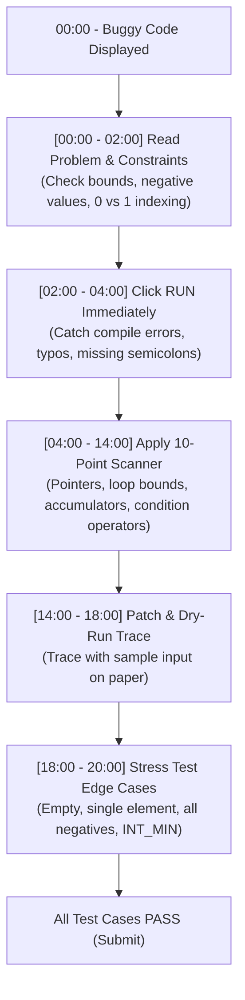

[Home](../README.md) > 04-code-debugging

# 04. Code Debugging Round (20-Minute Protocol)

This directory contains complete problem statements, sample inputs/outputs, buggy code snippets, diagnosed bugs, fixed code in Java and C++, dry-run execution tables, Spot-It-Fast rules, and edge cases for the Code Debugging section of the Capgemini assessment.

---

## The 10-Point Bug Scanner

1. **Pointer Dereference Guard**: Verify `node != null` is evaluated *before* accessing `node.val`, `node.left`, or `fast.next.next`.
2. **Loop Boundaries**: Verify 0-indexed loops run `< n` instead of `<= n`. For adjacent element comparisons, verify boundary stops at `< n - 1`.
3. **2D Matrix Dimensions**: Verify outer row loops iterate up to row count $n$ (`mat.length`) and inner column loops iterate up to column count $m$ (`mat[0].length`).
4. **Accumulator Resets**: Ensure per-row, per-level, or per-window sums (e.g., `rowSum = 0`) are reinitialized inside the outer loop.
5. **Min/Max Initialization**: When inputs can contain negative values, initialize maximum trackers to `INT_MIN` or `Integer.MIN_VALUE` (never `0`).
6. **Comparison vs Assignment**: Check for accidental assignment operators (`if (val = target)`) instead of equality checks (`==`).
7. **Boolean Connectors**: Verify boundary conditions use logical AND (`&&`) to ensure all dimensions are valid, rather than logical OR (`||`).
8. **Loop Updates & Pointer Advances**: Check that while-loop pointers (`left++`, `right--`, `curr = curr.next`, `row++`, `col--`) advance unconditionally to prevent infinite loops (TLE).
9. **Base Cases & Error Propagation**: Ensure recursive base cases return valid markers (e.g., propagating `-1` immediately up tree height recursion, checking strict inequality `Math.abs(left - right) > 1`).
10. **Integer Division & Overflow Cast**: Ensure divisions cast to floating point (`(double) a / b`) where decimals matter, and use `long` accumulators for sums exceeding $2 \times 10^9$.

---

## Module Files & Problem Breakdown

| File | Topic & Key Bug Types | Problems | Time to Finish |
| :--- | :--- | :---: | :---: |
| [01_trees.md](01_trees.md) | Height balance, BFS queue dynamic evaluation, Zigzag traversal, BST validation, Tree diameter, LCA | 6 | 30 mins |
| [02_matrix.md](02_matrix.md) | 2D Matrix row accumulator resets, Staircase binary search, Matrix rotation, In-place zeroes, Spiral boundary | 5 | 25 mins |
| [03_greedy_and_intervals.md](03_greedy_and_intervals.md) | Jump Game reach tracking, Gas Station circular pointer reset, Interval merge ordering, Non-overlapping, Assign Cookies | 7 | 35 mins |
| [04_linkedlist_stack_backtracking.md](04_linkedlist_stack_backtracking.md) | Tortoise & Hare cycle guard, Monotonic stack empty check, Backtrack state restoration, Reverse list, Parentheses | 6 | 30 mins |
| [05_graphs_and_dp.md](05_graphs_and_dp.md) | Bidirectional edge registration, Premature loop returns, Backtrack stack flags, 0/1 Knapsack reverse loop, Topological sort, Dijkstra, Coin change | 8 | 40 mins |
| [06_kadane_and_binary_search.md](06_kadane_and_binary_search.md) | All-negative Kadane tracker, Mid overflow & strict inequality, Circular Kadane, Rotated binary search, Peak element, Range bounds | 8 | 40 mins |

**Total Problems**: 40 debugging problems with complete Java solutions, C++ collapsed versions, dry-run tables, and edge cases.

---

## 4 Primary Failure Modes in Exam Debugging
1. **Unidirectional vs. Bidirectional Edges**: In undirected graphs, failing to push edges in both directions fragments connected components.
2. **Premature Loop Returns**: Placing `return result;` inside a `for` loop body terminates the algorithm prematurely after visiting only one neighbor.
3. **0-Indexed vs. 1-Indexed Allocation**: Allocating size $n$ instead of $n + 1$ or accessing out-of-bounds indices in DP tables.
4. **Forward vs. Backward Capacity Traversal**: Using forward loop instead of reverse traversal in space-optimized 0/1 Knapsack arrays.

---

Previous: [03-pseudocode-and-bitwise/README.md](../03-pseudocode-and-bitwise/README.md) | Next: [01_trees.md](01_trees.md)
