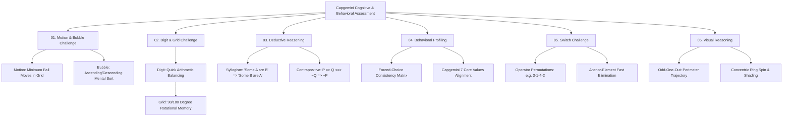

[Home](../README.md) > 06-cognitive-and-behavioral

# 06. Cognitive Ability & Behavioral Profiling

This directory provides interactive models, rules, and question banks for Capgemini's Gamified Cognitive and Behavioral rounds.

## Module Structure

| File | What You Learn | Questions Inside | Time to Finish |
| :--- | :--- | :---: | :---: |
| [01_motion_and_bubble.md](01_motion_and_bubble.md) | Motion Challenge (Maze ball routing) and Bubble Challenge (Order sorting) | 7 | 20 mins |
| [02_digit_and_grid.md](02_digit_and_grid.md) | Digit Challenge (Quick arithmetic) and Grid Challenge (Spatial symmetry & rotation) | 7 | 20 mins |
| [03_deductive_reasoning.md](03_deductive_reasoning.md) | Categorical syllogisms, seating arrangements, conditional logic, and order rankings | 30 | 40 mins |
| [04_behavioral.md](04_behavioral.md) | Forced-choice work culture dilemmas, corporate ethics, and consistency strategies | 25 | 30 mins |
| [05_switch_challenge.md](05_switch_challenge.md) | Multi-input permutation operators, reverse mapping, and branch elimination | 15 | 25 mins |
| [06_visual_reasoning_and_odd_one_out.md](06_visual_reasoning_and_odd_one_out.md) | Spatial trajectory, rotational symmetry, concentric morphing, and odd-one-out | 12 | 25 mins |

**Total Items**: 96 practice items across 6 gamified cognitive and behavioral disciplines.

---

## 💡 Top 5 Cognitive Assessment Shortcuts

1. **Switch Challenge: Single Anchor Tracking**:
   - Don't track all 4 symbols at once! Pick **ONE unique anchor symbol** (e.g. the Circle at position 1).
   - Trace where it moves through the operator: if Operator is `(2, 4, 1, 3)`, Symbol 1 moves to position 3.
   - Look at the answer choices and immediately eliminate the 3 options that do not have the Circle at position 3. Usually 1 anchor eliminates 2-3 choices instantly!
2. **Deductive Syllogism Conversion**:
   - *"Some A are B"* logically converts to *"Some B are A"* (symmetric).
   - *"All A are B"* does **NOT** convert to *"All B are A"*. (Commits the Converse Error).
   - *"All A are B"* converts ONLY to *"Some B are A"*, or contrapositive *"No non-B is A"*.
3. **Motion Challenge Strategy**:
   - Work backwards from the target hole! Identify which corridor leads into the goal hole, then navigate the ball towards that corridor entry.
4. **Digit Challenge Arithmetic**:
   - Start by placing the largest operations (multiplication / division) to bound the magnitude, then use addition and subtraction to hit the exact target integer.
5. **Behavioral Assessment Consistency Rule**:
   - Capgemini asks the same situational dilemma 3-4 times with inverted wording. Never contradict your previous answers. Prioritize: *Team Collaboration > Integrity > Timely Delivery > Personal Glory*.

---

Previous: [05-ai-assisted-coding/README.md](../05-ai-assisted-coding/README.md) | Next: [01_motion_and_bubble.md](01_motion_and_bubble.md)
