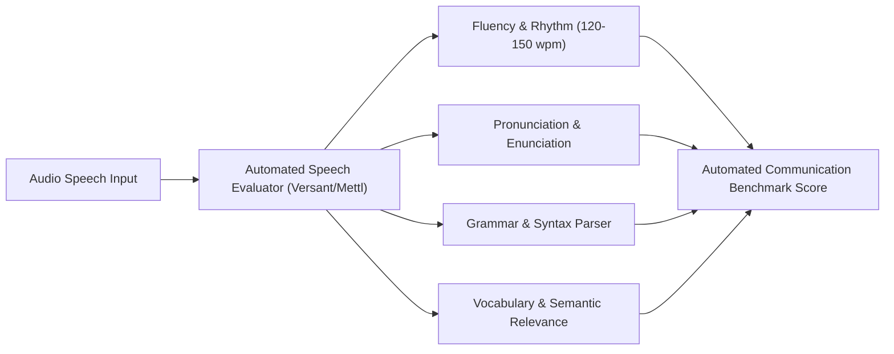

[Home](../README.md) > 07-communication

# 07. Spoken & Written Communication Assessment

This directory provides comprehensive guidance, test architecture, pronunciation rubrics, and 30 practice items for the Spoken and Written Communication round of the Capgemini assessment.

## Module Structure

| File | What You Learn | Questions Inside | Time to Finish |
| :--- | :--- | :---: | :---: |
| [01_comprehensive_english_modules.md](01_comprehensive_english_modules.md) | Passage read-aloud, sentence repetition, jumbled words, short Q&A, storytelling, extempore speech frameworks, and grammar MCQs | 30 | 45 mins |

---

## 💡 Top 5 Communication Round Tricks

1. **The 3-Second Silence Trap**:
   - The automated recording engine interprets any silence longer than 2.5-3 seconds as "end of response" and cuts off recording! Use filler transition phrases (*"Furthermore...", "In addition to this...", "From my perspective..."*) instead of dead air.
2. **The PREP Framework for Impromptu Speaking**:
   - **P - Point**: State your core thesis clearly in 1 sentence (*"I believe remote work significantly boosts team productivity."*)
   - **R - Reason**: Give the fundamental why (*"Because employees save commute hours and manage energy better."*)
   - **E - Example**: Share a concrete 15-second scenario (*"For instance, our software team delivered projects 2 weeks early when working asynchronously."*)
   - **P - Point**: Reiterate your conclusion (*"Therefore, hybrid setups represent the future of IT delivery."*)
3. **Sentence Repetition Audio Focus**:
   - Focus on chunking the sentence into Subject + Verb + Object rather than memorizing individual words. Reproduce the speaker's cadence and pitch inflection.
4. **Read Aloud Punctuation Rule**:
   - Pause for 0.5s at commas (`,`), and 1.0s at periods (`.`) and semicolons (`;`). Do not swallow word endings (`-ed`, `-s`, `-ing`).
5. **Grammar Agreement Scanner**:
   - Watch out for Subject-Verb disagreement with intervening prepositional phrases (*"The box of chocolates [is/are]"* $\implies$ *"The box ... is"*).

---

Previous: [06-cognitive-and-behavioral/README.md](../06-cognitive-and-behavioral/README.md) | Next: [01_comprehensive_english_modules.md](01_comprehensive_english_modules.md)
