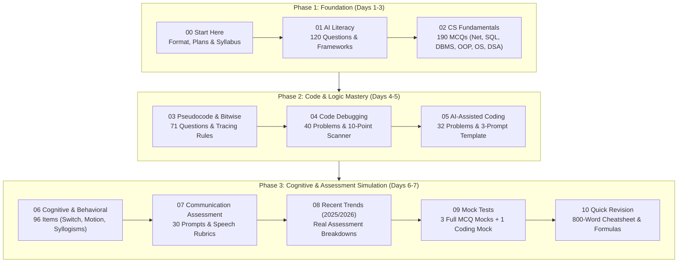

# Capgemini Hiring Assessment Preparation

A concise and structured preparation repository for candidates appearing in Capgemini's recruitment assessment for the 2027 passing-out batch.

Prep material, not the official syllabus. Real questions can differ.

## 5-Step Start Guide
1. **Understand the Exam**: Read [00-start-here/01_exam-format.md](00-start-here/01_exam-format.md) to understand timing, negative marking rules, and section weights.
2. **Pick Your Study Plan**: Open [00-start-here/02_study-plans.md](00-start-here/02_study-plans.md) and pick either the 7-day, 3-day, or last-24-hours plan.
3. **Master AI Literacy & CS Fundamentals**: Study [01-ai-literacy/README.md](01-ai-literacy/README.md), [02-cs-fundamentals/README.md](02-cs-fundamentals/README.md), and [03-pseudocode-and-bitwise/README.md](03-pseudocode-and-bitwise/README.md).
4. **Practice Hands-On Coding**: Run through [04-code-debugging/README.md](04-code-debugging/README.md) and [05-ai-assisted-coding/README.md](05-ai-assisted-coding/README.md) using our token-efficient prompting templates.
5. **Simulate Full Test & Quick Revise**: Take the full mocks in [09-mock-tests/README.md](09-mock-tests/README.md) and revise using [10-quick-revision/CHEATSHEET.md](10-quick-revision/CHEATSHEET.md).

## Complete Preparation Roadmap

## Start Here
- **New student?** Start with [00-start-here/02_study-plans.md](00-start-here/02_study-plans.md) for tailored schedules.
- **Short on time?** Jump straight to [10-quick-revision/CHEATSHEET.md](10-quick-revision/CHEATSHEET.md) (under 800 words) and [10-quick-revision/last-24-hours.md](10-quick-revision/last-24-hours.md).

## Folder Structure

| Folder | What You Learn | Questions Inside | Time to Finish |
| :--- | :--- | :--- | :--- |
| [00-start-here](00-start-here/README.md) | Exam format, study plans (7-day, 3-day, 24h), tags guide, syllabus map | Roadmap | 45 mins |
| [01-ai-literacy](01-ai-literacy/README.md) | LLM fundamentals, prompt engineering, RAG, safety, evaluation, fine-tuning, failure modes | 120 MCQs | 3 hours |
| [02-cs-fundamentals](02-cs-fundamentals/README.md) | Networking, SQL queries, DBMS internals, OOPs, OS, and DSA theory | 190 MCQs | 4 hours |
| [03-pseudocode-and-bitwise](03-pseudocode-and-bitwise/README.md) | Tracing loops, operator precedence, bitwise math, recursion, question bank | 71 MCQs | 2 hours |
| [04-code-debugging](04-code-debugging/README.md) | 20-min debugging strategy, 10-point scanner, trees, matrices, greedy, intervals, graphs, DP | 40 Problems | 3 hours |
| [05-ai-assisted-coding](05-ai-assisted-coding/README.md) | Token-efficient prompt plans, AI trap spotting, sliding window, graphs, DP, trees | 32 Problems | 3 hours |
| [06-cognitive-and-behavioral](06-cognitive-and-behavioral/README.md) | Motion, Bubble Memory, Grid, Digit, Switch Challenge, Deductive Syllogisms, Behavioral | 96 Items | 2.5 hours |
| [07-communication](07-communication/README.md) | Reading, repeating, listening, grammar sentence correction, impromptu speaking | 30 Prompts | 1.5 hours |
| [08-recent-patterns](08-recent-patterns/README.md) | Breakdown of recent exam trends, report sources, and targeted practice files | Analysis & Tips | 1 hour |
| [09-mock-tests](09-mock-tests/README.md) | 3 full 40-question MCQ mock exams and 1 full coding mock (debug + AI-assist) | 125 Items | 3 hours |
| [10-quick-revision](10-quick-revision/README.md) | 800-word Cheatsheet, formulas, trap scanner, and last-24-hours checklist | Rapid Review | 30 mins |
| [INDEX.md](INDEX.md) | Master index mapping every Question ID -> File -> Topic | Full Directory | Reference |
| [RESOURCES.md](RESOURCES.md) | All video walkthroughs, reference links, and allowed LeetCode practice links | Source Catalog | Reference |